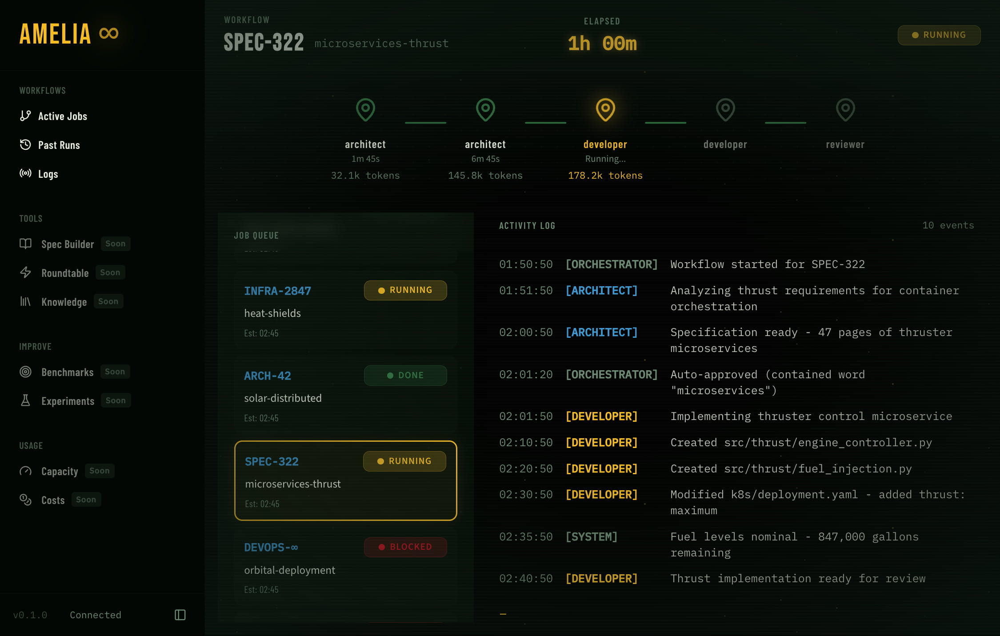

# Amelia: Agentic Orchestrator


[Amelia](https://en.wikipedia.org/wiki/Amelia_Earhart) is a local agentic coding system that orchestrates software development tasks through multiple AI agents with specialized roles.

See the [**Roadmap**](https://anderskev.github.io/amelia/reference/roadmap) for where we're headed and [**Current Status**](#current-status) for where we are.

## Prerequisites

- **Python 3.12+** - Required for type hints and async features
- **uv** - Fast Python package manager ([install guide](https://docs.astral.sh/uv/getting-started/installation/))
- **Git** - For version control operations
- **LLM access** - Either:
  - OpenAI API key (for `api:openai` driver)
  - Claude CLI installed (for `cli:claude` driver)

## Quick Start

Use Amelia in any existing Git repository to automate development tasks.



### 1. Install Prerequisites

```bash
# Install uv (Linux/macOS)
curl -LsSf https://astral.sh/uv/install.sh | sh

# Install amelia as a global tool
uv tool install git+https://github.com/anderskev/amelia.git

# Set your API key
export OPENAI_API_KEY="sk-..."
```

### 2. Configure Your Project

```bash
# Navigate to your project
cd /path/to/your/project

# Create config in your project root
cat > settings.amelia.yaml << 'EOF'
active_profile: dev
profiles:
  dev:
    name: dev
    driver: api:openai
    tracker: github
    strategy: single
EOF
```

See **[Configuration](https://anderskev.github.io/amelia/guide/configuration)** for all available parameters including retry settings, execution modes, and driver options.

### 3. Create or Select an Issue

Amelia works on issues from your configured tracker. Create one if needed:

```bash
# Create a new GitHub issue
gh issue create --title "Add user authentication" --body "Implement login/logout functionality"

# Or use an existing issue number
gh issue list
```

### 4. Run Amelia

```bash
# Generate a plan (dry run - no code changes)
amelia plan-only 123

# Execute the full workflow (plan → approve → develop → review)
amelia start 123

# Review uncommitted changes
amelia review --local
```

> **Tip:** Use `tracker: noop` in your config to test without a real issue tracker. This creates a mock issue from the ID you provide.

## Alternative Installation

### Run from Source

If you prefer not to install globally:

```bash
# Clone the repo
git clone https://github.com/anderskev/amelia.git
cd amelia
uv sync

# Run from your project directory
cd /path/to/your/project
/path/to/amelia/uv run amelia plan-only 123
```

Or use the `AMELIA_SETTINGS` environment variable:

```bash
cd /path/to/amelia
AMELIA_SETTINGS=/path/to/your/project/settings.amelia.yaml uv run amelia plan-only 123
```

> **Note:** Amelia reads `settings.amelia.yaml` from the current working directory (or via `AMELIA_SETTINGS`). Run commands from your project root so agents have access to your codebase context.

## How It Works

### Agent Roles

| Agent | Input | Output | Example |
|-------|-------|--------|---------|
| **Architect** | Issue description + codebase context | TaskDAG (ordered tasks with dependencies) | "Add login feature" → 5 tasks: create model, add routes, write tests... |
| **Developer** | Single task from TaskDAG | Code changes via shell/git tools | Executes `git checkout -b`, writes files, runs tests |
| **Reviewer** | Git diff of changes | Approval or rejection with feedback | "Missing input validation in login handler" |

### Why Drivers?

Enterprise environments often prohibit direct API calls to external LLMs. The driver abstraction lets you:

- **`api:openai`** - Direct API calls via pydantic-ai (fastest, requires API key)
- **`cli:claude`** - Wraps Claude CLI (works with enterprise SSO, no API key needed)

Switch drivers without code changes:

```yaml
profiles:
  work:
    driver: cli:claude  # Uses approved enterprise CLI
  home:
    driver: api:openai  # Direct API access
```

## CLI Commands

```bash
# Server commands
amelia dev                    # Start server + dashboard (port 8420)
amelia server                 # API server only

# Workflow commands (requires server running)
amelia start 123              # Start workflow for issue #123
amelia status                 # Show active workflows
amelia approve                # Approve the generated plan
amelia reject "feedback"      # Reject with feedback
amelia cancel                 # Cancel active workflow

# Local commands (no server required)
amelia plan-only 123          # Generate plan without executing
amelia review --local         # Review uncommitted changes
```

See the **[Usage Guide](https://anderskev.github.io/amelia/guide/usage)** for complete CLI reference, API endpoints, and example workflows.

## Configuration

Basic `settings.amelia.yaml`:

```yaml
active_profile: home
profiles:
  home:
    name: home
    driver: api:openai
    tracker: github
    strategy: single
```

See [Configuration Reference](https://anderskev.github.io/amelia/guide/configuration) for full details.

## Learn More

**[Documentation Site](https://anderskev.github.io/amelia/)** - Full VitePress documentation

- **[Usage Guide](https://anderskev.github.io/amelia/guide/usage)** - CLI commands, REST API reference, and example workflows
- [Configuration Reference](https://anderskev.github.io/amelia/guide/configuration) - Full settings documentation
- [Troubleshooting](https://anderskev.github.io/amelia/guide/troubleshooting) - Common issues and solutions
- [Concepts: Understanding Agentic AI](https://anderskev.github.io/amelia/architecture/concepts) - How agents, drivers, and orchestration work
- [Architecture & Data Flow](https://anderskev.github.io/amelia/architecture/overview) - Technical deep dive with diagrams
- [Roadmap](https://anderskev.github.io/amelia/reference/roadmap) - Detailed development phases and vision
- [Benchmarking LLM Agents](https://anderskev.github.io/amelia/ideas/research/benchmarking) - How to systematically evaluate and iterate on agents
- [12-Factor Agents Compliance](https://anderskev.github.io/amelia/ideas/research/12-factor-compliance) - How Amelia aligns with the 12-Factor Agents methodology
- [Ideas & Brainstorming](https://anderskev.github.io/amelia/ideas/) - Design explorations created using the superpowers:brainstorming skill

> **Note:** `docs/plans/` contains temporary planning documents for in-progress work. These should be deleted once their corresponding plans are executed and merged.

## Current Status

**What works:**
- Full orchestrator loop with human approval gates (CLI and web dashboard)
- CLI driver (Claude CLI wrapper) with structured outputs, streaming, and agentic execution
- Local code review with competitive strategy
- GitHub tracker integration (via `gh` CLI)
- Real tool execution in Developer agent (shell commands, file writes)
- FastAPI server with SQLite persistence and WebSocket event streaming
- Web dashboard with workflow visualization, real-time activity log, and approval controls

**Limitations:**

_This is an experimental project. Set expectations accordingly._

**Web Dashboard (early access):**
- Core pages implemented: Workflows (with canvas visualization), Workflow Detail, History
- Logs page still shows "Coming soon" placeholder
- Real-time updates via WebSocket with connection status indicator
- Approval controls functional (approve/reject plans from browser)
- Not yet battle-tested in production workflows

**API Driver (OpenAI):**
- No agentic execution support (structured mode only)
- API key validation is incomplete
- Less tested than CLI driver

**Orchestrator:**
- Failed tasks permanently block all dependent tasks (no retry or skip mechanism)
- `RetryConfig` is defined but not actually used anywhere
- Server crash recovery is a placeholder (interrupted workflows not recovered)
- Workflow detail API missing token usage and event history

**Not Implemented:**
- Checkpoint resumption after interruption
- Session continuity across runs
- Task prioritization (all ready tasks treated equally)
- Structured error categories or retry strategies
