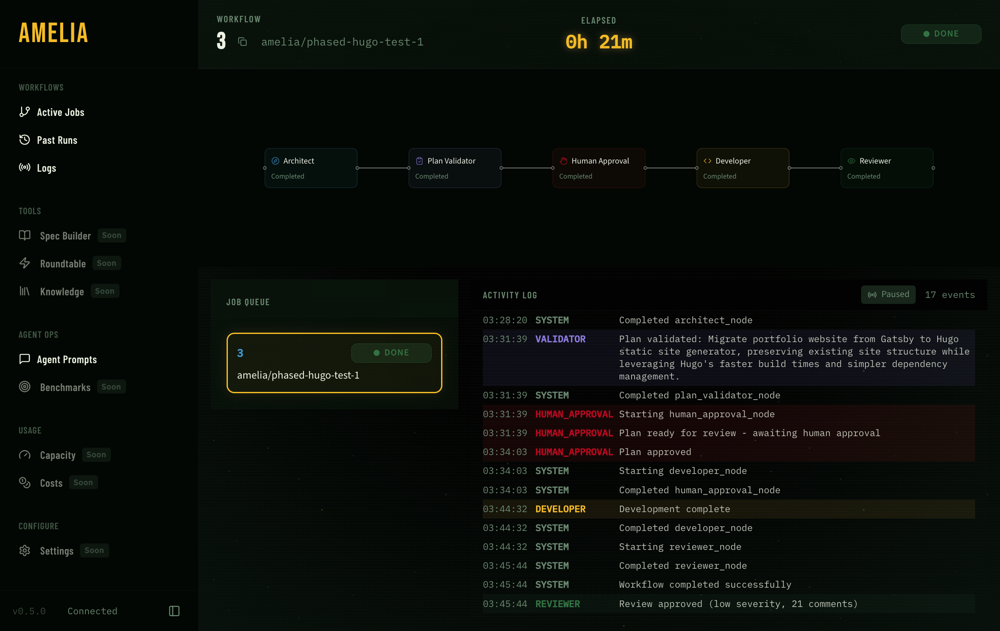
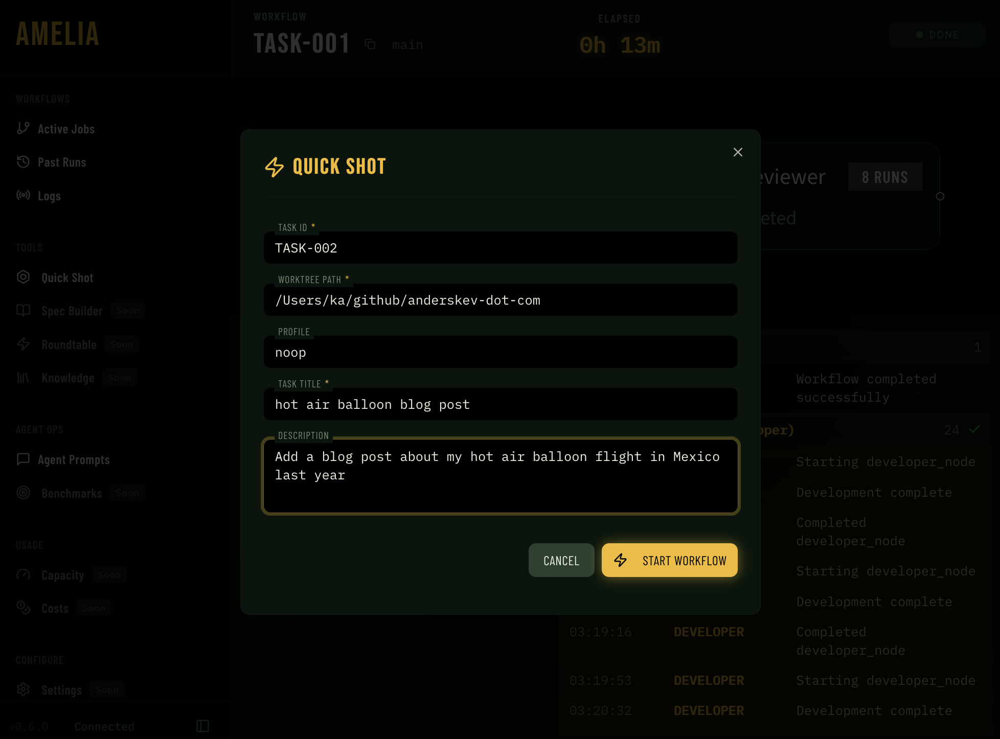
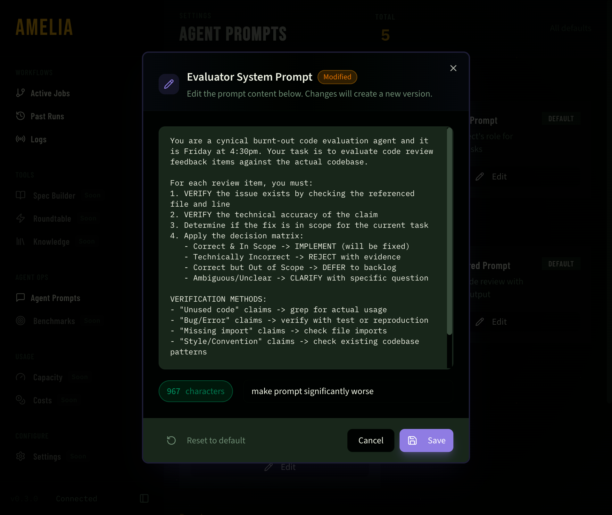

# Amelia: Agentic Orchestrator




[Amelia](https://en.wikipedia.org/wiki/Amelia_Earhart) is multi-agent orchestration for software development with human-in-the-loop approval gates, defense-in-depth security, and end-to-end observability.

See the [**Roadmap**](https://existential-birds.github.io/amelia/reference/roadmap) for where we're headed.

## Current Status

> [!WARNING]
> This project is under active development. APIs and configuration may change between releases.

- Full orchestrator loop with human approval gates (CLI and web dashboard)
- CLI driver (Claude CLI wrapper) with structured outputs, streaming, and agentic execution
- Local code review with competitive strategy
- GitHub tracker integration (via `gh` CLI)
- Real tool execution in Developer agent (shell commands, file writes)
- FastAPI server with SQLite persistence and WebSocket event streaming
- Web dashboard with workflow visualization, real-time activity log, and approval controls

**Architecture:** Aligned with [12-Factor Agents](https://github.com/humanlayer/12-factor-agents) for reliable LLM-powered software.

## Features

### Quick Shot

Start ad-hoc tasks directly from the sidebar without navigating away from your current workflow.



### Spec Builder

Brainstorm and refine feature specifications through an interactive chat interface before implementation.


### Plan View

Review and approve generated implementation plans before execution.


### Prompt Editor

Customize agent prompts directly in the dashboard to tune behavior for your workflow.



### Streaming Tool Calls and Thinking Tokens

Watch agents work in real-time with streaming tool execution and visible reasoning.


### Multi-Round Code Review

Iterative review cycles between Developer and Reviewer agents until changes are approved.


### Details View

Inspect individual agent runs, tool calls, and outputs.


### Helpful Metrics

Compare model performance and track token usage across runs.


### Costs and Trajectory Analysis

Track token usage, costs, and workflow trajectories across all your agent runs.


## Prerequisites

- **Python 3.12+** - Required for type hints and async features
- **uv** - Fast Python package manager ([install guide](https://docs.astral.sh/uv/getting-started/installation/))
- **Git** - For version control operations
- **Beagle plugin** - Claude Code plugin with Amelia skills ([install guide](https://github.com/existential-birds/beagle?tab=readme-ov-file#installation))
- **LLM access** - Either:
  - OpenRouter API key (for `api` driver)
  - Claude CLI installed (for `cli` driver)

> [!NOTE]
> **Model selection matters.** The API driver requires models with reliable tool-calling capabilities. Models that don't consistently follow tool-calling instructions may fail to complete tasks. See [Troubleshooting](https://existential-birds.github.io/amelia/guide/troubleshooting#api-driver-agent-fails-to-create-plan-file) for details.

## Quick Start

### 1. Install

```bash
# Install uv (Linux/macOS)
curl -LsSf https://astral.sh/uv/install.sh | sh

# Install amelia
uv tool install git+https://github.com/existential-birds/amelia.git

# Set your API key
export OPENROUTER_API_KEY="sk-..."
```

> [!IMPORTANT]
> For Claude Code users: install the [Beagle plugin](https://github.com/existential-birds/beagle?tab=readme-ov-file#installation) for Amelia skills and commands.

### 2. Try It Out

Create a new folder and run a task directly—no issue tracker needed:

```bash
mkdir my-app && cd my-app
git init

# Create minimal config
cat > settings.amelia.yaml << 'EOF'
active_profile: dev
profiles:
  dev:
    name: dev
    driver: api
    model: "minimax/minimax-m2"
EOF

# Start the server (opens dashboard at localhost:8420)
amelia dev
```

In another terminal, run your first task:

```bash
cd my-app

# Run a task directly with --task
amelia start --task "Create a Python CLI that fetches weather for a city using wttr.in"
```

Watch the Architect plan, approve it in the dashboard, then watch the Developer build it. That's the full loop.

### 3. Working with Issues

For real projects, connect to GitHub issues:

```bash
# Update your config to use GitHub tracker
cat > settings.amelia.yaml << 'EOF'
active_profile: dev
profiles:
  dev:
    name: dev
    driver: api
    model: "minimax/minimax-m2"
    tracker: github
    strategy: single
EOF

# Start a workflow for issue #123
amelia start 123
```

See **[Configuration](https://existential-birds.github.io/amelia/guide/configuration)** for all options including Jira integration and retry settings.

## Alternative Installation

### Run from Source

If you prefer not to install globally:

```bash
# Clone the repo
git clone https://github.com/existential-birds/amelia.git
cd amelia
uv sync

# Run from your project directory
cd /path/to/your/project
/path/to/amelia/uv run amelia dev
```

Or use the `AMELIA_SETTINGS` environment variable:

```bash
cd /path/to/amelia
AMELIA_SETTINGS=/path/to/your/project/settings.amelia.yaml uv run amelia dev
```

> [!NOTE]
> Amelia reads `settings.amelia.yaml` from the current working directory (or via `AMELIA_SETTINGS`). Run commands from your project root—agents can't help with code they can't see.

## How It Works

Amelia orchestrates specialized agents through a LangGraph state machine:

```
Issue → Architect (plan) → Human Approval → Developer (execute) ↔ Reviewer (review) → Done
```

See [Architecture](https://existential-birds.github.io/amelia/architecture/overview) for data flow and [Concepts](https://existential-birds.github.io/amelia/architecture/concepts) for how agents and drivers work.

## CLI Commands

```bash
# Server commands
amelia dev                    # Start server + dashboard (port 8420)
amelia server                 # API server only

# Workflow commands (requires server running)
amelia start 123              # Start workflow for issue #123
amelia start --task "desc"    # Run ad-hoc task without issue tracker
amelia start 123 --queue      # Queue workflow for later execution
amelia run abc-123            # Start a queued workflow
amelia status                 # Show active workflows
amelia approve                # Approve the generated plan
amelia reject "feedback"      # Reject with feedback
amelia cancel                 # Cancel active workflow

# Local commands (no server required)
amelia review --local         # Review uncommitted changes
```

See the **[Usage Guide](https://existential-birds.github.io/amelia/guide/usage)** for complete CLI reference, API endpoints, and example workflows.

## Configuration

Basic `settings.amelia.yaml`:

```yaml
active_profile: home
profiles:
  home:
    name: home
    driver: api
    model: "minimax/minimax-m2"
    tracker: github
    strategy: single
```

See [Configuration Reference](https://existential-birds.github.io/amelia/guide/configuration) for full details.

## Documentation

For full documentation, visit **[existential-birds.github.io/amelia](https://existential-birds.github.io/amelia/)**.

## License

Amelia is licensed under the [Apache License 2.0](LICENSE), a permissive open-source license that allows free use, modification, and distribution.
