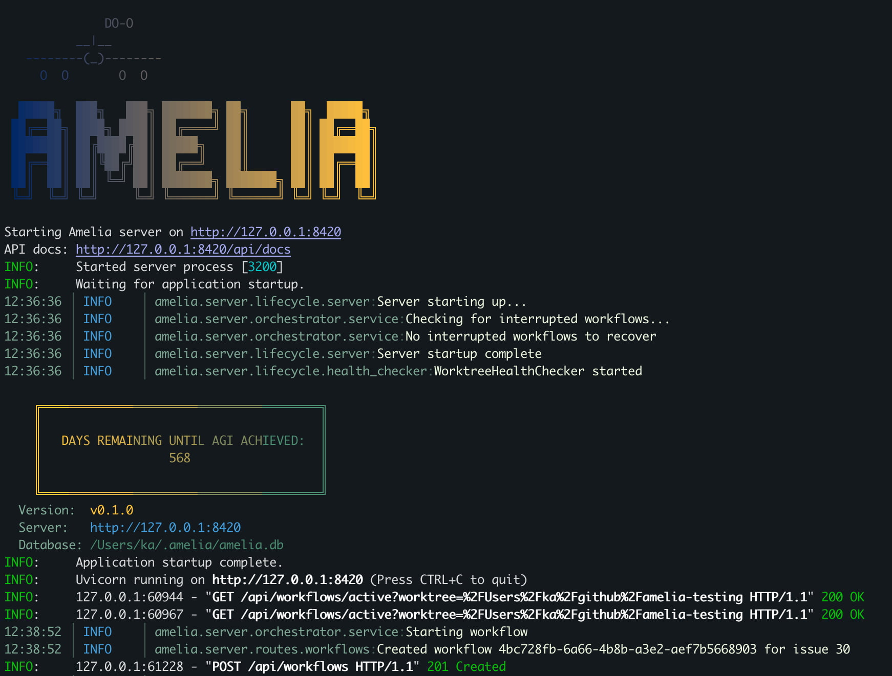
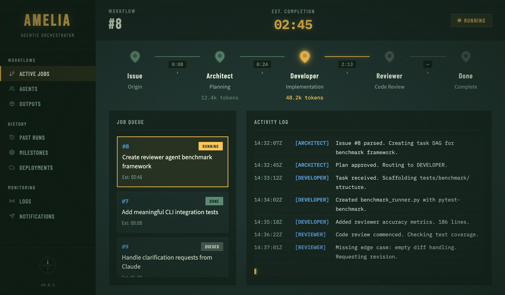

# Amelia: Agentic Orchestrator

[Amelia](https://en.wikipedia.org/wiki/Amelia_Earhart) is a local agentic coding system that orchestrates software development tasks through multiple AI agents with specialized roles.

## What is Amelia?

Amelia automates development workflows (issue analysis, planning, coding, review) while respecting enterprise constraints. It uses **agentic orchestration** - multiple AI agents coordinate to accomplish complex tasks.

**Core Philosophy:** Amelia is built with the assumption that LLMs will continually improve. We prefer prompts over code, delegation over hardcoding, and flexible architectures—so as models get smarter, Amelia automatically gets better without requiring changes.

```
Issue → Architect (plan) → Human Approval → Developer (execute) ↔ Reviewer (review) → Done
```





## Prerequisites

- **Python 3.12+** - Required for type hints and async features
- **uv** - Fast Python package manager ([install guide](https://docs.astral.sh/uv/getting-started/installation/))
- **Git** - For version control operations
- **LLM access** - Either:
  - OpenAI API key (for `api:openai` driver)
  - Claude CLI installed (for `cli:claude` driver)

## Quick Start

```bash
# Install uv (Linux/macOS)
curl -LsSf https://astral.sh/uv/install.sh | sh

# Clone and install
git clone https://github.com/anderskev/amelia.git
cd amelia
uv sync

# Set your API key (for api:openai driver)
export OPENAI_API_KEY="sk-..."

# Create minimal config
cat > settings.amelia.yaml << 'EOF'
active_profile: dev
profiles:
  dev:
    name: dev
    driver: api:openai
    tracker: noop
    strategy: single
EOF

# Test with a dry run
uv run amelia plan-only TEST-001
```

> **Note:** The `tracker: noop` configuration above uses a mock issue tracker for testing. If you configure `tracker: github` or `tracker: jira`, you must have an issue matching the ID (e.g., `TEST-001`) in your configured tracker.

## How It Works

### Agent Roles

| Agent | Input | Output | Example |
|-------|-------|--------|---------|
| **Architect** | Issue description + codebase context | TaskDAG (ordered tasks with dependencies) | "Add login feature" → 5 tasks: create model, add routes, write tests... |
| **Developer** | Single task from TaskDAG | Code changes via shell/git tools | Executes `git checkout -b`, writes files, runs tests |
| **Reviewer** | Git diff of changes | Approval or rejection with feedback | "Missing input validation in login handler" |

### Why Drivers?

Enterprise environments often prohibit direct API calls to external LLMs. The driver abstraction lets you:

- **`api:openai`** - Direct API calls via pydantic-ai (fastest, requires API key)
- **`cli:claude`** - Wraps Claude CLI (works with enterprise SSO, no API key needed)

Switch drivers without code changes:

```yaml
profiles:
  work:
    driver: cli:claude  # Uses approved enterprise CLI
  home:
    driver: api:openai  # Direct API access
```

## CLI Commands

### `amelia start <ISSUE_ID> [--profile <NAME>]`

Runs the full orchestrator loop:
1. Fetches issue from configured tracker
2. Architect generates TaskDAG (list of tasks with dependencies)
3. Prompts for human approval
4. Developer executes tasks (can run in parallel if no dependencies)
5. Reviewer evaluates changes
6. Loops back to Developer if reviewer disapproves

```bash
amelia start PROJ-123 --profile work
```

### `amelia review --local [--profile <NAME>]`

Reviews uncommitted changes:
1. Gets uncommitted changes via `git diff`
2. Runs Reviewer agent directly
3. Supports `single` (one review) or `competitive` (parallel Security/Performance/Usability reviews, aggregated)

```bash
amelia review --local
```

### `amelia plan-only <ISSUE_ID> [--profile <NAME>] [--design <PATH>]`

Generates plan without execution:
1. Fetches issue and runs Architect
2. Optionally uses a design document from brainstorming
3. Saves TaskDAG to markdown file
4. Useful for reviewing plans before execution

```bash
amelia plan-only GH-789 --profile home
amelia plan-only GH-789 --design docs/designs/feature.md
```

## Claude Code Commands

When working on this project with [Claude Code](https://claude.ai/code), the following slash commands are available:

| Command | Description |
|---------|-------------|
| `/amelia:commit-push` | Commit and push all local changes to remote |
| `/amelia:create-pr` | Create a PR with standardized description template |
| `/amelia:update-pr-desc` | Update existing PR description after additional changes |
| `/amelia:review` | Launch a code review agent for the current PR |
| `/amelia:review-tests` | Review test code for quality and conciseness |
| `/amelia:ensure-doc` | Ensure all code is properly documented |
| `/amelia:gen-test-plan` | Generate manual test plan for PR |
| `/amelia:run-test-plan <path>` | Execute a manual test plan in an isolated worktree |
| `/amelia:greptile-review` | Fetch and evaluate greptile-apps review comments |
| `/amelia:eval-feedback <feedback>` | Evaluate code review feedback from another session |
| `/amelia:respond-review` | Respond to greptile review comments after evaluation |

## Claude Code Skills

The following skills are available in `.claude/skills/amelia/` to help Claude Code understand project-specific patterns and libraries:

### Frontend Skills

| Skill | Triggers | Description |
|-------|----------|-------------|
| **tailwind-v4** | `@theme`, `oklch`, `--color-` | Tailwind CSS v4 with CSS-first configuration, OKLCH colors, dark mode |
| **shadcn-ui** | `shadcn`, `cva`, `cn()`, `data-slot` | shadcn/ui component patterns, CVA variants, Radix primitives |
| **react-router-v7** | `loader`, `action`, `NavLink` | React Router v7 data loading, actions, navigation patterns |
| **zustand-state** | `zustand`, `create`, `persist` | Zustand state management, middleware, TypeScript patterns |
| **react-flow** | `ReactFlow`, `Handle`, `NodeProps` | React Flow workflow visualization, custom nodes/edges |
| **ai-elements** | `Queue`, `Tool`, `Confirmation` | Vercel AI Elements for chat UI, tool execution, workflows |

### Backend Skills

| Skill | Triggers | Description |
|-------|----------|-------------|
| **vercel-ai-sdk** | `useChat`, `streamText`, `UIMessage` | Vercel AI SDK for streaming chat, tool calls, message handling |
| **docling** | `DocumentConverter`, `HierarchicalChunker` | Document parsing (PDF, DOCX), chunking for RAG pipelines |
| **langgraph-graphs** | `StateGraph`, `add_node`, `add_edge` | LangGraph state machine patterns, nodes, edges, conditional routing |
| **langgraph-persistence** | `AsyncSqliteSaver`, `interrupt_before`, `GraphInterrupt` | LangGraph checkpointing, human-in-loop, interrupts, streaming |
| **pydantic-ai-agents** | `pydantic_ai`, `Agent`, `RunContext`, `@agent.tool` | Pydantic AI agent patterns, tools, dependencies, structured outputs |
| **sqlite-vec** | `vec0`, `MATCH`, `vec_distance` | Vector similarity search in SQLite, KNN queries, embeddings |

### Testing Skills

| Skill | Triggers | Description |
|-------|----------|-------------|
| **vitest-testing** | `vitest`, `vi.mock`, `describe` | Vitest patterns, mocking, configuration, test utilities |

## Configuration

Basic `settings.amelia.yaml`:

```yaml
active_profile: home
profiles:
  home:
    name: home
    driver: api:openai
    tracker: github
    strategy: single
```

See [Configuration Reference](docs/configuration.md) for full details.

## Troubleshooting

### "No module named 'amelia'"
Run `uv sync` to install dependencies.

### "Invalid API key"
Set `OPENAI_API_KEY` environment variable or use `cli:claude` driver.

### "Issue not found"
Check your tracker configuration. Use `tracker: noop` for testing without a real issue tracker.

### Pre-push hook failing
Run checks manually to see detailed errors:
```bash
uv run ruff check amelia tests
uv run mypy amelia
uv run pytest
```

## Learn More

- [Roadmap](docs/roadmap.md) - Detailed development phases and vision
- [Concepts: Understanding Agentic AI](docs/concepts.md) - How agents, drivers, and orchestration work
- [Architecture & Data Flow](docs/architecture.md) - Technical deep dive with diagrams
- [Configuration Reference](docs/configuration.md) - Full settings documentation
- [Benchmarking LLM Agents](docs/benchmarking.md) - How to systematically evaluate and iterate on agents
- [12-Factor Agents Compliance](docs/analysis/12-factor-agents-compliance.md) - How Amelia aligns with the 12-Factor Agents methodology
- [Brainstorming](docs/brainstorming/) - Design explorations created using the superpowers:brainstorming skill

> **Note:** `docs/plans/` contains temporary planning documents for in-progress work. These should be deleted once their corresponding plans are executed and merged.

## Current Status

**What works:**
- Full orchestrator loop with human approval gates
- API driver (OpenAI via pydantic-ai) with structured outputs
- CLI driver (Claude CLI wrapper) with structured outputs
- Local code review with competitive strategy
- Jira and GitHub tracker integrations
- Real tool execution in Developer agent
- FastAPI server with SQLite persistence
- Workflow state machine with event tracking

**Limitations/Coming Soon:**
- TaskDAG doesn't validate cyclic dependencies

## Roadmap

> **Vision:** Complete end-to-end workflow control without ever opening GitHub, Jira, or any tracker web UI—with agents that maintain context across sessions and verify their own work.

See [**docs/roadmap.md**](docs/roadmap.md) for the full roadmap with implementation details.

| Phase | Focus | Status |
|-------|-------|--------|
| 1 | Core Orchestration | ✅ Complete |
| 2 | Web Dashboard | 🔄 In Progress |
| 3 | Session Continuity | Planned |
| 4 | Verification Framework | Planned |
| 5 | Bidirectional Tracker Sync | Planned |
| 6 | Pull Request Lifecycle | Planned |
| 7 | Quality Gates | Planned |
| 8 | Parallel Execution | Planned |
| 9 | Chat Integration | Planned |
| 10 | Continuous Improvement | Planned |
| 11 | Spec Builder | Planned |
| 12 | Debate Mode | Planned |
