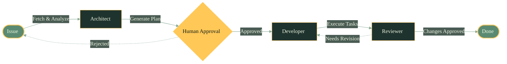

# Amelia Orchestrator Flow - Mermaid Example

Demonstrates the core orchestrator pattern with human-in-the-loop gate using Mermaid flowchart.

## Orchestrator Flow Diagram

## Pattern Explanation

This diagram shows the core Amelia orchestrator flow:

1. **Issue**: Entry point for the workflow
2. **Architect**: Analyzes the issue and generates an execution plan
3. **Human Approval** (Gate): Human-in-the-loop decision point
   - If approved, proceeds to Developer
   - If rejected, loops back to Issue for refinement
4. **Developer**: Executes tasks from the plan
5. **Reviewer**: Reviews the changes
   - If approved, marks as Done
   - If revision needed, loops back to Developer
6. **Done**: Terminal state indicating successful completion

The diamond shape for "Human Approval" emphasizes the gate pattern where human oversight is required before proceeding with automated execution.
