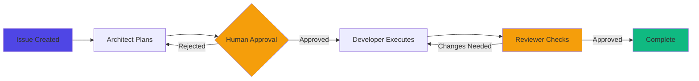

---
# Path is relative to the deck file location
# Adjust based on where your slides.md file is located relative to the theme
theme: ./themes/slidev
title: Amelia Design System Demo
info: Demonstration of all Amelia presentation layouts
colorSchema: both
highlighter: shiki
drawings:
  persist: false
transition: slide-left
mdc: true
---

# Amelia Design System

A complete demonstration of all presentation layouts

<div class="absolute bottom-10">
  <span class="font-700">
    Engineering Excellence through Design
  </span>
</div>

---
layout: section
---

# Extended Layouts
Six fundamental layout patterns

---
layout: default
---

# Default Layout

The default layout provides a clean, focused presentation of content with standard heading and body text support.

## Key Features

- Clear hierarchy with H1 and H2 headings
- Optimal line length for readability
- Supports lists, code blocks, and rich content
- Works in both light and dark modes

### Example Use Cases

1. **Documentation** - Present technical specifications
2. **Explanations** - Break down complex concepts
3. **Instructions** - Step-by-step guides

---
layout: two-cols
---

# Two Column Layout

Split content into two equal columns for side-by-side comparisons or parallel information.

## Left Column

- Perfect for comparisons
- Before/after scenarios
- Pros and cons lists
- Feature matrices

::right::

## Right Column

```python
# Code examples work great
async def process_task(task: Task):
    """Process a single task."""
    result = await execute(task)
    await validate(result)
    return result
```

**Benefits:**
- Visual balance
- Easy scanning
- Natural grouping

---
layout: diagram
---

# Diagram Layout



Diagrams are optimized for visual clarity with ample spacing and centered alignment.

---
layout: quote
---

# "Design systems are not a project. They're a product serving products."

Nathan Curtis, Founder of EightShapes

---
layout: section
class: light
---

# Custom Layouts
Nine specialized patterns for strategic communication

---
layout: action
title: Next Quarter Roadmap
objective: Ship core features and improve developer experience
---

## Q1 20XX Deliverables

::actions::

- Implement streaming dashboard output
- Complete design system integration
- Add multi-model support
- Enhance error recovery
- Launch metrics dashboard

::timeline::

**Launch Date:** [Target Date]

**Owner:** Engineering Team

---
layout: scqa
situation: Our developers spend 2-3 hours daily on repetitive code reviews
complication: Manual reviews miss edge cases and don't scale with team growth
question: How can we maintain code quality while reducing review time?
---

# AI-Powered Code Review

::answer::

Implement Amelia's automated reviewer agent to handle initial code quality checks.

**Key Benefits:**
- 80% reduction in review time
- Consistent quality standards
- Catches common issues automatically
- Frees senior developers for architectural review

::evidence::

```python
# Automatic detection of issues
async def review_code(changes: CodeChanges) -> Review:
    issues = await detect_issues(changes)
    suggestions = await generate_fixes(issues)
    return Review(issues=issues, suggestions=suggestions)
```

**Pilot Results:** 3 teams, 6 weeks, 156 PRs reviewed automatically

---
layout: summary
---

# Design System Summary

::problem::

**Challenge:** Inconsistent presentation quality across 40+ engineering decks

::solution::

**Amelia Design System:** Unified Slidev theme with 15 specialized layouts

::impact::

- **80% faster** deck creation
- **100% brand consistency**
- **Zero design time** for engineers

---
layout: data
headline: 10,000+
subheadline: Lines of code reviewed automatically
---

## Performance Metrics

| Metric | Before | After | Improvement |
|--------|--------|-------|-------------|
| Review Time | 2.5h | 0.5h | 80% faster |
| Issues Caught | 12/sprint | 34/sprint | 183% more |
| Developer Satisfaction | 6.2/10 | 8.9/10 | 44% better |

```typescript
// Agent performance tracking
interface ReviewMetrics {
  linesReviewed: number;
  issuesFound: number;
  timeSpent: number;
  accuracy: number;
}
```

---
layout: ghost
---

# The Ghost Layout

For moments that need dramatic emphasis and minimal distraction.

Perfect for quotes, key messages, or transition moments.

---
layout: pyramid
title: Implementation Priorities
---

::top::
### Critical Path
Core orchestration engine

::middle-left::
### High Priority
Streaming dashboard

::middle-right::
### High Priority
Error recovery

::bottom-left::
### Medium Priority
Metrics tracking

::bottom-center::
### Medium Priority
UI polish

::bottom-right::
### Medium Priority
Documentation

---
layout: comparison
option1: Manual Code Review
option2: Amelia Automated Review
---

::option1-pros::
- Deep contextual understanding
- Mentoring opportunity
- Architectural guidance

::option1-cons::
- 2-3 hours per review
- Inconsistent coverage
- Reviewer burnout
- Doesn't scale

::option2-pros::
- <1 hour review time
- 100% coverage of every PR
- Consistent standards
- Scales infinitely
- Learns from feedback

::option2-cons::
- Requires initial setup
- May miss nuanced context

---
layout: takeaway
---

# Key Takeaways

1. **15 specialized layouts** cover every presentation scenario
2. **Dark mode first** with optional light mode support
3. **Component library** for advanced visualizations
4. **Zero configuration** for standard use cases
5. **Full customization** when you need it

**Next Steps:** Copy this demo, modify for your content, present with confidence

---
layout: harvey
title: Project Health Dashboard
---

::metric-1::
**Code Quality**
<HarveyBall percentage="90" color="green" />
90% test coverage

::metric-2::
**Performance**
<HarveyBall percentage="75" color="yellow" />
API response < 200ms

::metric-3::
**Documentation**
<HarveyBall percentage="60" color="yellow" />
Core APIs documented

::metric-4::
**Security**
<HarveyBall percentage="95" color="green" />
Zero critical CVEs

::metric-5::
**Team Velocity**
<HarveyBall percentage="40" color="red" />
12 story points/sprint

::metric-6::
**User Satisfaction**
<HarveyBall percentage="85" color="green" />
4.2/5 average rating

---
layout: cover
class: light
---

# Thank You

Questions? Feedback? Contributions?

<div class="absolute bottom-10">
  <div class="text-sm opacity-75">
    [Your GitHub URL] • [Your Docs URL]
  </div>
</div>
