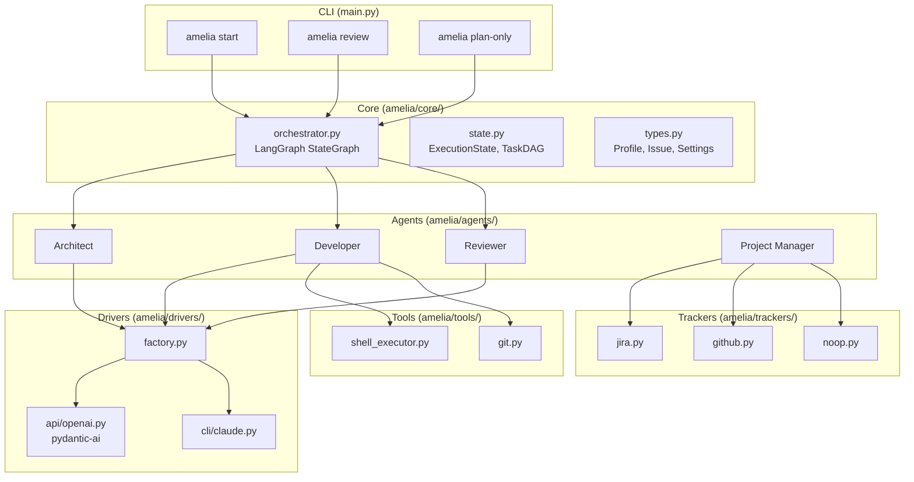
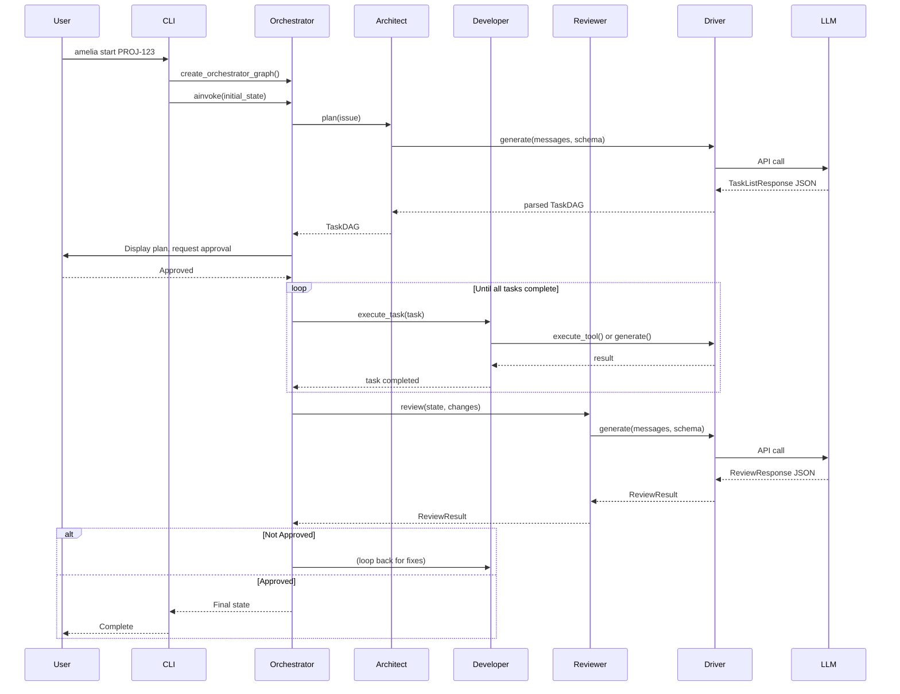

# Architecture & Data Flow

This document provides a technical deep dive into Amelia's architecture, component interactions, and data flow.

## System Overview



## Component Breakdown

### Core Layer (`amelia/core/`)

| File | Purpose |
|------|---------|
| `orchestrator.py` | LangGraph state machine, defines nodes (agent calls) and edges (transitions), conditional routing |
| `state.py` | Pydantic models: `ExecutionState`, `Task`, `TaskDAG`, `ReviewResult`, `AgentMessage` |
| `types.py` | Shared types: `Profile`, `Issue`, `Settings` |

### Agents Layer (`amelia/agents/`)

| File | Purpose |
|------|---------|
| `architect.py` | Generates TaskDAG from Issue using structured LLM output |
| `developer.py` | Executes tasks (shell commands, file writes, LLM generation) |
| `reviewer.py` | Reviews code with single or competitive strategy |
| `project_manager.py` | Creates appropriate tracker, fetches issues |

### Drivers Layer (`amelia/drivers/`)

| File | Purpose |
|------|---------|
| `base.py` | `DriverInterface` protocol definition |
| `factory.py` | `DriverFactory.get_driver(key)` - returns driver from string like "api:openai" |
| `api/openai.py` | OpenAI implementation using pydantic-ai for structured outputs |
| `cli/claude.py` | Claude CLI wrapper (currently stub for LLM, real tool execution) |

### Trackers Layer (`amelia/trackers/`)

| File | Purpose |
|------|---------|
| `base.py` | `BaseTracker` protocol |
| `jira.py` | Jira integration via HTTPX |
| `github.py` | GitHub integration |
| `noop.py` | No-op for testing |

### Tools Layer (`amelia/tools/`)

| File | Purpose |
|------|---------|
| `git.py` | `get_git_diff()` for local changes |
| `shell_executor.py` | Shell command execution |

## Data Flow: `amelia start PROJ-123`

Step-by-step trace through the system:

### 1. CLI Parsing (`main.py:start`)

```python
# Load settings.amelia.yaml
settings = load_settings()

# Get active profile or use --profile flag
profile = settings.profiles[profile_name or settings.active_profile]

# Validate profile has required fields
validate_profile(profile)
```

### 2. Issue Fetching

```python
# Create tracker based on profile
project_manager = create_project_manager(profile)

# Fetch issue details
issue = await project_manager.get_issue("PROJ-123")
# Returns: Issue(id="PROJ-123", title="...", description="...")
```

### 3. Initialize State

```python
# Create initial execution state
initial_state = ExecutionState(
    profile=profile,
    issue=issue
)

# Create LangGraph app
app = create_orchestrator_graph()
```

### 4. Orchestrator Loop

```python
# Run the state machine
final_state = await app.ainvoke(initial_state)
```

#### Node: `architect_node`

```python
# Get driver for LLM communication
driver = DriverFactory.get_driver(profile.driver)

# Generate plan with structured output
architect = Architect(driver)
task_dag = await architect.plan(issue)
# LLM called with TaskListResponse schema
# Returns: TaskDAG with tasks and dependencies

# Update state
state.plan = task_dag
```

#### Node: `human_approval_node`

```python
# Display plan to user via typer
display_plan(state.plan)

# Prompt for approval
approved = typer.confirm("Approve this plan?")

# If rejected → END
# If approved → continue to developer
state.human_approved = approved
```

#### Node: `developer_node` (may loop)

```python
# Find tasks with met dependencies
ready_tasks = get_ready_tasks(state.plan)

# Execute tasks concurrently
results = await asyncio.gather(*[
    developer.execute_task(task)
    for task in ready_tasks
])

# Update task statuses: pending → in_progress → completed/failed
for task, result in zip(ready_tasks, results):
    task.status = "completed" if result.success else "failed"

# If pending tasks remain → loop back to developer_node
# If all complete → proceed to reviewer_node
```

#### Node: `reviewer_node`

```python
# Get code changes
code_changes = state.code_changes_for_review or get_git_diff("HEAD")

# Run review based on strategy
reviewer = Reviewer(driver)
review_result = await reviewer.review(state, code_changes)

# If strategy == "competitive": parallel reviews, aggregated
# Returns: ReviewResult(approved, comments, severity)

# If not approved → back to developer_node
# If approved → END
state.review_results.append(review_result)
```

### 5. Completion

```python
# Final state contains:
# - All messages exchanged
# - Review results
# - Final task statuses
# Process exits with appropriate code
```

## Sequence Diagram



## Key Types

### Profile

```python
class Profile(BaseModel):
    name: str
    driver: str                                    # "api:openai" or "cli:claude"
    tracker: str                                   # "jira", "github", or "noop"
    strategy: str                                  # "single" or "competitive"
    plan_output_template: str = "plans/{issue_id}.md"
```

### Issue

```python
class Issue(BaseModel):
    id: str
    title: str
    description: str
```

### Task

```python
class Task(BaseModel):
    id: str
    description: str
    status: TaskStatus        # "pending" | "in_progress" | "completed" | "failed"
    dependencies: List[str]   # IDs of tasks that must complete first
    files_changed: List[str]
```

### ExecutionState

```python
class ExecutionState(BaseModel):
    profile: Profile
    issue: Optional[Issue]
    plan: Optional[TaskDAG]
    current_task_id: Optional[str]
    human_approved: Optional[bool]
    review_results: List[ReviewResult]
    messages: List[AgentMessage]
    code_changes_for_review: Optional[str]
```

## Orchestrator Nodes

The LangGraph state machine consists of these nodes:

| Node | Function | Next |
|------|----------|------|
| `architect_node` | Calls `Architect.plan()` | `human_approval_node` |
| `human_approval_node` | Prompts user via typer | Developer (approved) or END (rejected) |
| `developer_node` | Calls `Developer.execute_task()` for ready tasks | Loop (pending tasks) or `reviewer_node` (all complete) |
| `reviewer_node` | Calls `Reviewer.review()` | `developer_node` (not approved) or END (approved) |

## Conditional Edges

```python
# From human_approval_node
def route_after_approval(state):
    if state.human_approved:
        return "developer_node"
    return END

# From developer_node
def route_after_developer(state):
    if has_pending_tasks(state.plan):
        return "developer_node"  # Loop
    return "reviewer_node"

# From reviewer_node
def route_after_review(state):
    if state.review_results[-1].approved:
        return END
    return "developer_node"  # Fix issues
```

## Key Design Decisions

### Why the Driver Abstraction?

Enterprise environments often prohibit direct API calls due to data retention policies. The CLI driver wraps existing approved tools (like `claude` CLI) that inherit SSO authentication and comply with policies. Users can switch between API (fast prototyping) and CLI (enterprise compliance) without code changes.

### Why Separate Agents Instead of One Big Prompt?

1. **Specialization**: Each agent has focused system prompts, leading to better outputs
2. **Token efficiency**: Only relevant context is passed to each agent
3. **Modularity**: Easy to swap implementations (e.g., different review strategies)
4. **Debuggability**: Clear separation makes it easier to trace issues

### Why pydantic-ai for the API Driver?

1. **Structured outputs**: Forces LLM to return valid JSON matching Pydantic schemas
2. **Type safety**: Catches schema mismatches at runtime
3. **Cleaner code**: No manual JSON parsing or validation

### Why LangGraph for Orchestration?

1. **Built for cycles**: Supports developer ↔ reviewer loop naturally
2. **State management**: Built-in state tracking
3. **Checkpointing**: Resumable workflows (future feature)
4. **Conditional edges**: Clean decision logic

## File Structure Reference

```
amelia/
├── agents/
│   ├── architect.py      # Architect agent
│   ├── developer.py      # Developer agent
│   ├── project_manager.py # PM agent (tracker selection)
│   └── reviewer.py       # Reviewer agent
├── core/
│   ├── orchestrator.py   # LangGraph state machine
│   ├── state.py          # ExecutionState, TaskDAG, etc.
│   └── types.py          # Profile, Issue, Settings
├── drivers/
│   ├── api/
│   │   └── openai.py     # OpenAI via pydantic-ai
│   ├── cli/
│   │   └── claude.py     # Claude CLI wrapper
│   ├── base.py           # DriverInterface
│   └── factory.py        # DriverFactory
├── trackers/
│   ├── base.py           # BaseTracker protocol
│   ├── github.py
│   ├── jira.py
│   └── noop.py
├── tools/
│   ├── git.py            # get_git_diff()
│   └── shell_executor.py
├── config.py             # load_settings(), validate_profile()
└── main.py               # Typer CLI app
```
