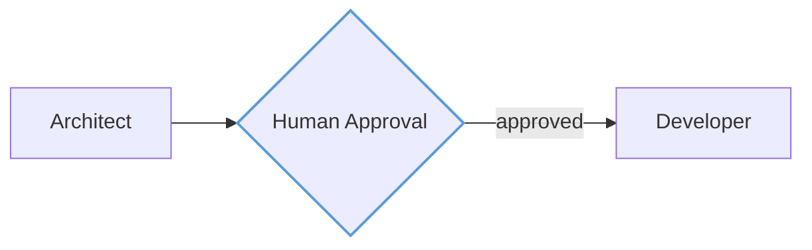

# Amelia Design System

> Design specification for a unified design system spanning web dashboard, technical diagrams, documentation, and presentations.

## Overview

The Amelia Design System is built on the **aviation cockpit aesthetic** - the visual language of flight instruments, navigation charts, and control panels. This reflects what Amelia does: orchestrating complex autonomous operations with precision, status awareness, and clarity under pressure.

### Goals

- **Visual consistency** - Everything looks like "Amelia" regardless of medium
- **Speed of creation** - Fast to produce diagrams and slides without design decisions each time
- **External presentation** - Polished materials for stakeholders, demos, or open-source marketing
- **Developer documentation** - Technical docs and architecture diagrams

### Tooling

| Purpose | Tool | Theme Support |
|---------|------|---------------|
| Web dashboard | React + Tailwind v4 + shadcn/ui | Native CSS variables |
| Quick diagrams | Mermaid | JSON theme config |
| Polished diagrams | D2 | Custom .d2 theme files |
| Presentations | Slidev | Vue/CSS theme package |
| Documentation | VitePress | Vue/CSS theme |
| Icons | Lucide | Color tokens |

---

## Design Principles

1. **Instrument Clarity** - Information hierarchy is immediate. Status is visible at a glance. No ambiguity about what's running, blocked, or complete.

2. **Dark-First, Light-Ready** - The primary experience is dark (cockpit at night), but all elements must work on light backgrounds (printed charts, projector displays).

3. **Gold Signals Action** - Aviation gold (#FFC857) means "active" or "in progress." It draws attention without alarm. On light backgrounds, aviation blue takes this role.

4. **Typography Has Altitude** - Display text (Bebas Neue) is bold and commanding. Body text (Source Sans 3) is readable in any condition. Code (IBM Plex Mono) is precise.

5. **Motion With Purpose** - Animations exist to convey state (pulsing = running, beacon glow = attention needed). Never decorative motion.

6. **LLM-Native** - All assets can be described, generated, and modified through text. Themes are code. Diagrams are declarative. Slides are Markdown.

---

## Color System

The color system uses **OKLCH** for perceptual uniformity - colors maintain consistent apparent brightness across hues.

### Dark Mode (Primary)

| Token | OKLCH | Hex | Usage |
|-------|-------|-----|-------|
| `background` | oklch(8% 0.02 150) | #0D1A12 | Page background |
| `surface` | oklch(18% 0.025 150) | #1F332E | Cards, panels |
| `foreground` | oklch(95% 0.02 120) | #EFF8E2 | Primary text |
| `muted` | oklch(60% 0.05 150) | #88A896 | Secondary text |
| `primary` | oklch(82% 0.16 85) | #FFC857 | Actions, highlights |
| `accent` | oklch(65% 0.12 240) | #5B9BD5 | Links, interactive |
| `destructive` | oklch(50% 0.2 25) | #A33D2E | Errors, warnings |
| `border` | oklch(30% 0.02 150 / 20%) | — | Dividers, edges |

**Coolors palette:** https://coolors.co/0d1a12-1f332e-eff8e2-88a896-ffc857-5b9bd5-a33d2e

### Light Mode (Secondary)

| Token | OKLCH | Hex | Usage |
|-------|-------|-----|-------|
| `background` | oklch(96% 0.02 85) | #FDF8F0 | Warm cream paper |
| `surface` | oklch(99% 0.01 85) | #FFFDF9 | Cards, elevated |
| `foreground` | oklch(20% 0.04 150) | #1A2F23 | Forest green text |
| `muted` | oklch(45% 0.03 150) | #5C7263 | Secondary text |
| `primary` | oklch(45% 0.12 240) | #2E6B9C | Aviation blue (links) |
| `accent` | oklch(75% 0.14 85) | #E8B84A | Gold (decorative only) |
| `destructive` | oklch(45% 0.18 25) | #8B3224 | Errors |
| `border` | oklch(25% 0.03 150 / 15%) | — | Subtle dividers |

**Coolors palette:** https://coolors.co/fdf8f0-fffdf9-1a2f23-5c7263-2e6b9c-e8b84a-8b3224

### Status Colors

| Status | Dark | Light | Meaning |
|--------|------|-------|---------|
| `running` | Gold #FFC857 | Blue #2E6B9C | In progress |
| `thinking` | Gold #FFC857 (pulse) | Blue #2E6B9C (pulse) | Agent reasoning/RAG search |
| `streaming` | Gold #FFC857 (blink) | Blue #2E6B9C (blink) | Token generation |
| `completed` | Green #5B8A72 | Green #3D7A5A | Success |
| `pending` | Gray #4A5C54 | Gray #8A9A90 | Queued |
| `blocked` | Red #A33D2E | Red #8B3224 | Awaiting input |
| `interrupt` | Blue #5B9BD5 | Blue #2E6B9C | Human-in-the-loop gate |
| `failed` | Red #A33D2E | Red #8B3224 | Error |

**Status palettes:**
- Dark: https://coolors.co/ffc857-5b8a72-4a5c54-a33d2e-5b9bd5
- Light: https://coolors.co/2e6b9c-3d7a5a-8a9a90-8b3224

### Full Brand Palette

https://coolors.co/0d1a12-1f332e-ffc857-5b9bd5-5b8a72-a33d2e-eff8e2

---

## Animation

Animations convey state changes. Three named animations for dashboard use only (static diagrams use color alone).

| Name | Effect | Duration | Usage |
|------|--------|----------|-------|
| `pulse` | Opacity 1 → 0.6 → 1 | 2s ease-in-out infinite | `thinking` state |
| `beacon` | Box-shadow glow 0 → 8px → 0 | 1.5s ease-in-out infinite | Attention needed |
| `blink` | Opacity 1 → 0 → 1 | 0.8s steps(2) infinite | `streaming` cursor |

### CSS Implementation

```css
@keyframes pulse {
  0%, 100% { opacity: 1; }
  50% { opacity: 0.6; }
}

@keyframes beacon {
  0%, 100% { box-shadow: 0 0 0 0 var(--color-primary); }
  50% { box-shadow: 0 0 8px 2px var(--color-primary); }
}

@keyframes blink {
  0%, 100% { opacity: 1; }
  50% { opacity: 0; }
}
```

**Scope**: Dashboard (CSS) only. Mermaid and D2 diagrams are static and use color differentiation.

---

## Typography

Four font families, each with a distinct role. All are Google Fonts.

### Font Stack

| Role | Family | Weight(s) | Usage |
|------|--------|-----------|-------|
| **Display** | Bebas Neue | 400 | Logo wordmark, hero titles, slide headers |
| **Heading** | Barlow Condensed | 500, 600, 700 | Section headings, nav items, labels |
| **Body** | Source Sans 3 | 400, 600 | Paragraphs, UI text, documentation |
| **Mono** | IBM Plex Mono | 400, 500 | Code, terminal output, technical values |

### Type Scale

Base size: `16px` (1rem). Scale ratio: `1.25` (Major Third).

| Name | Size | Line Height | Usage |
|------|------|-------------|-------|
| `xs` | 0.75rem (12px) | 1.4 | Captions, timestamps |
| `sm` | 0.875rem (14px) | 1.5 | Secondary text, labels |
| `base` | 1rem (16px) | 1.6 | Body text |
| `lg` | 1.25rem (20px) | 1.5 | Lead paragraphs |
| `xl` | 1.563rem (25px) | 1.3 | H4, card titles |
| `2xl` | 1.953rem (31px) | 1.2 | H3 |
| `3xl` | 2.441rem (39px) | 1.15 | H2 |
| `4xl` | 3.052rem (49px) | 1.1 | H1, page titles |
| `5xl` | 3.815rem (61px) | 1.05 | Hero, display |

### Usage Guidelines

- **Display (Bebas Neue)**: Always uppercase. Use for "AMELIA" wordmark and major section headers in slides. Never for body text.
- **Heading (Barlow Condensed)**: Title case or uppercase. Its condensed width allows longer headings without wrapping.
- **Body (Source Sans 3)**: Sentence case. Highly legible at small sizes. Use 400 weight for reading, 600 for emphasis.
- **Mono (IBM Plex Mono)**: For all code, file paths, CLI commands, and technical identifiers.

---

## Logo & Wordmark

The Amelia logo is a **typographic wordmark** - the word "AMELIA" set in Bebas Neue.

### Primary Wordmark

- **Font**: Bebas Neue, 400 weight
- **Case**: Always uppercase
- **Tracking**: Default (0)

### Color Usage

| Context | Color | Token |
|---------|-------|-------|
| Dark backgrounds | Aviation Gold #FFC857 | `primary` |
| Light backgrounds | Forest Green #1F332E | `surface` (dark) |
| Monochrome dark | Off-white #EFF8E2 | `foreground` |
| Monochrome light | Forest Green #1A2F23 | `foreground` (light) |

### Clear Space

Minimum clear space around the wordmark: **height of the letter "A"** on all sides.

### Minimum Size

- **Digital**: 80px wide minimum
- **Print**: 20mm wide minimum

### Don'ts

- Don't use lowercase ("Amelia" or "amelia")
- Don't add a tagline attached to the wordmark
- Don't stretch, rotate, or apply effects
- Don't use gold on light backgrounds (contrast)
- Don't outline or stroke - always solid fill

---

## Iconography

Lucide icons are the standard across all Amelia properties.

### Icon Sizing

| Size | Pixels | Usage |
|------|--------|-------|
| `xs` | 14px | Inline with small text, badges |
| `sm` | 16px | Buttons, form fields, inline |
| `md` | 20px | Navigation, card headers |
| `lg` | 24px | Empty states, feature highlights |
| `xl` | 32px | Hero sections, onboarding |

### Stroke Weight

Lucide default stroke: **2px**. Maintain this across all sizes.

### Semantic Icons

| Concept | Lucide Name |
|---------|-------------|
| Architect agent | `compass` |
| Developer agent | `code` |
| Reviewer agent | `eye` |
| Workflow/Graph | `git-branch` |
| Task | `check-square` |
| Issue | `circle-dot` |
| Running | `play` |
| Completed | `check-circle` |
| Failed | `x-circle` |
| Blocked | `pause-circle` |
| Settings | `settings` |
| Terminal | `terminal` |

### Color Application

- **Default**: `muted` color
- **Interactive**: `foreground` on hover
- **Active/Selected**: `primary` (gold in dark, blue in light)
- **Destructive**: `destructive` for delete, errors
- **Status icons**: Use corresponding status color

---

## Component Patterns

### Cards

| Property | Dark Mode | Light Mode |
|----------|-----------|------------|
| Background | `surface` (#1F332E) | `surface` (#FFFDF9) |
| Border | `border` (20% opacity) | `border` (15% opacity) |
| Border radius | `radius-lg` (0.625rem) | Same |
| Shadow | None | Subtle (0 1px 3px rgba(0,0,0,0.08)) |

### Buttons

| Variant | Dark Mode | Light Mode |
|---------|-----------|------------|
| **Primary** | Gold bg, dark text | Blue bg, white text |
| **Secondary** | Surface bg, foreground text | Same |
| **Ghost** | Transparent, muted → foreground on hover | Same |
| **Destructive** | Red bg, white text | Same |

Border radius: `radius-md` (0.5rem). Height: 36px default, 32px small, 40px large.

### Badges / Status Pills

| Status | Background (Dark) | Text |
|--------|-------------------|------|
| Running | Gold/15% | Gold |
| Completed | Green/15% | Green |
| Pending | Muted/15% | Muted |
| Failed | Red/15% | Red |

### Spacing Scale

Based on 4px unit:

| Token | Value | Usage |
|-------|-------|-------|
| `space-1` | 4px | Tight gaps, icon padding |
| `space-2` | 8px | Related elements |
| `space-3` | 12px | Form field gaps |
| `space-4` | 16px | Card padding, section gaps |
| `space-6` | 24px | Card groups |
| `space-8` | 32px | Page sections |
| `space-12` | 48px | Major sections |

---

## Diagram Theming

### D2 Theme

**Dark Theme Colors:**

| Element | Color |
|---------|-------|
| Background | #0D1A12 |
| Node fill | #1F332E |
| Node stroke | #88A896 |
| Node text | #EFF8E2 |
| Edge stroke | #88A896 |
| Primary nodes | #FFC857 stroke |
| Accent nodes | #5B9BD5 stroke |

**Coolors:** https://coolors.co/0d1a12-1f332e-88a896-eff8e2-ffc857-5b9bd5

**Light Theme Colors:**

| Element | Color |
|---------|-------|
| Background | #FDF8F0 |
| Node fill | #FFFDF9 |
| Node stroke | #5C7263 |
| Node text | #1A2F23 |
| Primary nodes | #2E6B9C stroke |

**Coolors:** https://coolors.co/fdf8f0-fffdf9-5c7263-1a2f23-2e6b9c

### Mermaid Theme

**Dark Theme Variables:**

```
primaryColor: #1F332E
primaryTextColor: #EFF8E2
primaryBorderColor: #FFC857
secondaryColor: #4A5C54
tertiaryColor: #0D1A12
lineColor: #88A896
textColor: #EFF8E2
```

**Coolors:** https://coolors.co/0d1a12-1f332e-4a5c54-88a896-eff8e2-ffc857

**Light Theme Variables:**

```
primaryColor: #FFFDF9
primaryTextColor: #1A2F23
primaryBorderColor: #2E6B9C
secondaryColor: #F5F0E8
tertiaryColor: #FDF8F0
lineColor: #5C7263
textColor: #1A2F23
```

**Coolors:** https://coolors.co/fdf8f0-fffdf9-f5f0e8-5c7263-1a2f23-2e6b9c

### Diagram Typography

- **Node labels**: Source Sans 3
- **Code entities**: IBM Plex Mono
- **Titles**: Barlow Condensed

### Edge Styles

Edges convey different types of flow in orchestration diagrams.

| Flow Type | Style | Color | Usage |
|-----------|-------|-------|-------|
| Control flow | Solid (default) | `muted` (#88A896) | Agent-to-agent transitions |
| Data/Context | Dashed (2px dash, 4px gap) | `muted` (#88A896) | State data passing |
| Error/Interrupt | Dotted (2px dot, 2px gap) | `destructive` (#A33D2E) | Exception paths |

### Human-in-the-Loop Gate

Use a **diamond** node shape with `accent` stroke color to indicate mandatory human approval before proceeding.

**D2 Example:**

```d2
approval: {
  shape: diamond
  style.stroke: "#5B9BD5"
  style.fill: "#1F332E"
  style.font-color: "#EFF8E2"
}

architect -> approval: plan complete
approval -> developer: approved {
  style.stroke-dash: 0
}
```

**Mermaid Example:**



---

## Presentation Theme (Slidev)

### Theme Structure

```
slidev-theme-amelia/
├── package.json
├── styles/
│   ├── base.css
│   └── code.css
├── layouts/
│   ├── cover.vue
│   ├── section.vue
│   ├── default.vue
│   ├── two-cols.vue
│   ├── diagram.vue
│   └── quote.vue
└── components/
    ├── AmeliaLogo.vue
    └── StatusBadge.vue
```

### Slide Layouts

**Cover (Title Slide)**
- Background: `background` (#0D1A12)
- "AMELIA" wordmark top-left, gold, small
- Title: Bebas Neue, `5xl`, centered
- Subtitle: Source Sans 3, `lg`, muted

**Section (Divider)**
- Background: `surface` (#1F332E)
- Section number: Bebas Neue, gold, large
- Section title: Barlow Condensed, `3xl`

**Default (Content)**
- Title: Barlow Condensed, `2xl`, top
- Body: Source Sans 3, `lg`
- Bullets: Gold dash prefix

**Diagram**

- Full-bleed, no padding
- Caption: Small, muted, bottom-right

**DiffView (Code Comparison)**

- Two-column layout for "before/after" code demos
- Left column: "Before" code with `destructive/15%` (#A33D2E at 15% opacity) background for removed lines
- Right column: "After" code with `completed/15%` (#5B8A72 at 15% opacity) background for added lines
- Header: Barlow Condensed, `xl`, centered above columns
- Caption: Source Sans 3, `sm`, muted, centered below
- Code font: IBM Plex Mono

**Focus (Demo Spotlight)**

- Dims background to near-black (#050A07)
- Reduces non-active panel opacity to 0.3
- Active element remains at full brightness
- Usage: Live demos when explaining specific transitions

### Code Highlighting (Shiki)

| Token | Color |
|-------|-------|
| Keywords | Gold #FFC857 |
| Strings | Green #5B8A72 |
| Functions | Blue #5B9BD5 |
| Comments | Muted #88A896 |
| Variables | Foreground #EFF8E2 |

---

## Presentation Design Principles

The Slidev theme includes layouts designed for stakeholder-facing presentations. These emphasize clarity, structure, and data-driven storytelling using the Amelia color system.

> **Light mode recommended for presentations** - Use light mode for projectors, printed handouts, and executive audiences. Dark mode works well for developer conferences and technical demos.

### Design Philosophy

1. **Pyramid Principle** (Barbara Minto) — Start with the answer. Present the key takeaway first, then supporting arguments, then evidence. "Think bottom-up, present top-down."

2. **Action Titles** — Every slide title is a complete sentence stating the main insight. Titles alone should tell the complete story.

3. **One Message Per Slide** — Each slide communicates exactly one key point. The action title captures this message.

4. **SCQA Framework** — Structure narratives using Situation-Complication-Question-Answer for executive buy-in.

5. **Zelazny's Chart Rule** — "A chart is a sentence, not a picture of data." Every visualization states its conclusion explicitly.

---

### Presentation Color Usage

For presentations, use the **Amelia light mode** color tokens. These provide good contrast on projectors and in printed materials.

| Token (Light Mode) | Hex | Presentation Usage |
|-------------------|-----|-------------------|
| `background` | #FDF8F0 | Slide background |
| `surface` | #FFFDF9 | Panels, callout boxes |
| `foreground` | #1A2F23 | Titles, body text |
| `muted` | #5C7263 | Secondary text |
| `primary` | #2E6B9C | Links, highlights, key data |
| `accent` | #E8B84A | Decorative accents (sparingly) |
| `completed` | #3D7A5A | Positive data, growth |
| `destructive` | #8B3224 | Negative data, errors |

**Color Principles:**
- **Restrained base palette** — Most data series use muted gray (#5C7263)
- **Single highlight color** — Reserve `primary` (#2E6B9C) for "our recommendation," "target state," or the key data point
- **Color = meaning** — Never decorative; always functional

#### Color Budget Rule (Three-Color Rule)

Each slide should use a maximum of **three colors** for data visualization:

| Slot | Purpose | Default Color |
|------|---------|---------------|
| **Primary** | Key data point, "our company," recommendation | `primary` (#2E6B9C) |
| **Neutral** | All other data series, comparison items | `muted` (#5C7263) |
| **Directional** | Positive/negative change (when showing trends) | `completed` or `destructive` |

**Enforcement:**
- If you need more than 3 colors, the chart is too complex — split into multiple charts
- Background, text, and borders don't count toward the 3-color budget
- Exception: SCQA slides may use 4 colors (one per quadrant) for visual separation

---

### Presentation Typography

Uses the standard Amelia font stack:

| Role | Family | Weight | Usage |
|------|--------|--------|-------|
| **Action Title** | Barlow Condensed | 700 | Slide headlines (complete sentences) |
| **Subheading** | Barlow Condensed | 600 | Section labels, chart titles |
| **Body** | Source Sans 3 | 400, 600 | Paragraphs, bullets |
| **Data** | IBM Plex Mono | 400 | Numbers, percentages, KPIs |

**Action Title Rules:**
- Complete sentence (subject + verb + object)
- Maximum 2 lines or 15 words
- No colons, ellipses, or fragments
- Should be **debatable** — could someone disagree?
- Test: Cover the data; does the title still convey the insight?

**Examples:**
| Bad (Generic) | Good (Action Title) |
|---------------|---------------------|
| "Revenue Analysis" | "Three new markets drove 60% of revenue growth" |
| "Customer Satisfaction Results" | "NPS scores declined 15 points after the pricing change" |
| "Q3 Performance" | "Q3 exceeded targets despite supply chain disruptions" |

---

### Presentation Slide Grid

Three-zone layout with strict margins and alignment.

```
┌────────────────────────────────────────────────────────┐
│  ← 5% margin                              5% margin →  │
│  ┌──────────────────────────────────────────────────┐  │
│  │ ACTION TITLE ZONE (10% height)                   │  │
│  │ Complete sentence stating the key insight        │  │
│  ├──────────────────────────────────────────────────┤  │
│  │                                                  │  │
│  │                                                  │  │
│  │             BODY ZONE (78% height)               │  │
│  │       Charts, content, supporting evidence       │  │
│  │                                                  │  │
│  │                                                  │  │
│  ├──────────────────────────────────────────────────┤  │
│  │ FOOTER ZONE (5% height)                          │  │
│  │ Source: [citation]                    Slide 12   │  │
│  └──────────────────────────────────────────────────┘  │
│           ↑ 3% bottom margin                           │
└────────────────────────────────────────────────────────┘
```

**Spacing:**
- Margins: 5% horizontal, 3% vertical (approximates 1-inch at 1920×1080)
- Title zone: 10% of slide height
- Body zone: 78% of slide height
- Footer zone: 5% of slide height
- Internal gutters: 24px between elements

---

### Presentation Layouts

Extended layouts for stakeholder presentations:

```
layouts/
├── action.vue       # Standard action-title slide
├── scqa.vue         # SCQA framework (4-panel)
├── summary.vue      # Executive summary with recommendation
├── data.vue         # Full-bleed chart
├── ghost.vue        # Wireframe planning mode
├── pyramid.vue      # Pyramid principle diagram
├── comparison.vue   # Side-by-side analysis
├── takeaway.vue     # Key insight callout
├── waterfall.vue    # Bridge/waterfall chart
├── timeline.vue     # Horizontal timeline
├── layercake.vue    # Technology architecture stack
├── chevron.vue      # Sequential process flow
└── harvey.vue       # Qualitative comparison matrix
```

#### action (Default)

Standard slide with action title, body content, and source footer.

**Usage:**
```md
---
layout: action
title: "Customer churn increased 23% after removing the free tier"
source: "Internal analytics, Q3 2024"
---

<!-- Body content: charts, bullets, etc. -->
```

**Properties:**
- `title` (required): Action title as complete sentence
- `source`: Data source citation for footer
- `subtitle`: Optional 1-line elaboration below title

#### scqa

Four-panel SCQA framework for executive narratives.

**Usage:**
```md
---
layout: scqa
---

::situation::
For a decade, Acme Corp led the market with premium pricing and white-glove service.

::complication::
New entrants now offer 80% of features at 40% of price, capturing price-sensitive segments.

::question::
How should Acme defend market share while maintaining margins?

::answer::
Launch a fighter brand targeting the mid-market, preserving the premium tier for enterprise.
```

**Visual Structure:**
```
┌─────────────────┬─────────────────┐
│   SITUATION     │  COMPLICATION   │
│   (stable)      │  (change)       │
├─────────────────┼─────────────────┤
│   QUESTION      │     ANSWER      │
│   (problem)     │  (solution)     │
└─────────────────┴─────────────────┘
```

#### summary

Executive summary slide with recommendation box.

**Usage:**
```md
---
layout: summary
title: "Executive Summary"
recommendation: "Proceed with Option B: Acquire TechCo for $450M"
---

**Key Findings:**
- Market window closes in 18 months
- Build option requires 3 years, $600M
- TechCo valuation is 15% below peers

**Next Steps:**
1. Board approval by Dec 15
2. Due diligence kickoff Jan 3
3. Signing target: Feb 28
```

**Visual:** Recommendation displayed in highlighted callout box with `primary` left border.

#### data

Full-bleed chart slide with minimal chrome. Chart covers 90% of body zone.

**Usage:**
```md
---
layout: data
title: "Revenue concentration decreased as we expanded into three new verticals"
source: "Company financials, 2020-2024"
chartTitle: "Revenue by segment ($M)"
---

<!-- Embed chart here -->
```

**Design:**
- Action title at top
- Chart title (Barlow Condensed) above visualization
- Full-width chart area
- Source citation in footer

#### ghost

Wireframe/planning mode for ghost decks. Shows slide structure without final content.

**Usage:**
```md
---
layout: ghost
title: "[ACTION TITLE: State the key insight about market opportunity]"
placeholder: "Chart showing TAM/SAM/SOM breakdown by region"
notes: "Need Q4 market sizing data from research team"
---
```

**Visual:**
- Dashed borders around content zones
- Gray placeholder boxes
- Yellow sticky-note style comments
- "DRAFT" watermark

#### pyramid

Visualize the Pyramid Principle hierarchy.

**Usage:**
```md
---
layout: pyramid
title: "Three initiatives will reduce costs by $50M annually"
---

::top::
Reduce operating costs by $50M through supply chain optimization

::supporting::
- Consolidate 3 regional DCs into 1 hub (-$20M)
- Renegotiate carrier contracts (-$18M)
- Automate order processing (-$12M)

::evidence::
[Detailed data and analysis for each initiative]
```

**Visual:**
```
          ┌─────────────────┐
          │   KEY MESSAGE   │
          │    ($50M)       │
          └────────┬────────┘
       ┌───────────┼───────────┐
       ▼           ▼           ▼
   ┌───────┐   ┌───────┐   ┌───────┐
   │ DC    │   │Carrier│   │ Auto  │
   │ $20M  │   │ $18M  │   │ $12M  │
   └───────┘   └───────┘   └───────┘
```

#### comparison

Side-by-side analysis of options or scenarios.

**Usage:**
```md
---
layout: comparison
title: "Option B offers faster time-to-market at comparable cost"
leftLabel: "Option A: Build"
rightLabel: "Option B: Buy"
recommendation: "right"
---

::left::
- Timeline: 36 months
- Cost: $600M
- Risk: High (execution)
- Control: Full

::right::
- Timeline: 6 months
- Cost: $450M
- Risk: Medium (integration)
- Control: Partial
```

**Visual:** Recommended option highlighted with `primary` border.

#### takeaway

Key insight callout slide for transitions or emphasis.

**Usage:**
```md
---
layout: takeaway
---

The market will consolidate to 3 players within 5 years.

**Acme must choose: acquire or be acquired.**
```

**Visual:**
- Large, centered text
- Emphasis line in `primary`
- Minimal visual elements

---

### Presentation Components

Vue components for presentations:

```
components/
├── ActionTitle.vue       # Formatted action title
├── SourceNote.vue        # Footer source citation
├── InsightBox.vue        # Highlighted callout
├── SCQABlock.vue         # Single SCQA quadrant
├── PyramidDiagram.vue    # Pyramid visualization
├── GhostPlaceholder.vue  # Wireframe placeholder
├── DataHighlight.vue     # KPI/metric display
├── WaterfallBar.vue      # Bridge chart segment
├── RecommendationBox.vue # Executive recommendation
├── HarveyBall.vue        # Qualitative comparison indicator
├── LayerCakeDiagram.vue  # Technology architecture stack
├── ChevronFlow.vue       # Sequential process visualization
└── MarimekkoChart.vue    # 2D market composition chart
```

#### ActionTitle

```vue
<ActionTitle>
  Customer churn increased 23% after removing the free tier
</ActionTitle>
```

- Font: Georgia, 700
- Size: 28px (scales with slide)
- Color: `foreground`
- Max lines: 2

#### InsightBox

Highlighted callout for key insights or recommendations.

```vue
<InsightBox type="recommendation">
  Proceed with Option B: Acquire TechCo for $450M
</InsightBox>
```

**Types:**
- `recommendation` — Blue left border (`primary`)
- `warning` — Red left border
- `insight` — Navy left border
- `action` — Green left border

#### DataHighlight

Large KPI/metric display for dashboards or summaries.

```vue
<DataHighlight
  value="$450M"
  label="Acquisition cost"
  change="+15%"
  changeType="negative"
/>
```

#### HarveyBall

Qualitative comparison indicator for matrices (Build vs Buy, vendor comparisons).

```vue
<HarveyBall
  fill="full"      <!-- empty | quarter | half | three-quarter | full -->
  size="md"        <!-- sm (16px) | md (20px) | lg (24px) -->
/>
```

**States:**
| Fill | Visual | Meaning |
|------|--------|---------|
| `empty` | ○ | Does not meet criteria |
| `quarter` | ◔ | Minimally meets criteria |
| `half` | ◑ | Partially meets criteria |
| `three-quarter` | ◕ | Mostly meets criteria |
| `full` | ● | Fully meets criteria |

**Styling:**
- Circle stroke: `border` (#E0E0E0)
- Fill color: `foreground` (#051D49)
- Always include legend explaining what "Full" means

#### LayerCakeDiagram

Stacked horizontal bands for visualizing technology architecture layers.

```vue
<LayerCakeDiagram :layers="[
  { label: 'Experience Layer', sublabel: 'Teams, Slack, Web', highlight: false },
  { label: 'Orchestration Layer', sublabel: 'Amelia', highlight: true },
  { label: 'Model Layer', sublabel: 'GPT-4, Claude, Llama', highlight: false },
  { label: 'Data Layer', sublabel: 'Vector stores, SQL', highlight: false },
]" />
```

**Styling:**
- Default band: `surface` background, `border` stroke
- Highlighted band: `primary` left border (4px), slightly elevated shadow
- Labels: Barlow Condensed 600, left-aligned
- Sublabels: Source Sans 3 400, `muted`
- Band height: 60-80px, full width
- Gap between bands: 2px (to show separation)

#### ChevronFlow

Arrow-shaped process steps for visualizing sequential workflows (agentic processes).

```vue
<ChevronFlow :steps="[
  { label: 'User Request', status: 'completed' },
  { label: 'Amelia Reasoning', status: 'completed' },
  { label: 'Tool Execution', status: 'active' },
  { label: 'Decision', status: 'pending' },
  { label: 'Action', status: 'pending' },
]" />
```

**Styling:**
- Shape: Chevron/arrow pointing right, interlocking
- Status colors:
  - `completed`: `completed` (#2E7D32)
  - `active`: `primary` (#0077C8)
  - `pending`: `muted` (#9E9E9E)
- Labels: Source Sans 3 600, centered in chevron
- Height: 48px, width proportional to label
- Overlap: 12px between chevrons

#### WaterfallBar

Individual segment for bridge/waterfall charts with connectors.

```vue
<WaterfallBar
  value="$20M"
  label="DC Consolidation"
  type="decrease"    <!-- start | increase | decrease | end -->
  showConnector
/>
```

**Styling:**
- Bar colors:
  - `start` / `end`: `foreground` (#051D49)
  - `increase`: `destructive` (#C62828) for costs, `completed` for revenue
  - `decrease`: `completed` (#2E7D32) for cost savings
- Connector: 1px solid `border`, horizontal line from bar top to next bar
- Value label: IBM Plex Mono, positioned above bar
- Category label: Source Sans 3, below bar
- Bar width: 48-64px, gap: 24px

---

### Data Visualization Standards (Zelazny)

Following Gene Zelazny's principles from "Say It With Charts":

#### Three Core Principles

| Principle | Rule | Test |
|-----------|------|------|
| **Simplicity** | Show minimum data needed | Can you remove a series without losing the point? |
| **Clarity** | No decoding required | Can a new viewer understand in 5 seconds? |
| **Message** | Insight is explicit | Does the title state the conclusion? |

#### Chart Selection

| If showing... | Use... |
|---------------|--------|
| Trend over time | Line chart |
| Comparison across categories | Horizontal bar |
| Part-to-whole | Stacked bar or waterfall |
| Correlation | Scatter plot |
| Distribution | Histogram |
| Flow/process | Sankey or waterfall |
| 2D comparison (size + composition) | Marimekko chart |
| Qualitative comparison matrix | Harvey Balls table |
| Value bridge (A → B) | Waterfall chart |
| Technology architecture | Layer Cake diagram |
| Sequential process | Chevron flow |

#### Chart Construction Rules

1. **Title as sentence** — Chart title states the insight, not the data type
   - Bad: "Revenue by Quarter"
   - Good: "Revenue grew 23% in Q3, reversing two quarters of decline"

2. **Meaningful ordering** — Sort bars by value (not alphabetically) unless time-based

3. **Single highlight** — Use `primary` for only the key data point; all others in `muted`

4. **Direct labeling** — Label data points directly, not via legend when possible

5. **Axis clarity** — Units obvious, no excessive decimal places, sensible scales

6. **Source citation** — Every chart has a source in the footer

#### Chart Construction Checklist (Pre-Flight)

Before finalizing any data visualization, validate against this checklist:

- [ ] **Title is insight** — Action title states the conclusion, not "Revenue by Quarter"
- [ ] **Sorted meaningfully** — Bars sorted by value (largest first) unless time-based
- [ ] **Single highlight** — Only ONE data point uses `primary`; all others neutral
- [ ] **Direct labels** — Data values labeled on/near data points, not in separate legend
- [ ] **No chart junk** — No gridlines, no 3D effects, no background fills, no decorative elements
- [ ] **Axis clarity** — Units obvious, sensible scale, no excessive decimals
- [ ] **Source cited** — Footer contains data source with date
- [ ] **Color budget** — Maximum 3 colors used (primary, neutral, directional)
- [ ] **5-second test** — A new viewer can understand the main point in 5 seconds

#### Marimekko Chart Specification

Use Marimekko (Mekko) charts for 2D comparisons showing both segment size AND composition within segments.

**When to use:**
- Market share across segments where segment sizes differ
- Revenue composition across business units of different sizes
- Comparing "our position" across multiple markets

**Structure:**
- X-axis: Segment width proportional to segment size (e.g., market size)
- Y-axis: Stacked percentages showing composition within segment
- Total width = 100% of market

**Styling:**

| Element | Specification |
|---------|---------------|
| "Our company" segment | `primary` (#0077C8) |
| Competitor segments | `muted` (#9E9E9E) with varying opacity (90%, 70%, 50%) |
| Segment borders | 1px `border` |
| Segment labels | Source Sans 3, inside if >15% width, outside otherwise |
| Width labels | IBM Plex Mono, below x-axis showing segment size |

**Example caption:** "Acme holds 35% share in the largest segment (Enterprise, 45% of TAM)"

#### Color Application in Charts

```
┌─────────────────────────────────────────────┐
│                                             │
│   ████ $120M  ← primary (our co.)       │
│   ████ $95M   ← muted                   │
│   ████ $82M   ← muted                   │
│   ████ $78M   ← muted                   │
│   ████ $65M   ← muted                   │
│                                             │
│   Revenue by company, 2024                  │
└─────────────────────────────────────────────┘
```

---

### Ghost Deck Workflow

The ghost deck approach enables rapid storyline validation before content creation.

#### Process

1. **Define main message** — What is the single takeaway for the entire deck?
2. **Build skeleton** — Create blank slides with action titles only
3. **Review horizontal flow** — Read titles sequentially; do they tell a coherent story?
4. **Validate MECE structure** — Run the MECE checklist (below)
5. **Mark data needs** — Note what analysis/data each slide requires
6. **Validate with stakeholders** — Get buy-in on structure before content work
7. **Fill content** — Only now create charts, write bullets, finalize design

#### MECE Validation Checklist (Pyramid Principle)

Before finalizing the ghost deck structure, validate the argument hierarchy:

**Mutually Exclusive (No Overlap):**

- [ ] Do the key supporting arguments overlap? (If "Cost" and "Efficiency" are separate points, ensure efficiency gains aren't counted as cost savings)
- [ ] Could any two arguments be combined into one without losing meaning?
- [ ] Are categories distinct enough that data points clearly belong to only one?

**Collectively Exhaustive (No Gaps):**

- [ ] What could a skeptic ask "What about X?" — have you covered X?
- [ ] Have you addressed all major stakeholder concerns (Finance, Ops, Risk, Tech)?
- [ ] For a technology recommendation: Have you covered Build vs Buy vs Partner?
- [ ] For a strategy recommendation: Have you covered risks, alternatives, and implementation?

**Pyramid Structure Validation:**

- [ ] Does the Governing Thought (slide 1-2) answer the core question?
- [ ] Does each Key Line Argument directly support the Governing Thought? (Test: "We should do X **because** [Key Line]")
- [ ] Does each data point directly prove its Key Line Argument? (Test: "We know [Key Line] **because** [Data]")
- [ ] Can you remove any slide without breaking the logical chain?

**The "So What?" Test:**

For each slide, ask: "So what?" If the answer isn't obvious from the action title, the slide needs revision.

#### Ghost Deck Slide Example

```md
---
layout: ghost
title: "[Insight about competitive positioning in enterprise segment]"
---

::placeholder::
2×2 matrix: Market share vs. growth rate
Quadrants: Leaders, Challengers, Niche, Declining

::data-needed::
- Competitor revenue data (Source: Gartner)
- Market growth rates by segment (Need from research)
- Our positioning based on Q3 actuals (Have)

::open-questions::
- Include all 12 competitors or top 6?
- Time horizon: 3-year or 5-year CAGR?
```

#### Ghost Mode Styling

| Element | Style |
|---------|-------|
| Slide border | Dashed, 2px, `border` |
| Placeholders | Gray box with dotted border |
| Notes | Yellow background (#FFF9C4), handwriting font |
| Watermark | "DRAFT" diagonal, 20% opacity |
| Title brackets | [Action title placeholder text] format |

---

### Theme Package Structure

Complete Slidev theme package structure:

```
slidev-theme-amelia/
├── package.json
├── styles/
│   ├── base.css
│   └── code.css
├── layouts/
│   ├── cover.vue
│   ├── section.vue
│   ├── default.vue
│   ├── two-cols.vue
│   ├── diagram.vue
│   ├── quote.vue
│   ├── diff-view.vue
│   ├── focus.vue
│   ├── action.vue        # Action title slide
│   ├── scqa.vue          # SCQA framework
│   ├── summary.vue       # Executive summary
│   ├── data.vue          # Full-bleed chart
│   ├── ghost.vue         # Wireframe mode
│   ├── pyramid.vue       # Pyramid principle
│   ├── comparison.vue    # Side-by-side
│   ├── takeaway.vue      # Key insight
│   ├── waterfall.vue     # Bridge chart
│   ├── timeline.vue      # Horizontal timeline
│   ├── layercake.vue     # Tech stack
│   ├── chevron.vue       # Process flow
│   └── harvey.vue        # Comparison matrix
└── components/
    ├── AmeliaLogo.vue
    ├── StatusBadge.vue
    ├── ActionTitle.vue
    ├── SourceNote.vue
    ├── InsightBox.vue
    ├── SCQABlock.vue
    ├── PyramidDiagram.vue
    ├── GhostPlaceholder.vue
    ├── DataHighlight.vue
    ├── RecommendationBox.vue
    ├── HarveyBall.vue
    ├── LayerCakeDiagram.vue
    ├── ChevronFlow.vue
    └── WaterfallBar.vue
```

### Theme Configuration

Configure the theme in presentation frontmatter:

```yaml
---
theme: amelia
---
```

Use `class: dark` or `class: light` per-slide to control color mode:

```md
---
layout: action
title: "Revenue grew 45% through three strategic initiatives"
class: light
---
```

---

### Example Presentation

```md
---
theme: amelia
title: Strategic Options for Market Expansion
author: Strategy Team
date: 2024-12-15
---

# Strategic Options for Market Expansion

Prepared for: Executive Committee

---
layout: summary
title: Executive Summary
recommendation: Pursue Option B (Partnership) to enter APAC within 12 months
class: light
---

**Situation:** Acme leads North America but has no APAC presence, missing $2B TAM.

**Complication:** Competitors are establishing APAC footholds; window closing.

**Key Finding:** Partnership offers fastest path (12 months) at moderate risk.

**Next Steps:**
1. Board approval: Dec 20
2. Partner shortlist: Jan 15
3. Term sheet: Feb 28

---
layout: scqa
class: light
---

::situation::
Acme Corp holds 35% market share in North America with strong brand recognition and enterprise relationships.

::complication::
APAC market ($2B) is growing 25% annually. Three competitors entered in 2024. Without action, Acme will be locked out.

::question::
How should Acme enter APAC in the next 18 months while managing risk and investment?

::answer::
Partner with RegionalCo for distribution, combining Acme technology with local relationships and compliance expertise.

---
layout: comparison
class: light
title: Partnership offers the best risk-adjusted path to APAC market entry
leftLabel: Option A: Build
rightLabel: Option B: Partner
recommendation: right
---

::left::
- **Timeline:** 36 months
- **Investment:** $150M
- **Risk:** High (execution, regulatory)
- **Control:** Full

::right::
- **Timeline:** 12 months
- **Investment:** $45M + revenue share
- **Risk:** Medium (partner dependency)
- **Control:** Shared

---
layout: data
class: light
title: RegionalCo has the strongest distribution network across target markets
source: Partner analysis, Q4 2024
chartTitle: Distribution reach by potential partner (stores)
---

<!-- Bar chart showing partner comparison -->

---
layout: takeaway
class: light
---

**The APAC window is closing.**

Partnership with RegionalCo is the fastest, lowest-risk path to establish presence before competitors lock in the market.

---
layout: action
title: Three workstreams will execute the partnership within 6 months
class: light
source: Project plan, v2.1
---

| Workstream | Lead | Timeline | Key Milestone |
|------------|------|----------|---------------|
| Legal/Compliance | J. Smith | Weeks 1-12 | Term sheet signed |
| Integration | M. Chen | Weeks 8-20 | Systems connected |
| Go-to-Market | S. Park | Weeks 16-24 | First revenue |

---
```

---

## Documentation Theme (VitePress)

### Theme Structure

```
docs/site/.vitepress/
├── config.ts
├── theme/
│   ├── index.ts
│   ├── style.css
│   ├── custom.css
│   └── components/
│       ├── AmeliaLogo.vue
│       └── StatusBadge.vue
└── public/
    └── fonts/
```

### Color Mode Mapping

| VitePress Token | Dark (Amelia) | Light (Amelia) |
|-----------------|---------------|----------------|
| `--vp-c-bg` | #0D1A12 | #FDF8F0 |
| `--vp-c-bg-soft` | #1F332E | #FFFDF9 |
| `--vp-c-text-1` | #EFF8E2 | #1A2F23 |
| `--vp-c-text-2` | #88A896 | #5C7263 |
| `--vp-c-brand` | #FFC857 | #2E6B9C |
| `--vp-c-brand-light` | #FFD97A | #3A7DB5 |
| `--vp-c-brand-dark` | #E6B44E | #245A80 |

### Typography Override

```css
:root {
  --vp-font-family-base: 'Source Sans 3', sans-serif;
  --vp-font-family-mono: 'IBM Plex Mono', monospace;
}

.VPNavBarTitle .title {
  font-family: 'Bebas Neue', sans-serif;
}

h1, h2, h3 {
  font-family: 'Barlow Condensed', sans-serif;
}
```

### Callout Colors

- Tip: Green (#5B8A72)
- Warning: Gold (#FFC857)
- Danger: Red (#A33D2E)
- Info: Blue (#5B9BD5)

---

## Deliverables & File Structure

### Directory Structure

```
design-system/
├── README.md
├── tokens/
│   ├── colors.css
│   ├── colors.json
│   ├── typography.css
│   └── tokens.d.ts
├── themes/
│   ├── d2/
│   │   ├── amelia-dark.d2
│   │   └── amelia-light.d2
│   ├── mermaid/
│   │   ├── amelia-dark.json
│   │   └── amelia-light.json
│   ├── slidev/
│   │   └── (theme package)
│   └── vitepress/
│       └── (theme files)
├── assets/
│   ├── logo/
│   │   ├── amelia-gold.svg
│   │   ├── amelia-green.svg
│   │   └── amelia-white.svg
│   └── fonts/
│       └── (woff2 files)
└── examples/
    ├── diagram-d2.d2
    ├── diagram-mermaid.md
    └── slides.md

docs/
├── site/                    # VitePress
│   ├── .vitepress/
│   │   └── theme/
│   ├── public/fonts/
│   ├── index.md
│   ├── guide/
│   └── api/
├── presentations/           # Slidev decks
│   ├── intro/
│   │   └── slides.md
│   ├── architecture/
│   │   └── slides.md
│   └── README.md
├── plans/
└── testing/
```

### Build Commands

```bash
# Documentation site
vitepress build docs/site

# Single presentation
slidev build docs/presentations/intro/slides.md --out dist/slides/intro

# All presentations
pnpm build:slides
```

### Deliverable Checklist

| Deliverable | Format | Location |
|-------------|--------|----------|
| Design spec document | Markdown | `design-system/README.md` |
| CSS design tokens | CSS variables | `design-system/tokens/colors.css` |
| JSON design tokens | JSON | `design-system/tokens/colors.json` |
| Typography tokens | CSS variables | `design-system/tokens/typography.css` |
| D2 dark theme | .d2 | `design-system/themes/d2/amelia-dark.d2` |
| D2 light theme | .d2 | `design-system/themes/d2/amelia-light.d2` |
| Mermaid dark theme | JSON | `design-system/themes/mermaid/amelia-dark.json` |
| Mermaid light theme | JSON | `design-system/themes/mermaid/amelia-light.json` |
| Slidev theme styles | CSS | `design-system/themes/slidev/styles/` |
| Slidev layouts (21 total) | Vue | `design-system/themes/slidev/layouts/` |
| Slidev components (14 total) | Vue | `design-system/themes/slidev/components/` |
| VitePress theme | Vue/CSS | `design-system/themes/vitepress/` |
| Logo SVGs | SVG | `design-system/assets/logo/` |
| Font files | WOFF2 | `design-system/assets/fonts/` |
| Example diagrams | D2, Mermaid | `design-system/examples/` |
| Example presentation | Slidev | `design-system/examples/slides-demo.md` |
| VitePress site | Markdown/Vue | `docs/site/` |
| Presentations | Slidev | `docs/presentations/` |

---

## Deployment

### GitHub Pages (VitePress)

Host the documentation site on GitHub Pages using GitHub Actions.

**Configuration:**

```ts
// docs/site/.vitepress/config.ts
export default {
  base: '/amelia/',  // For github.io/amelia/ (omit if using custom domain)
  // ...
}
```

**Workflow file:** `.github/workflows/docs.yml`

| Step | Action |
|------|--------|
| Trigger | Push to `main` (docs/** paths) |
| Build | `vitepress build docs/site` |
| Deploy | `actions/deploy-pages@v4` |

**GitHub Settings:**
- Settings → Pages → Source: "GitHub Actions"

**Fonts:** Self-host in `docs/site/public/fonts/` (WOFF2) to avoid external requests.
