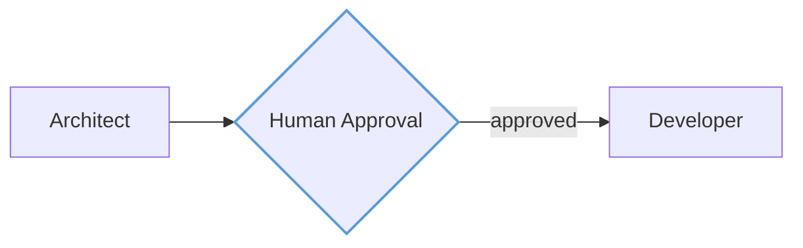

# Amelia Design System

> Design specification for a unified design system spanning web dashboard, technical diagrams, documentation, and presentations.

## Overview

The Amelia Design System is built on the **aviation cockpit aesthetic** - the visual language of flight instruments, navigation charts, and control panels. This reflects what Amelia does: orchestrating complex autonomous operations with precision, status awareness, and clarity under pressure.

### Goals

- **Visual consistency** - Everything looks like "Amelia" regardless of medium
- **Speed of creation** - Fast to produce diagrams and slides without design decisions each time
- **External presentation** - Polished materials for stakeholders, demos, or open-source marketing
- **Developer documentation** - Technical docs and architecture diagrams

### Tooling

| Purpose | Tool | Theme Support |
|---------|------|---------------|
| Web dashboard | React + Tailwind v4 + shadcn/ui | Native CSS variables |
| Quick diagrams | Mermaid | JSON theme config |
| Polished diagrams | D2 | Custom .d2 theme files |
| Presentations | Slidev | Vue/CSS theme package |
| Documentation | VitePress | Vue/CSS theme |
| Icons | Lucide | Color tokens |

---

## Design Principles

1. **Instrument Clarity** - Information hierarchy is immediate. Status is visible at a glance. No ambiguity about what's running, blocked, or complete.

2. **Dark-First, Light-Ready** - The primary experience is dark (cockpit at night), but all elements must work on light backgrounds (printed charts, projector displays).

3. **Gold Signals Action** - Aviation gold (#FFC857) means "active" or "in progress." It draws attention without alarm. On light backgrounds, aviation blue takes this role.

4. **Typography Has Altitude** - Display text (Bebas Neue) is bold and commanding. Body text (Source Sans 3) is readable in any condition. Code (IBM Plex Mono) is precise.

5. **Motion With Purpose** - Animations exist to convey state (pulsing = running, beacon glow = attention needed). Never decorative motion.

6. **LLM-Native** - All assets can be described, generated, and modified through text. Themes are code. Diagrams are declarative. Slides are Markdown.

---

## Color System

The color system uses **OKLCH** for perceptual uniformity - colors maintain consistent apparent brightness across hues.

### Dark Mode (Primary)

| Token | OKLCH | Hex | Usage |
|-------|-------|-----|-------|
| `background` | oklch(8% 0.02 150) | #0D1A12 | Page background |
| `surface` | oklch(18% 0.025 150) | #1F332E | Cards, panels |
| `foreground` | oklch(95% 0.02 120) | #EFF8E2 | Primary text |
| `muted` | oklch(60% 0.05 150) | #88A896 | Secondary text |
| `primary` | oklch(82% 0.16 85) | #FFC857 | Actions, highlights |
| `accent` | oklch(65% 0.12 240) | #5B9BD5 | Links, interactive |
| `destructive` | oklch(50% 0.2 25) | #A33D2E | Errors, warnings |
| `border` | oklch(30% 0.02 150 / 20%) | — | Dividers, edges |

**Coolors palette:** https://coolors.co/0d1a12-1f332e-eff8e2-88a896-ffc857-5b9bd5-a33d2e

### Light Mode (Secondary)

| Token | OKLCH | Hex | Usage |
|-------|-------|-----|-------|
| `background` | oklch(96% 0.02 85) | #FDF8F0 | Warm cream paper |
| `surface` | oklch(99% 0.01 85) | #FFFDF9 | Cards, elevated |
| `foreground` | oklch(20% 0.04 150) | #1A2F23 | Forest green text |
| `muted` | oklch(45% 0.03 150) | #5C7263 | Secondary text |
| `primary` | oklch(45% 0.12 240) | #2E6B9C | Aviation blue (links) |
| `accent` | oklch(75% 0.14 85) | #E8B84A | Gold (decorative only) |
| `destructive` | oklch(45% 0.18 25) | #8B3224 | Errors |
| `border` | oklch(25% 0.03 150 / 15%) | — | Subtle dividers |

**Coolors palette:** https://coolors.co/fdf8f0-fffdf9-1a2f23-5c7263-2e6b9c-e8b84a-8b3224

### Status Colors

| Status | Dark | Light | Meaning |
|--------|------|-------|---------|
| `running` | Gold #FFC857 | Blue #2E6B9C | In progress |
| `thinking` | Gold #FFC857 (pulse) | Blue #2E6B9C (pulse) | Agent reasoning/RAG search |
| `streaming` | Gold #FFC857 (blink) | Blue #2E6B9C (blink) | Token generation |
| `completed` | Green #5B8A72 | Green #3D7A5A | Success |
| `pending` | Gray #4A5C54 | Gray #8A9A90 | Queued |
| `blocked` | Red #A33D2E | Red #8B3224 | Awaiting input |
| `interrupt` | Blue #5B9BD5 | Blue #2E6B9C | Human-in-the-loop gate |
| `failed` | Red #A33D2E | Red #8B3224 | Error |

**Status palettes:**
- Dark: https://coolors.co/ffc857-5b8a72-4a5c54-a33d2e-5b9bd5
- Light: https://coolors.co/2e6b9c-3d7a5a-8a9a90-8b3224

### Full Brand Palette

https://coolors.co/0d1a12-1f332e-ffc857-5b9bd5-5b8a72-a33d2e-eff8e2

---

## Animation

Animations convey state changes. Three named animations for dashboard use only (static diagrams use color alone).

| Name | Effect | Duration | Usage |
|------|--------|----------|-------|
| `pulse` | Opacity 1 → 0.6 → 1 | 2s ease-in-out infinite | `thinking` state |
| `beacon` | Box-shadow glow 0 → 8px → 0 | 1.5s ease-in-out infinite | Attention needed |
| `blink` | Opacity 1 → 0 → 1 | 0.8s steps(2) infinite | `streaming` cursor |

### CSS Implementation

```css
@keyframes pulse {
  0%, 100% { opacity: 1; }
  50% { opacity: 0.6; }
}

@keyframes beacon {
  0%, 100% { box-shadow: 0 0 0 0 var(--color-primary); }
  50% { box-shadow: 0 0 8px 2px var(--color-primary); }
}

@keyframes blink {
  0%, 100% { opacity: 1; }
  50% { opacity: 0; }
}
```

**Scope**: Dashboard (CSS) only. Mermaid and D2 diagrams are static and use color differentiation.

---

## Typography

Four font families, each with a distinct role. All are Google Fonts.

### Font Stack

| Role | Family | Weight(s) | Usage |
|------|--------|-----------|-------|
| **Display** | Bebas Neue | 400 | Logo wordmark, hero titles, slide headers |
| **Heading** | Barlow Condensed | 500, 600, 700 | Section headings, nav items, labels |
| **Body** | Source Sans 3 | 400, 600 | Paragraphs, UI text, documentation |
| **Mono** | IBM Plex Mono | 400, 500 | Code, terminal output, technical values |

### Type Scale

Base size: `16px` (1rem). Scale ratio: `1.25` (Major Third).

| Name | Size | Line Height | Usage |
|------|------|-------------|-------|
| `xs` | 0.75rem (12px) | 1.4 | Captions, timestamps |
| `sm` | 0.875rem (14px) | 1.5 | Secondary text, labels |
| `base` | 1rem (16px) | 1.6 | Body text |
| `lg` | 1.25rem (20px) | 1.5 | Lead paragraphs |
| `xl` | 1.563rem (25px) | 1.3 | H4, card titles |
| `2xl` | 1.953rem (31px) | 1.2 | H3 |
| `3xl` | 2.441rem (39px) | 1.15 | H2 |
| `4xl` | 3.052rem (49px) | 1.1 | H1, page titles |
| `5xl` | 3.815rem (61px) | 1.05 | Hero, display |

### Usage Guidelines

- **Display (Bebas Neue)**: Always uppercase. Use for "AMELIA" wordmark and major section headers in slides. Never for body text.
- **Heading (Barlow Condensed)**: Title case or uppercase. Its condensed width allows longer headings without wrapping.
- **Body (Source Sans 3)**: Sentence case. Highly legible at small sizes. Use 400 weight for reading, 600 for emphasis.
- **Mono (IBM Plex Mono)**: For all code, file paths, CLI commands, and technical identifiers.

---

## Logo & Wordmark

The Amelia logo is a **typographic wordmark** - the word "AMELIA" set in Bebas Neue.

### Primary Wordmark

- **Font**: Bebas Neue, 400 weight
- **Case**: Always uppercase
- **Tracking**: Default (0)

### Color Usage

| Context | Color | Token |
|---------|-------|-------|
| Dark backgrounds | Aviation Gold #FFC857 | `primary` |
| Light backgrounds | Forest Green #1F332E | `surface` (dark) |
| Monochrome dark | Off-white #EFF8E2 | `foreground` |
| Monochrome light | Forest Green #1A2F23 | `foreground` (light) |

### Clear Space

Minimum clear space around the wordmark: **height of the letter "A"** on all sides.

### Minimum Size

- **Digital**: 80px wide minimum
- **Print**: 20mm wide minimum

### Don'ts

- Don't use lowercase ("Amelia" or "amelia")
- Don't add a tagline attached to the wordmark
- Don't stretch, rotate, or apply effects
- Don't use gold on light backgrounds (contrast)
- Don't outline or stroke - always solid fill

---

## Iconography

Lucide icons are the standard across all Amelia properties.

### Icon Sizing

| Size | Pixels | Usage |
|------|--------|-------|
| `xs` | 14px | Inline with small text, badges |
| `sm` | 16px | Buttons, form fields, inline |
| `md` | 20px | Navigation, card headers |
| `lg` | 24px | Empty states, feature highlights |
| `xl` | 32px | Hero sections, onboarding |

### Stroke Weight

Lucide default stroke: **2px**. Maintain this across all sizes.

### Semantic Icons

| Concept | Lucide Name |
|---------|-------------|
| Architect agent | `compass` |
| Developer agent | `code` |
| Reviewer agent | `eye` |
| Workflow/Graph | `git-branch` |
| Task | `check-square` |
| Issue | `circle-dot` |
| Running | `play` |
| Completed | `check-circle` |
| Failed | `x-circle` |
| Blocked | `pause-circle` |
| Settings | `settings` |
| Terminal | `terminal` |

### Color Application

- **Default**: `muted` color
- **Interactive**: `foreground` on hover
- **Active/Selected**: `primary` (gold in dark, blue in light)
- **Destructive**: `destructive` for delete, errors
- **Status icons**: Use corresponding status color

---

## Component Patterns

### Cards

| Property | Dark Mode | Light Mode |
|----------|-----------|------------|
| Background | `surface` (#1F332E) | `surface` (#FFFDF9) |
| Border | `border` (20% opacity) | `border` (15% opacity) |
| Border radius | `radius-lg` (0.625rem) | Same |
| Shadow | None | Subtle (0 1px 3px rgba(0,0,0,0.08)) |

### Buttons

| Variant | Dark Mode | Light Mode |
|---------|-----------|------------|
| **Primary** | Gold bg, dark text | Blue bg, white text |
| **Secondary** | Surface bg, foreground text | Same |
| **Ghost** | Transparent, muted → foreground on hover | Same |
| **Destructive** | Red bg, white text | Same |

Border radius: `radius-md` (0.5rem). Height: 36px default, 32px small, 40px large.

### Badges / Status Pills

| Status | Background (Dark) | Text |
|--------|-------------------|------|
| Running | Gold/15% | Gold |
| Completed | Green/15% | Green |
| Pending | Muted/15% | Muted |
| Failed | Red/15% | Red |

### Spacing Scale

Based on 4px unit:

| Token | Value | Usage |
|-------|-------|-------|
| `space-1` | 4px | Tight gaps, icon padding |
| `space-2` | 8px | Related elements |
| `space-3` | 12px | Form field gaps |
| `space-4` | 16px | Card padding, section gaps |
| `space-6` | 24px | Card groups |
| `space-8` | 32px | Page sections |
| `space-12` | 48px | Major sections |

---

## Diagram Theming

### D2 Theme

**Dark Theme Colors:**

| Element | Color |
|---------|-------|
| Background | #0D1A12 |
| Node fill | #1F332E |
| Node stroke | #88A896 |
| Node text | #EFF8E2 |
| Edge stroke | #88A896 |
| Primary nodes | #FFC857 stroke |
| Accent nodes | #5B9BD5 stroke |

**Coolors:** https://coolors.co/0d1a12-1f332e-88a896-eff8e2-ffc857-5b9bd5

**Light Theme Colors:**

| Element | Color |
|---------|-------|
| Background | #FDF8F0 |
| Node fill | #FFFDF9 |
| Node stroke | #5C7263 |
| Node text | #1A2F23 |
| Primary nodes | #2E6B9C stroke |

**Coolors:** https://coolors.co/fdf8f0-fffdf9-5c7263-1a2f23-2e6b9c

### Mermaid Theme

**Dark Theme Variables:**

```
primaryColor: #1F332E
primaryTextColor: #EFF8E2
primaryBorderColor: #FFC857
secondaryColor: #4A5C54
tertiaryColor: #0D1A12
lineColor: #88A896
textColor: #EFF8E2
```

**Coolors:** https://coolors.co/0d1a12-1f332e-4a5c54-88a896-eff8e2-ffc857

**Light Theme Variables:**

```
primaryColor: #FFFDF9
primaryTextColor: #1A2F23
primaryBorderColor: #2E6B9C
secondaryColor: #F5F0E8
tertiaryColor: #FDF8F0
lineColor: #5C7263
textColor: #1A2F23
```

**Coolors:** https://coolors.co/fdf8f0-fffdf9-f5f0e8-5c7263-1a2f23-2e6b9c

### Diagram Typography

- **Node labels**: Source Sans 3
- **Code entities**: IBM Plex Mono
- **Titles**: Barlow Condensed

### Edge Styles

Edges convey different types of flow in orchestration diagrams.

| Flow Type | Style | Color | Usage |
|-----------|-------|-------|-------|
| Control flow | Solid (default) | `muted` (#88A896) | Agent-to-agent transitions |
| Data/Context | Dashed (2px dash, 4px gap) | `muted` (#88A896) | State data passing |
| Error/Interrupt | Dotted (2px dot, 2px gap) | `destructive` (#A33D2E) | Exception paths |

### Human-in-the-Loop Gate

Use a **diamond** node shape with `accent` stroke color to indicate mandatory human approval before proceeding.

**D2 Example:**

```d2
approval: {
  shape: diamond
  style.stroke: "#5B9BD5"
  style.fill: "#1F332E"
  style.font-color: "#EFF8E2"
}

architect -> approval: plan complete
approval -> developer: approved {
  style.stroke-dash: 0
}
```

**Mermaid Example:**



---

## Presentation Theme (Slidev)

### Theme Structure

```
slidev-theme-amelia/
├── package.json
├── styles/
│   ├── base.css
│   └── code.css
├── layouts/
│   ├── cover.vue
│   ├── section.vue
│   ├── default.vue
│   ├── two-cols.vue
│   ├── diagram.vue
│   └── quote.vue
└── components/
    ├── AmeliaLogo.vue
    └── StatusBadge.vue
```

### Slide Layouts

**Cover (Title Slide)**
- Background: `background` (#0D1A12)
- "AMELIA" wordmark top-left, gold, small
- Title: Bebas Neue, `5xl`, centered
- Subtitle: Source Sans 3, `lg`, muted

**Section (Divider)**
- Background: `surface` (#1F332E)
- Section number: Bebas Neue, gold, large
- Section title: Barlow Condensed, `3xl`

**Default (Content)**
- Title: Barlow Condensed, `2xl`, top
- Body: Source Sans 3, `lg`
- Bullets: Gold dash prefix

**Diagram**

- Full-bleed, no padding
- Caption: Small, muted, bottom-right

**DiffView (Code Comparison)**

- Two-column layout for "before/after" code demos
- Left column: "Before" code with `destructive/15%` (#A33D2E at 15% opacity) background for removed lines
- Right column: "After" code with `completed/15%` (#5B8A72 at 15% opacity) background for added lines
- Header: Barlow Condensed, `xl`, centered above columns
- Caption: Source Sans 3, `sm`, muted, centered below
- Code font: IBM Plex Mono

**Focus (Demo Spotlight)**

- Dims background to near-black (#050A07)
- Reduces non-active panel opacity to 0.3
- Active element remains at full brightness
- Usage: Live demos when explaining specific transitions

### Code Highlighting (Shiki)

| Token | Color |
|-------|-------|
| Keywords | Gold #FFC857 |
| Strings | Green #5B8A72 |
| Functions | Blue #5B9BD5 |
| Comments | Muted #88A896 |
| Variables | Foreground #EFF8E2 |

---

## Documentation Theme (VitePress)

### Theme Structure

```
docs/site/.vitepress/
├── config.ts
├── theme/
│   ├── index.ts
│   ├── style.css
│   ├── custom.css
│   └── components/
│       ├── AmeliaLogo.vue
│       └── StatusBadge.vue
└── public/
    └── fonts/
```

### Color Mode Mapping

| VitePress Token | Dark (Amelia) | Light (Amelia) |
|-----------------|---------------|----------------|
| `--vp-c-bg` | #0D1A12 | #FDF8F0 |
| `--vp-c-bg-soft` | #1F332E | #FFFDF9 |
| `--vp-c-text-1` | #EFF8E2 | #1A2F23 |
| `--vp-c-text-2` | #88A896 | #5C7263 |
| `--vp-c-brand` | #FFC857 | #2E6B9C |
| `--vp-c-brand-light` | #FFD97A | #3A7DB5 |
| `--vp-c-brand-dark` | #E6B44E | #245A80 |

### Typography Override

```css
:root {
  --vp-font-family-base: 'Source Sans 3', sans-serif;
  --vp-font-family-mono: 'IBM Plex Mono', monospace;
}

.VPNavBarTitle .title {
  font-family: 'Bebas Neue', sans-serif;
}

h1, h2, h3 {
  font-family: 'Barlow Condensed', sans-serif;
}
```

### Callout Colors

- Tip: Green (#5B8A72)
- Warning: Gold (#FFC857)
- Danger: Red (#A33D2E)
- Info: Blue (#5B9BD5)

---

## Deliverables & File Structure

### Directory Structure

```
design-system/
├── README.md
├── tokens/
│   ├── colors.css
│   ├── colors.json
│   ├── typography.css
│   └── tokens.d.ts
├── themes/
│   ├── d2/
│   │   ├── amelia-dark.d2
│   │   └── amelia-light.d2
│   ├── mermaid/
│   │   ├── amelia-dark.json
│   │   └── amelia-light.json
│   ├── slidev/
│   │   └── (theme package)
│   └── vitepress/
│       └── (theme files)
├── assets/
│   ├── logo/
│   │   ├── amelia-gold.svg
│   │   ├── amelia-green.svg
│   │   └── amelia-white.svg
│   └── fonts/
│       └── (woff2 files)
└── examples/
    ├── diagram-d2.d2
    ├── diagram-mermaid.md
    └── slides.md

docs/
├── site/                    # VitePress
│   ├── .vitepress/
│   │   └── theme/
│   ├── public/fonts/
│   ├── index.md
│   ├── guide/
│   └── api/
├── presentations/           # Slidev decks
│   ├── intro/
│   │   └── slides.md
│   ├── architecture/
│   │   └── slides.md
│   └── README.md
├── plans/
└── testing/
```

### Build Commands

```bash
# Documentation site
vitepress build docs/site

# Single presentation
slidev build docs/presentations/intro/slides.md --out dist/slides/intro

# All presentations
pnpm build:slides
```

### Deliverable Checklist

| Deliverable | Format | Location |
|-------------|--------|----------|
| Design spec document | Markdown | `design-system/README.md` |
| CSS design tokens | CSS variables | `design-system/tokens/colors.css` |
| JSON design tokens | JSON | `design-system/tokens/colors.json` |
| D2 dark theme | .d2 | `design-system/themes/d2/amelia-dark.d2` |
| D2 light theme | .d2 | `design-system/themes/d2/amelia-light.d2` |
| Mermaid dark theme | JSON | `design-system/themes/mermaid/amelia-dark.json` |
| Mermaid light theme | JSON | `design-system/themes/mermaid/amelia-light.json` |
| Slidev theme | Vue/CSS | `design-system/themes/slidev/` |
| VitePress theme | Vue/CSS | `design-system/themes/vitepress/` |
| Logo SVGs | SVG | `design-system/assets/logo/` |
| Font files | WOFF2 | `design-system/assets/fonts/` |
| Example diagrams | D2, Mermaid | `design-system/examples/` |
| VitePress site | Markdown/Vue | `docs/site/` |
| Presentations | Slidev | `docs/presentations/` |
