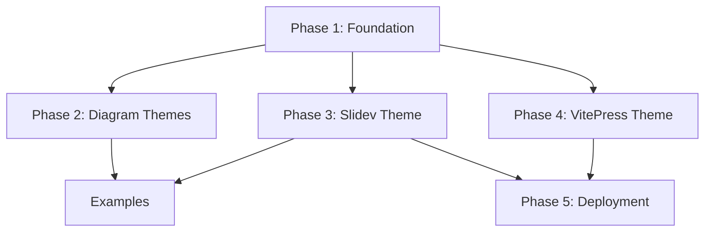

# Amelia Design System - Implementation Plan

> Implementation plan for the [Design System Specification](./2025-12-13-design-system-design.md)

## Current State Analysis

### What Already Exists

| Component | Status | Location |
|-----------|--------|----------|
| Dashboard (React + Tailwind v4) | ✅ Exists | `dashboard/` |
| Aviation color tokens (OKLCH) | ✅ Exists | `dashboard/src/styles/globals.css` |
| shadcn/ui components | ✅ Exists | `dashboard/src/components/ui/` |
| Font variables defined | ✅ Exists | CSS vars in globals.css |
| Animation keyframes | ✅ Exists | pulse-glow, beacon-glow, blink |
| Status colors | ✅ Exists | CSS vars for running/completed/pending/etc. |

### What Needs to Be Created

| Component | Priority | Complexity |
|-----------|----------|------------|
| `design-system/` directory structure | High | Low |
| Standalone CSS/JSON design tokens | High | Low |
| Light mode color tokens | High | Medium |
| D2 themes (dark + light) | Medium | Low |
| Mermaid themes (dark + light) | Medium | Low |
| Logo SVG assets | Medium | Low |
| Slidev theme package | Medium | High |
| VitePress documentation theme | Low | High |
| GitHub Pages deployment workflow | Low | Medium |

---

## Implementation Phases

### Phase 1: Foundation (Design Tokens & Assets)

Extract and formalize design tokens from the existing dashboard implementation into standalone, portable formats.

#### Task 1.1: Create directory structure

```
design-system/
├── README.md
├── tokens/
│   ├── colors.css          # CSS custom properties (dark + light mode)
│   ├── colors.json         # JSON for tooling
│   ├── typography.css      # Font stacks, scale
│   └── tokens.d.ts         # TypeScript definitions
├── themes/
│   ├── d2/
│   ├── mermaid/
│   ├── slidev/
│   └── vitepress/
├── assets/
│   ├── logo/
│   └── fonts/
└── examples/
```

**Acceptance criteria:**
- [ ] Directory structure created
- [ ] README.md documents the design system purpose and usage

#### Task 1.2: Extract color tokens to standalone files

Extract from `dashboard/src/styles/globals.css` into portable formats.

**File: `design-system/tokens/colors.css`**
- Dark mode (primary) color tokens
- Light mode (secondary) color tokens - used for presentations on projectors
- Status color tokens
- Chart color tokens

**File: `design-system/tokens/colors.json`**
- Same tokens in JSON format for JavaScript tooling
- Structure: `{ dark: {...}, light: {...}, status: {...} }`

**Acceptance criteria:**
- [ ] colors.css contains all dark/light mode tokens
- [ ] colors.json mirrors CSS tokens in JSON
- [ ] Dashboard still works (tokens remain in globals.css; these are portable copies)

#### Task 1.3: Create typography tokens

**File: `design-system/tokens/typography.css`**
- Font family definitions (Bebas Neue, Barlow Condensed, Source Sans 3, IBM Plex Mono)
- Type scale (xs through 5xl)
- Line heights
- Google Fonts import URLs

**Acceptance criteria:**
- [ ] All four font families defined
- [ ] Type scale matches spec (1.25 ratio)
- [ ] Google Fonts URLs documented for external use

#### Task 1.4: Create logo SVG assets

**Files:**
- `design-system/assets/logo/amelia-gold.svg` - Gold wordmark for dark backgrounds
- `design-system/assets/logo/amelia-green.svg` - Forest green wordmark for light backgrounds
- `design-system/assets/logo/amelia-white.svg` - White wordmark for monochrome dark

**Acceptance criteria:**
- [ ] Bebas Neue uppercase "AMELIA" wordmark
- [ ] Correct colors per spec
- [ ] Optimized SVG (no unnecessary metadata)

---

### Phase 2: Diagram Themes

Create diagram themes for D2 and Mermaid that match the aviation aesthetic.

#### Task 2.1: Create D2 themes

**File: `design-system/themes/d2/amelia-dark.d2`**
```d2
vars: {
  d2-config: {
    theme-overrides: {
      B1: "#0D1A12"    # background
      B2: "#1F332E"    # node fill
      ...
    }
  }
}
```

**File: `design-system/themes/d2/amelia-light.d2`**
- Light mode equivalent

**Acceptance criteria:**
- [ ] Dark theme matches spec colors
- [ ] Light theme matches spec colors
- [ ] Example diagram renders correctly with each theme

#### Task 2.2: Create Mermaid themes

**File: `design-system/themes/mermaid/amelia-dark.json`**
```json
{
  "theme": "base",
  "themeVariables": {
    "primaryColor": "#1F332E",
    "primaryTextColor": "#EFF8E2",
    ...
  }
}
```

**File: `design-system/themes/mermaid/amelia-light.json`**
- Light mode equivalent

**Acceptance criteria:**
- [ ] Dark theme matches spec colors
- [ ] Light theme matches spec colors
- [ ] Flowchart, sequence diagram test cases render correctly

#### Task 2.3: Create example diagrams

**File: `design-system/examples/diagram-d2.d2`**
- Sample orchestrator flow diagram

**File: `design-system/examples/diagram-mermaid.md`**
- Sample flowchart with theme initialization

**Acceptance criteria:**
- [ ] Examples demonstrate key diagram patterns
- [ ] Human-in-the-loop gate pattern shown

---

### Phase 3: Slidev Theme Package

Create a complete Slidev theme with all presentation layouts using the unified Amelia design system.

#### Task 3.1: Initialize Slidev theme package

```
design-system/themes/slidev/
├── package.json
├── styles/
│   ├── base.css
│   └── code.css
├── layouts/
└── components/
```

**Acceptance criteria:**
- [ ] Valid npm package structure
- [ ] Can be installed as Slidev theme

#### Task 3.2: Create presentation layouts

**Core Layouts:**
- `cover.vue` - Title slide with wordmark
- `section.vue` - Section divider
- `default.vue` - Content slide
- `two-cols.vue` - Two-column layout
- `diagram.vue` - Full-bleed diagram
- `quote.vue` - Quote slide
- `diff-view.vue` - Before/after code comparison
- `focus.vue` - Demo spotlight mode

**Stakeholder Layouts:**
- `action.vue` - Standard action-title slide
- `scqa.vue` - SCQA 4-panel framework
- `summary.vue` - Executive summary with recommendation
- `data.vue` - Full-bleed chart slide
- `ghost.vue` - Wireframe/planning mode
- `pyramid.vue` - Pyramid principle diagram
- `comparison.vue` - Side-by-side analysis
- `takeaway.vue` - Key insight callout
- `waterfall.vue` - Bridge/waterfall chart layout
- `timeline.vue` - Horizontal timeline
- `layercake.vue` - Technology stack diagram
- `chevron.vue` - Sequential process flow
- `harvey.vue` - Qualitative comparison matrix

**Acceptance criteria:**
- [ ] Each layout matches spec design
- [ ] All layouts support both dark and light mode via `class: dark` or `class: light`
- [ ] Bebas Neue for display, Barlow Condensed for headings

#### Task 3.3: Create shared components

**Components:**
- `AmeliaLogo.vue` - Logo component with color variants
- `StatusBadge.vue` - Status indicator badges
- `ActionTitle.vue` - Formatted action title
- `SourceNote.vue` - Footer source citation
- `InsightBox.vue` - Highlighted callout box
- `SCQABlock.vue` - Single SCQA quadrant
- `PyramidDiagram.vue` - Pyramid visualization
- `GhostPlaceholder.vue` - Wireframe placeholder
- `DataHighlight.vue` - KPI/metric display
- `RecommendationBox.vue` - Executive recommendation
- `HarveyBall.vue` - Qualitative comparison indicator
- `LayerCakeDiagram.vue` - Technology stack visualization
- `ChevronFlow.vue` - Sequential process arrows
- `WaterfallBar.vue` - Bridge chart segment

**Acceptance criteria:**
- [ ] Components reusable across layouts
- [ ] Props typed with TypeScript
- [ ] Match spec styling exactly

#### Task 3.4: Create Shiki code theme

Configure code highlighting to use aviation colors:
- Keywords: Gold #FFC857
- Strings: Green #5B8A72
- Functions: Blue #5B9BD5
- Comments: Muted #88A896
- Variables: Foreground #EFF8E2

**Acceptance criteria:**
- [ ] Code blocks render with correct colors
- [ ] Works in both dark and light modes

#### Task 3.5: Create example presentation

**File: `design-system/examples/slides-demo.md`**
- Demo of all layouts (both core and stakeholder)
- Shows both dark and light mode usage

**Acceptance criteria:**
- [ ] All layouts demonstrated
- [ ] Can build and export to PDF/HTML

---

### Phase 4: VitePress Documentation Theme

Create a VitePress theme for the documentation site.

#### Task 4.1: Initialize VitePress structure

```
docs/site/
├── .vitepress/
│   ├── config.ts
│   └── theme/
│       ├── index.ts
│       ├── style.css
│       └── custom.css
├── public/
│   └── fonts/
├── index.md
├── guide/
└── api/
```

**Acceptance criteria:**
- [ ] VitePress builds successfully
- [ ] Base configuration with title, description

#### Task 4.2: Apply Amelia theme to VitePress

**Customizations:**
- Map VitePress CSS variables to Amelia tokens
- Override font families
- Custom callout colors (tip, warning, danger, info)
- Logo in navigation

**Acceptance criteria:**
- [ ] Dark mode uses aviation dark palette
- [ ] Light mode uses aviation light palette
- [ ] Typography matches spec

#### Task 4.3: Create documentation content structure

**Pages:**
- `index.md` - Landing page
- `guide/getting-started.md` - Setup instructions
- `guide/color-system.md` - Color token reference
- `guide/typography.md` - Font and scale reference
- `guide/diagrams.md` - D2 and Mermaid theme usage
- `guide/presentations.md` - Slidev theme usage
- `api/tokens.md` - Token API reference

**Acceptance criteria:**
- [ ] Navigation sidebar configured
- [ ] All sections have placeholder content

---

### Phase 5: Deployment & Integration

#### Task 5.1: GitHub Pages deployment workflow

**File: `.github/workflows/docs.yml`**

Triggers on push to `main` when `docs/site/**` changes:
1. Setup Node.js
2. Install dependencies
3. Build VitePress
4. Deploy to GitHub Pages

**Acceptance criteria:**
- [ ] Workflow runs on push to main
- [ ] Site deploys to GitHub Pages
- [ ] Base URL configured correctly

#### Task 5.2: Self-host fonts

Download and include WOFF2 files:
- Bebas Neue (400)
- Barlow Condensed (500, 600, 700)
- Source Sans 3 (400, 600)
- IBM Plex Mono (400, 500)

**Acceptance criteria:**
- [ ] Fonts in `docs/site/public/fonts/`
- [ ] No external Google Fonts requests in production

#### Task 5.3: Dashboard token sync (optional)

Consider whether to:
- A) Keep tokens duplicated (dashboard has own copy, design-system has portable copy)
- B) Import design-system tokens into dashboard

**Recommendation:** Option A for now - simpler, dashboard already works.

**Acceptance criteria:**
- [ ] Decision documented
- [ ] If syncing, build process established

---

## Implementation Order & Dependencies



**Recommended order:**
1. **Phase 1** (Foundation) - Required first, provides tokens for everything else
2. **Phase 2** (Diagrams) - Low complexity, quick wins
3. **Phase 3** (Slidev) - Higher complexity but high value
4. **Phase 4** (VitePress) - Can run in parallel with Phase 3
5. **Phase 5** (Deployment) - After documentation site exists

---

## Parallelization Opportunities

These task groups can run in parallel:

| Group | Tasks | Dependencies |
|-------|-------|--------------|
| **Tokens** | 1.2, 1.3 | After 1.1 |
| **Diagrams** | 2.1, 2.2 | After Phase 1 |
| **Slidev Layouts** | 3.2, 3.4 | After 3.1 |
| **Slidev Components** | 3.3 | After 3.1 |
| **VitePress** | 4.1, 4.2 | After Phase 1 |

---

## Risk Assessment

| Risk | Impact | Mitigation |
|------|--------|------------|
| Slidev theme complexity | High | Start with minimal layouts, iterate |
| Font licensing | Low | All selected fonts are open source (OFL) |
| D2/Mermaid theme limitations | Medium | Test early; fall back to inline styles if needed |
| VitePress version compatibility | Low | Pin to stable version |

---

## Success Criteria

The design system is complete when:

1. **Tokens are portable** - Can be used in any project without dashboard dependency
2. **Diagrams are consistent** - D2 and Mermaid diagrams look "Amelia-branded"
3. **Presentations are fast** - Can create a new deck in minutes using existing layouts
4. **Documentation is live** - VitePress site deployed and accessible
5. **Stakeholder decks work** - Can produce professional presentations with light mode for projectors

---

## Estimated Scope

| Phase | Tasks | Estimated Files |
|-------|-------|-----------------|
| Phase 1 | 4 | ~8 files |
| Phase 2 | 3 | ~6 files |
| Phase 3 | 5 | ~35 files |
| Phase 4 | 3 | ~15 files |
| Phase 5 | 3 | ~5 files |
| **Total** | **18** | **~69 files** |
