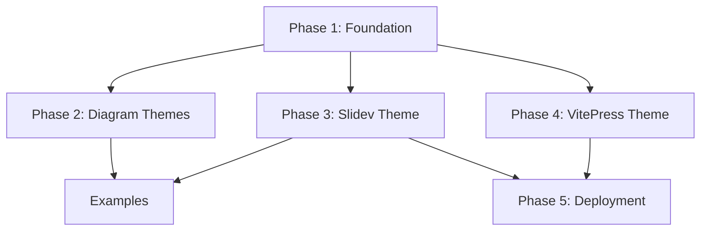

# Amelia Design System - Implementation Plan

> Implementation plan for the [Design System Specification](./2025-12-13-design-system-design.md)

## Current State Analysis

### What Already Exists

| Component | Status | Location |
|-----------|--------|----------|
| Dashboard (React + Tailwind v4) | ✅ Exists | `dashboard/` |
| Color tokens (OKLCH) | ✅ Exists | `dashboard/src/styles/globals.css` |
| shadcn/ui components | ✅ Exists | `dashboard/src/components/ui/` |
| Font variables defined | ✅ Exists | CSS vars in globals.css |
| Animation keyframes | ✅ Exists | pulse-glow, beacon-glow, blink |
| Status colors | ✅ Exists | CSS vars for running/completed/pending/etc. |

### What Needs to Be Created

| Component | Priority | Complexity |
|-----------|----------|------------|
| `design-system/` directory structure | High | Low |
| Standalone CSS/JSON design tokens | High | Low |
| Light mode color tokens | High | Medium |
| D2 themes (dark + light) | Medium | Low |
| Mermaid themes (dark + light) | Medium | Low |
| Logo SVG assets | Medium | Low |
| Slidev theme package | Medium | High |
| VitePress documentation theme | Low | High |
| GitHub Pages deployment workflow | Low | Medium |

---

## Implementation Phases

### Phase 1: Foundation (Design Tokens & Assets)

Extract and formalize design tokens from the existing dashboard implementation into standalone, portable formats.

#### Task 1.1: Create directory structure

```
design-system/
├── README.md
├── tokens/
│   ├── colors.css          # CSS custom properties (dark + light mode)
│   ├── colors.json         # JSON for tooling
│   ├── typography.css      # Font stacks, scale
│   └── tokens.d.ts         # TypeScript definitions
├── themes/
│   ├── d2/
│   ├── mermaid/
│   ├── slidev/
│   └── vitepress/
├── assets/
│   ├── logo/
│   └── fonts/
└── examples/
```

**Acceptance criteria:**
- [ ] Directory structure created
- [ ] README.md documents the design system purpose and usage

#### Task 1.2: Extract color tokens to standalone files

Extract from `dashboard/src/styles/globals.css` into portable formats.

**File: `design-system/tokens/colors.css`**
- Dark mode (primary) color tokens
- Light mode (secondary) color tokens - used for presentations on projectors
- Status color tokens
- Chart color tokens

**Note:** Light mode tokens are defined in the design spec but not yet implemented in `dashboard/src/styles/globals.css`. The extracted `colors.css` should include both modes. Dashboard integration of light mode is optional (Task 5.3).

**File: `design-system/tokens/colors.json`**
- Same tokens in JSON format for JavaScript tooling
- Structure: `{ dark: {...}, light: {...}, status: {...} }`

**Acceptance criteria:**
- [ ] colors.css contains all dark/light mode tokens
- [ ] colors.json mirrors CSS tokens in JSON
- [ ] Dashboard still works (tokens remain in globals.css; these are portable copies)

#### Task 1.3: Create typography tokens

**File: `design-system/tokens/typography.css`**
- Font family definitions (Bebas Neue, Barlow Condensed, Source Sans 3, IBM Plex Mono)
- Type scale (xs through 5xl)
- Line heights
- Google Fonts import URLs

**Acceptance criteria:**
- [ ] All four font families defined
- [ ] Type scale matches spec (1.25 ratio)
- [ ] Google Fonts URLs documented for external use

#### Task 1.4: Create logo SVG assets

**Files:**
- `design-system/assets/logo/amelia-gold.svg` - Gold wordmark for dark backgrounds
- `design-system/assets/logo/amelia-green.svg` - Forest green wordmark for light backgrounds
- `design-system/assets/logo/amelia-white.svg` - White wordmark for monochrome dark

**Acceptance criteria:**
- [ ] Bebas Neue uppercase "AMELIA" wordmark
- [ ] Correct colors per spec
- [ ] Optimized SVG (no unnecessary metadata)

---

### Phase 2: Diagram Themes

Create diagram themes for D2 and Mermaid that match the design system aesthetic.

#### Task 2.1: Create D2 themes

**File: `design-system/themes/d2/amelia-dark.d2`**
```d2
# Amelia Dark Theme
# Usage: Copy vars block to your diagrams

vars: {
  background: "#0D1A12"
  surface: "#1F332E"
  text: "#EFF8E2"
  accent: "#FFC857"
  green: "#5B8A72"
  blue: "#5B9BD5"
  muted: "#88A896"
}

# Example usage in diagram nodes:
# my-node: {
#   style: {
#     fill: ${surface}
#     stroke: ${accent}
#   }
# }
```

**File: `design-system/themes/d2/amelia-light.d2`**
- Light mode equivalent with inline `vars` definitions

**Acceptance criteria:**
- [ ] Dark theme uses inline `vars` with all spec colors
- [ ] Light theme uses inline `vars` with all spec colors
- [ ] Example diagram demonstrates usage of `${var}` references in node styles

#### Task 2.2: Create Mermaid themes

**File: `design-system/themes/mermaid/amelia-dark.md`**
```markdown
# Amelia Dark Theme for Mermaid

Use this frontmatter in your Mermaid diagrams:

\`\`\`yaml
---
config:
  theme: base
  themeVariables:
    primaryColor: "#1F332E"
    primaryTextColor: "#EFF8E2"
    primaryBorderColor: "#FFC857"
    secondaryColor: "#4A5C54"
    tertiaryColor: "#0D1A12"
    lineColor: "#88A896"
    fontFamily: "Source Sans 3"
---
\`\`\`

Or use init directive:
\`\`\`
%%{init: { "theme": "base", "themeVariables": { "primaryColor": "#1F332E", "primaryTextColor": "#EFF8E2", "primaryBorderColor": "#FFC857", "secondaryColor": "#4A5C54", "tertiaryColor": "#0D1A12", "lineColor": "#88A896", "fontFamily": "Source Sans 3" } } }%%
\`\`\`
```

**File: `design-system/themes/mermaid/amelia-light.md`**
- Light mode equivalent in Markdown documentation format

**Acceptance criteria:**
- [ ] Dark theme Markdown template includes frontmatter and init directive formats
- [ ] Light theme Markdown template includes both usage patterns
- [ ] Documentation explains how to use each format
- [ ] Flowchart, sequence diagram test cases render correctly with both frontmatter and init directive

#### Task 2.3: Create example diagrams

**File: `design-system/examples/diagram-d2.d2`**
- Sample orchestrator flow diagram

**File: `design-system/examples/diagram-mermaid.md`**
- Sample flowchart with theme initialization

**Acceptance criteria:**
- [ ] Examples demonstrate key diagram patterns
- [ ] Human-in-the-loop gate pattern shown

---

### Phase 3: Slidev Theme Package

Create a complete Slidev theme with all presentation layouts using the unified Amelia design system.

#### Task 3.1: Initialize Slidev theme package

```
design-system/themes/slidev/
├── package.json
├── styles/
│   ├── base.css
│   └── code.css
├── layouts/
├── components/
└── setup/
    └── shiki.ts
```

**File: `design-system/themes/slidev/package.json`**
```json
{
  "name": "slidev-theme-amelia",
  "version": "1.0.0",
  "keywords": ["slidev-theme", "slidev"],
  "engines": {
    "node": ">=18.0.0",
    "slidev": ">=0.47.0"
  },
  "slidev": {
    "defaults": {
      "fonts": {
        "sans": "Barlow Condensed",
        "serif": "Source Sans 3",
        "mono": "IBM Plex Mono"
      },
      "colorSchema": "both"
    }
  }
}
```

**Acceptance criteria:**
- [ ] Valid npm package structure
- [ ] Can be installed as Slidev theme
- [ ] package.json includes `slidev.defaults` configuration
- [ ] `colorSchema: "both"` enables dark and light mode support
- [ ] Keywords include "slidev-theme" for discoverability

#### Task 3.2: Create presentation layouts

**Extend from Slidev built-ins (CSS overrides only):**
- `cover.vue` - Extend Slidev's default cover
- `section.vue` - Extend Slidev's section/divider
- `default.vue` - Extend Slidev's default
- `two-cols.vue` - Extend Slidev's two-cols
- `diagram.vue` - Extend Slidev's center layout
- `quote.vue` - Extend Slidev's statement layout

**Custom layouts (truly unique structure):**
- `action.vue` - Action title slide
- `scqa.vue` - SCQA 4-panel framework
- `summary.vue` - Executive summary with recommendation
- `data.vue` - Full-bleed chart slide
- `ghost.vue` - Wireframe/planning mode
- `pyramid.vue` - Pyramid principle diagram
- `comparison.vue` - Side-by-side analysis
- `takeaway.vue` - Key insight callout
- `harvey.vue` - Qualitative comparison matrix

**Removed from scope (use other layouts instead):**
- `diff-view.vue` → Use `two-cols` with custom styling
- `focus.vue` → Use CSS dim class on any layout
- `waterfall.vue` → Use `data` layout with waterfall chart
- `timeline.vue` → Use `data` layout with timeline chart
- `layercake.vue` → Use `data` layout with layer diagram
- `chevron.vue` → Use `data` layout with chevron flow

**Acceptance criteria:**
- [ ] 6 extended layouts override CSS only (no structural changes)
- [ ] 9 custom layouts implement unique structures
- [ ] All layouts support both dark and light mode via `class: dark` or `class: light`
- [ ] Bebas Neue for display, Barlow Condensed for headings

#### Task 3.3: Create shared components

**Keep as Vue components (specialized visualizations):**
- `PyramidDiagram.vue` - Unique pyramid visualization
- `SCQABlock.vue` - SCQA framework quadrant
- `HarveyBall.vue` - Qualitative comparison indicators
- `LayerCakeDiagram.vue` - Architecture layer stacking
- `ChevronFlow.vue` - Sequential process arrows
- `WaterfallBar.vue` - Waterfall chart segments
- `RecommendationBox.vue` - Executive recommendation styling

**Replace with CSS utilities or SVG assets (not Vue components):**
- `AmeliaLogo.vue` → Use SVG asset in `public/logo/`
- `StatusBadge.vue` → Tailwind utility classes
- `ActionTitle.vue` → Typography CSS utilities
- `SourceNote.vue` → `text-xs text-muted-foreground` class
- `InsightBox.vue` → CSS border-left styling
- `DataHighlight.vue` → Card composition with CSS
- `GhostPlaceholder.vue` → `border-dashed` CSS utility

**Acceptance criteria:**
- [ ] 7 Vue components for specialized visualizations
- [ ] Components reusable across layouts
- [ ] Props typed with TypeScript
- [ ] Match spec styling exactly
- [ ] Non-component alternatives documented in theme README

#### Task 3.4: Create Shiki code theme

Configure code highlighting to use design system colors.

**File: `design-system/themes/slidev/setup/shiki.ts`**
```typescript
import { defineShikiSetup } from '@slidev/types'

export default defineShikiSetup(() => {
  return {
    themes: {
      dark: {
        name: 'amelia-dark',
        colors: {
          'editor.background': '#0D1A12',
          'editor.foreground': '#EFF8E2',
        },
        tokenColors: [
          { scope: ['keyword', 'storage'], settings: { foreground: '#FFC857' } },
          { scope: ['string'], settings: { foreground: '#5B8A72' } },
          { scope: ['entity.name.function'], settings: { foreground: '#5B9BD5' } },
          { scope: ['comment'], settings: { foreground: '#88A896' } },
        ]
      },
      light: 'min-light',
    }
  }
})
```

**Color mapping:**
- Keywords: Gold #FFC857
- Strings: Green #5B8A72
- Functions: Blue #5B9BD5
- Comments: Muted #88A896
- Variables: Foreground #EFF8E2

**Acceptance criteria:**
- [ ] Shiki setup file created in `setup/shiki.ts`
- [ ] Code blocks render with correct colors in dark mode
- [ ] Light mode uses `min-light` built-in theme
- [ ] Works in both dark and light modes

#### Task 3.5: Create example presentation

**File: `design-system/examples/slides-demo.md`**
- Demo of all layouts (extended and custom)
- Shows both dark and light mode usage

**Acceptance criteria:**
- [ ] All 15 layouts demonstrated (6 extended + 9 custom)
- [ ] Can build and export to PDF/HTML

---

### Phase 4: VitePress Documentation Theme

Create a VitePress theme for the documentation site.

#### Task 4.1: Initialize VitePress structure

```
docs/site/
├── .vitepress/
│   ├── config.ts
│   └── theme/
│       ├── index.ts
│       ├── style.css
│       └── custom.css
├── public/
│   └── fonts/
├── index.md
├── guide/
└── api/
```

**Acceptance criteria:**
- [ ] VitePress builds successfully
- [ ] Base configuration with title, description

#### Task 4.2: Apply Amelia theme to VitePress

**Customizations:**
- Map VitePress CSS variables to Amelia tokens
- Override font families
- Custom callout colors (tip, warning, danger, info)
- Logo in navigation

**Acceptance criteria:**
- [ ] Dark mode uses dark palette
- [ ] Light mode uses light palette
- [ ] Typography matches spec

#### Task 4.3: Create documentation content structure

**Pages:**
- `index.md` - Landing page
- `guide/getting-started.md` - Setup instructions
- `guide/color-system.md` - Color token reference
- `guide/typography.md` - Font and scale reference
- `guide/diagrams.md` - D2 and Mermaid theme usage
- `guide/presentations.md` - Slidev theme usage
- `api/tokens.md` - Token API reference

**Acceptance criteria:**
- [ ] Navigation sidebar configured
- [ ] All sections have placeholder content

---

### Phase 5: Deployment & Integration

#### Task 5.1: GitHub Pages deployment workflow

**File: `.github/workflows/docs.yml`**

Triggers on push to `main` when `docs/site/**` changes:
1. Setup Node.js
2. Install dependencies
3. Build VitePress
4. Deploy to GitHub Pages

**Acceptance criteria:**
- [ ] Workflow runs on push to main
- [ ] Site deploys to GitHub Pages
- [ ] Base URL configured correctly

#### Task 5.2: Self-host fonts

Download and include WOFF2 files:
- Bebas Neue (400)
- Barlow Condensed (500, 600, 700)
- Source Sans 3 (400, 600)
- IBM Plex Mono (400, 500)

**Acceptance criteria:**
- [ ] Fonts in `docs/site/public/fonts/`
- [ ] No external Google Fonts requests in production

#### Task 5.3: Dashboard token sync (optional)

Consider whether to:
- A) Keep tokens duplicated (dashboard has own copy, design-system has portable copy)
- B) Import design-system tokens into dashboard

**Recommendation:** Option A for now - simpler, dashboard already works.

**Acceptance criteria:**
- [ ] Decision documented
- [ ] If syncing, build process established

---

## Implementation Order & Dependencies



**Recommended order:**
1. **Phase 1** (Foundation) - Required first, provides tokens for everything else
2. **Phase 2** (Diagrams) - Low complexity, quick wins
3. **Phase 3** (Slidev) - Higher complexity but high value
4. **Phase 4** (VitePress) - Can run in parallel with Phase 3
5. **Phase 5** (Deployment) - After documentation site exists

### Recommended Parallel Execution Batches

| Batch | Agents | Tasks | Dependencies |
|-------|--------|-------|--------------|
| 1 | 1 | Task 1.1 (directory structure) | None |
| 2 | 3 | Tasks 1.2, 1.3, 1.4 (tokens, typography, logos) | After Batch 1 |
| 3 | 4 | Tasks 2.1, 2.2, 3.1, 4.1 (theme initializations) | After Batch 2 |
| 4 | 5 | Tasks 3.2-3.4, 4.2, 4.3 (layouts, components, VitePress) | After Batch 3 |
| 5 | 5 | Tasks 2.3, 3.5, 5.1, 5.2, 5.3 (examples, deployment) | After Batch 4 |

**Maximum concurrent agents:** 5
**Estimated time savings vs sequential:** 60-65%

For Batch 4, assign specific layout files to each agent to avoid file conflicts:
- Agent 1: Core extended layouts (cover, section, default, two-cols, diagram, quote)
- Agent 2: Custom layouts part 1 (action, scqa, summary, data, ghost)
- Agent 3: Custom layouts part 2 (pyramid, comparison, takeaway, harvey) + Shiki theme
- Agent 4: All 7 visualization components
- Agent 5: VitePress theming (4.2 + 4.3)

---

## Parallelization Opportunities

These task groups can run in parallel:

| Group | Tasks | Dependencies |
|-------|-------|--------------|
| **Tokens** | 1.2, 1.3 | After 1.1 |
| **Diagrams** | 2.1, 2.2 | After Phase 1 |
| **Slidev Layouts** | 3.2, 3.4 | After 3.1 |
| **Slidev Components** | 3.3 | After 3.1 |
| **VitePress** | 4.1, 4.2 | After Phase 1 |

---

## Risk Assessment

| Risk | Impact | Mitigation |
|------|--------|------------|
| Slidev theme complexity | High | Start with minimal layouts, iterate |
| Font licensing | Low | All selected fonts are open source (OFL) |
| D2/Mermaid theme limitations | Medium | Test early; fall back to inline styles if needed |
| VitePress version compatibility | Low | Pin to stable version |

---

## Testing Strategy

This is a design system with static assets (CSS, JSON, Vue templates). Traditional unit testing (TDD) is not the appropriate paradigm. Instead, use:

### Build Validation
- Slidev theme builds without errors: `pnpm build`
- VitePress generates static site: `vitepress build`
- CSS tokens parse correctly (no syntax errors)
- JSON token files are valid JSON

### Visual QA Checklist
For each deliverable, verify against the design spec:
- [ ] Colors match OKLCH values in spec
- [ ] Typography uses correct font families
- [ ] Layouts render correctly in both dark and light modes
- [ ] Animations function as specified

### Example Gallery
Create working examples that serve as acceptance tests:
- `design-system/examples/slides-demo.md` - All layouts demonstrated
- `design-system/examples/diagram-d2.d2` - D2 theme applied
- `design-system/examples/diagram-mermaid.md` - Mermaid theme applied

### Component Tests (Vitest - for interactive components only)
For the 7 custom visualization components, write behavioral tests:

```typescript
// Example: HarveyBall.test.ts
describe('HarveyBall', () => {
  it('renders correct fill level for fill="half"')
  it('applies correct size class for size="md"')
  it('throws error for invalid fill value')
})
```

Only test components with logic (PyramidDiagram, HarveyBall, ChevronFlow, etc.). Do not write unit tests for pure CSS styling.

---

## Success Criteria

The design system is complete when:

1. **Tokens are portable** - Can be used in any project without dashboard dependency
2. **Diagrams are consistent** - D2 and Mermaid diagrams look "Amelia-branded"
3. **Presentations are fast** - Can create a new deck in minutes using existing layouts
4. **Documentation is live** - VitePress site deployed and accessible
5. **Stakeholder decks work** - Can produce professional presentations with light mode for projectors

---

## Estimated Scope

| Phase | Tasks | Estimated Files |
|-------|-------|-----------------|
| Phase 1 | 4 | ~8 files |
| Phase 2 | 3 | ~6 files |
| Phase 3 | 5 | ~20 files (reduced from ~35) |
| Phase 4 | 3 | ~15 files |
| Phase 5 | 3 | ~5 files |
| **Total** | **18** | **~54 files** (reduced from ~69) |
