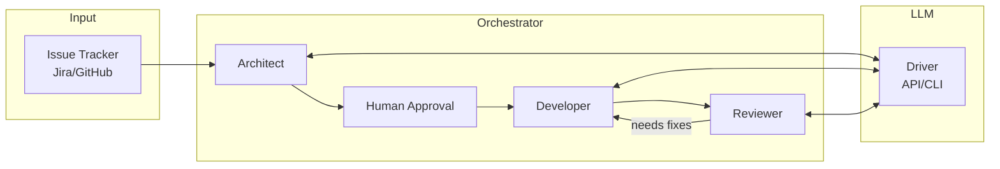
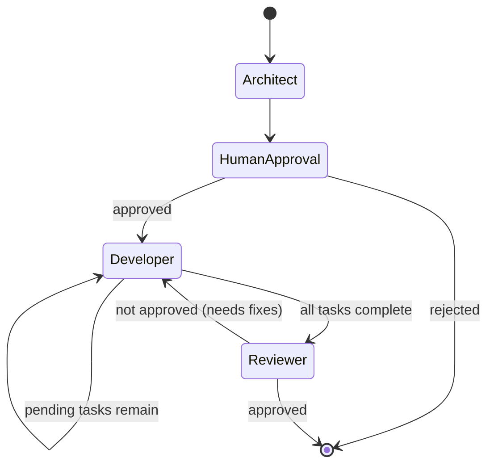
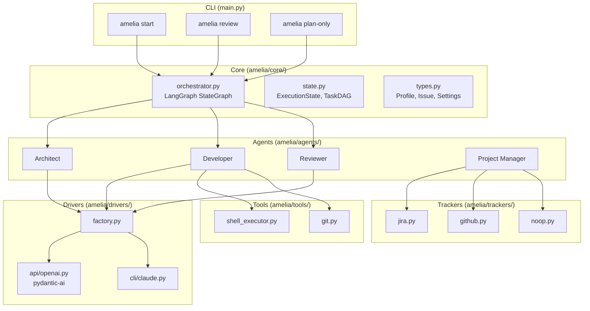
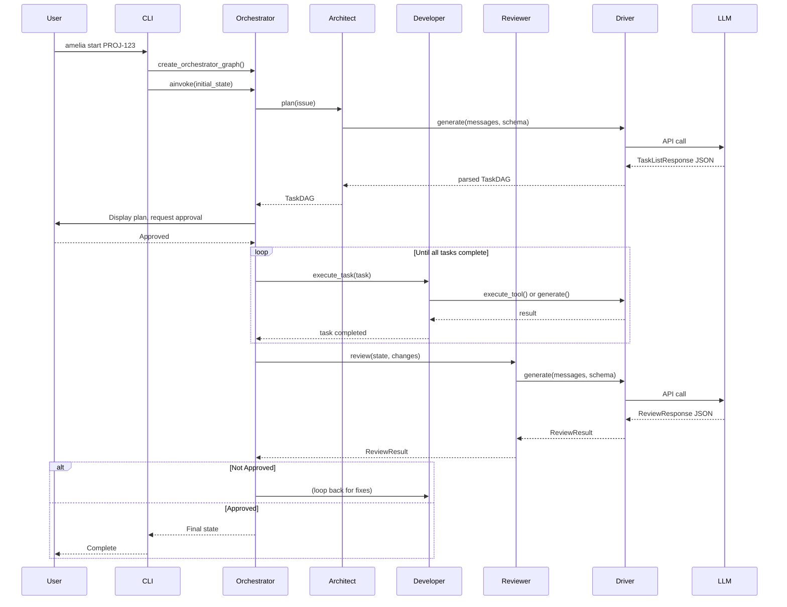

# Documentation Implementation Prompt

Use this prompt in a new Claude Code session to implement the documentation.

---

## Task Overview

Implement documentation for the Amelia project targeting engineers new to agentic AI who want to understand concepts and use Amelia on their projects.

**Deliverables:**
1. Rewrite `README.md` as a hub document
2. Create `docs/concepts.md` - Agentic AI fundamentals
3. Create `docs/architecture.md` - Technical deep dive with diagrams
4. Create `docs/configuration.md` - Full settings reference

**Approach:** Concept-first structure. Explain "why" and mental models before usage.

---

## File 1: README.md (Rewrite)

Create a new README.md with this structure:

### Section: What is Amelia?
- Amelia is a local agentic coding system that orchestrates software development tasks
- Explain what "agentic orchestration" means for someone new: multiple AI agents with specialized roles coordinate to accomplish complex tasks
- Problem it solves: automates development workflows (issue analysis → planning → coding → review) while respecting enterprise constraints

### Section: Key Concepts (include ASCII/Mermaid diagram)
Brief explanation of each (2-3 sentences), linking to docs/concepts.md for details:
- **Agents**: Specialized AI roles - Architect (plans), Developer (writes code), Reviewer (reviews), Project Manager (coordinates)
- **Orchestrator**: LangGraph-based state machine that coordinates agents through workflow (uses ExecutionState to track progress)
- **Drivers**: Abstraction for LLM communication - `api:openai` (direct API) or `cli:claude` (wraps CLI tools)
- **Trackers**: Abstraction for issue sources - `jira`, `github`, or `noop`
- **Profiles**: Bundled configurations in settings.amelia.yaml

Include this Mermaid diagram:


### Section: Quick Start
```bash
# Install
pip install -e .

# Create settings.amelia.yaml (show minimal example)
# Run first command
amelia plan-only ISSUE-123
```

### Section: CLI Commands
For each command, explain what happens under the hood:

**`amelia start <ISSUE_ID> [--profile <NAME>]`**
- Fetches issue from configured tracker
- Architect generates TaskDAG (list of tasks with dependencies)
- Prompts for human approval
- Developer executes tasks (can run in parallel if no dependencies)
- Reviewer evaluates changes
- Loops back to Developer if reviewer disapproves

**`amelia review --local [--profile <NAME>]`**
- Gets uncommitted changes via `git diff`
- Runs Reviewer agent directly
- Supports `single` (one review) or `competitive` (parallel Security/Performance/Usability reviews, aggregated)

**`amelia plan-only <ISSUE_ID> [--profile <NAME>]`**
- Generates plan without execution
- Saves to markdown file

### Section: Configuration
Show basic example, link to docs/configuration.md:
```yaml
active_profile: home
profiles:
  home:
    name: home
    driver: api:openai
    tracker: github
    strategy: single
```

### Section: Learn More
- [Concepts: Understanding Agentic AI](docs/concepts.md)
- [Architecture & Data Flow](docs/architecture.md)
- [Configuration Reference](docs/configuration.md)

### Section: Current Status
What works:
- Full orchestrator loop with human approval gates
- API driver (OpenAI via pydantic-ai) with structured outputs
- Local code review with competitive strategy
- Jira and GitHub tracker integrations

Limitations/Coming Soon:
- CLI driver (`cli:claude`) is currently a stub for LLM interactions
- TaskDAG doesn't validate cyclic dependencies

---

## File 2: docs/concepts.md (New)

Title: "Agentic AI Concepts"

### What is an "Agent"?
- An agent is an LLM given a specific role, tools, and instructions
- Unlike a chatbot that just responds, an agent can take actions
- Each agent has:
  - A system prompt defining its persona and capabilities
  - Access to specific tools (shell commands, file operations)
  - Input/output schemas for structured communication

### Amelia's Agents
Explain each agent's role with code references:

**Architect** (`amelia/agents/architect.py`)
- Role: Analyzes issues, designs solutions, creates task plans
- Input: Issue (id, title, description)
- Output: TaskDAG (list of tasks with dependencies)
- Uses structured output (TaskListResponse schema) to ensure parseable JSON

**Developer** (`amelia/agents/developer.py`)
- Role: Executes tasks by writing code and running commands
- Can: Execute shell commands, write files, generate LLM responses
- Tasks are executed based on their descriptions (e.g., "run shell command: npm test")

**Reviewer** (`amelia/agents/reviewer.py`)
- Role: Reviews code changes, provides feedback
- Strategies:
  - `single`: One general review
  - `competitive`: Parallel reviews from Security, Performance, Usability personas, then aggregated
- Output: ReviewResult (approved, comments, severity)

**Project Manager** (`amelia/agents/project_manager.py`)
- Role: Fetches issues from trackers
- Selects appropriate tracker based on profile configuration

### What is "Orchestration"?
- Orchestration coordinates multiple agents through a workflow
- Amelia uses LangGraph's StateGraph for the orchestration loop
- State machine pattern: nodes (agent calls) connected by edges (transitions)
- ExecutionState tracks: profile, issue, plan, messages, approval status, review results

Include state machine diagram:


### Tool Use
- Agents don't just generate text—they call tools
- Driver abstraction provides `execute_tool(tool_name, **kwargs)` method
- Example tools: `run_shell_command`, `write_file`
- Tool calls are structured: the agent requests a specific tool with parameters

Show example of tool execution flow.

### The Driver Abstraction
Why two drivers?
- **API Driver** (`api:openai`): Direct API calls for simple setups, needs API key
- **CLI Driver** (`cli:claude`): Enterprise-friendly, wraps existing authenticated CLI tools

Both implement `DriverInterface`:
- `generate(messages, schema)`: Get LLM response, optionally with structured output
- `execute_tool(tool_name, **kwargs)`: Execute a tool

### The Tracker Abstraction
Pluggable backends for fetching issues:
- `jira`: Fetches from Jira (uses HTTPX)
- `github`: Fetches from GitHub
- `noop`: No-op tracker for testing/manual input

All implement `BaseTracker` protocol with `get_issue(issue_id) -> Issue`.

---

## File 3: docs/architecture.md (New)

Title: "Architecture & Data Flow"

### System Overview



### Component Breakdown

**Core Layer** (`amelia/core/`)
| File | Purpose |
|------|---------|
| `orchestrator.py` | LangGraph state machine, defines nodes (agent calls) and edges (transitions), conditional routing |
| `state.py` | Pydantic models: `ExecutionState`, `Task`, `TaskDAG`, `ReviewResult`, `AgentMessage` |
| `types.py` | Shared types: `Profile`, `Issue`, `Settings` |

**Agents Layer** (`amelia/agents/`)
| File | Purpose |
|------|---------|
| `architect.py` | Generates TaskDAG from Issue using structured LLM output |
| `developer.py` | Executes tasks (shell commands, file writes, LLM generation) |
| `reviewer.py` | Reviews code with single or competitive strategy |
| `project_manager.py` | Creates appropriate tracker, fetches issues |

**Drivers Layer** (`amelia/drivers/`)
| File | Purpose |
|------|---------|
| `base.py` | `DriverInterface` protocol definition |
| `factory.py` | `DriverFactory.get_driver(key)` - returns driver from string like "api:openai" |
| `api/openai.py` | OpenAI implementation using pydantic-ai for structured outputs |
| `cli/claude.py` | Claude CLI wrapper (currently stub for LLM, real tool execution) |

**Trackers Layer** (`amelia/trackers/`)
| File | Purpose |
|------|---------|
| `base.py` | `BaseTracker` protocol |
| `jira.py` | Jira integration via HTTPX |
| `github.py` | GitHub integration |
| `noop.py` | No-op for testing |

### Data Flow: `amelia start PROJ-123`

Step-by-step trace:

1. **CLI Parsing** (`main.py:start`)
   - Load `settings.amelia.yaml` via `load_settings()`
   - Get active profile or use `--profile` flag
   - Validate profile has required fields

2. **Issue Fetching**
   - `create_project_manager(profile)` → selects tracker
   - `project_manager.get_issue("PROJ-123")` → returns `Issue(id, title, description)`

3. **Initialize State**
   - Create `ExecutionState(profile=profile, issue=issue)`
   - Create LangGraph app via `create_orchestrator_graph()`

4. **Orchestrator Loop** (via `asyncio.run(app.ainvoke(initial_state))`)

   **Node: architect_node**
   - `DriverFactory.get_driver(profile.driver)` → get driver
   - `Architect(driver).plan(issue)` → generates `TaskDAG`
   - LLM called with structured output schema `TaskListResponse`
   - State updated with plan

   **Node: human_approval_node**
   - Displays plan to user via typer
   - Prompts for approval (Y/n)
   - If rejected → END
   - If approved → continue

   **Node: developer_node** (may loop)
   - `get_ready_tasks(plan)` → find tasks with met dependencies
   - For each ready task, `Developer(driver).execute_task(task)`
   - Tasks executed concurrently via `asyncio.gather()`
   - Task status updated: pending → in_progress → completed/failed
   - If pending tasks remain → loop back
   - If all complete → proceed to reviewer

   **Node: reviewer_node**
   - Get code changes (from state or `git diff HEAD`)
   - `Reviewer(driver).review(state, code_changes)`
   - If `strategy == "competitive"`: parallel reviews, aggregated
   - If not approved → back to developer_node
   - If approved → END

5. **Completion**
   - Final state contains all messages, review results
   - Process exits

### Sequence Diagram



### Key Design Decisions

**Why the driver abstraction?**
Enterprise environments often prohibit direct API calls due to data retention policies. The CLI driver wraps existing approved tools (like `claude` CLI) that inherit SSO authentication and comply with policies. Users can switch between API (fast prototyping) and CLI (enterprise compliance) without code changes.

**Why separate agents instead of one big prompt?**
- **Specialization**: Each agent has focused system prompts, leading to better outputs
- **Token efficiency**: Only relevant context is passed to each agent
- **Modularity**: Easy to swap implementations (e.g., different review strategies)
- **Debuggability**: Clear separation makes it easier to trace issues

**Why pydantic-ai for the API driver?**
- Structured outputs: Forces LLM to return valid JSON matching Pydantic schemas
- Type safety: Catches schema mismatches at runtime
- Cleaner code: No manual JSON parsing or validation

**Why LangGraph for orchestration?**
- Built for agent workflows with cycles (developer ↔ reviewer loop)
- State management built-in
- Checkpointing support for resumable workflows
- Conditional edges for decision logic

---

## File 4: docs/configuration.md (New)

Title: "Configuration Reference"

### File Location

Amelia looks for `settings.amelia.yaml` in the current working directory.

### Full Example

```yaml
# Which profile to use when --profile is not specified
active_profile: home

profiles:
  # Enterprise profile - uses CLI tools for compliance
  work:
    name: work
    driver: cli:claude        # LLM via claude CLI
    tracker: jira             # Issues from Jira
    strategy: single          # Single reviewer
    plan_output_template: "plans/{issue_id}.md"  # Where to save plans

  # Personal profile - direct API access
  home:
    name: home
    driver: api:openai        # LLM via OpenAI API
    tracker: github           # Issues from GitHub
    strategy: competitive     # Multiple parallel reviewers
    plan_output_template: "plans/{issue_id}.md"

  # Testing profile
  test:
    name: test
    driver: api:openai
    tracker: noop             # No real tracker
    strategy: single
```

### Profile Structure

#### `active_profile` (required)
The default profile to use when `--profile` is not specified.

```yaml
active_profile: home
```

#### `profiles.<name>.name` (required)
Human-readable name for the profile. Should match the key.

#### `profiles.<name>.driver` (required)
How Amelia communicates with LLMs.

| Value | Description | Requirements | Notes |
|-------|-------------|--------------|-------|
| `api:openai` | Direct OpenAI API calls | `OPENAI_API_KEY` env var | Full functionality, structured outputs |
| `api` | Alias for `api:openai` | Same as above | Shorthand |
| `cli:claude` | Wraps claude CLI tool | `claude` CLI installed & authenticated | LLM generation is stub, tool execution works |
| `cli` | Alias for `cli:claude` | Same as above | Shorthand |

#### `profiles.<name>.tracker` (required)
Where Amelia fetches issue details from.

| Value | Description | Requirements |
|-------|-------------|--------------|
| `jira` | Jira issues | `JIRA_BASE_URL`, `JIRA_EMAIL`, `JIRA_API_TOKEN` env vars |
| `github` | GitHub issues | `gh` CLI authenticated or `GITHUB_TOKEN` |
| `noop` | No tracker (manual input) | None |

#### `profiles.<name>.strategy` (required)
How code review is performed.

| Value | Description | Behavior |
|-------|-------------|----------|
| `single` | One reviewer pass | General review from single LLM call |
| `competitive` | Multiple parallel reviews | Security, Performance, Usability reviews run concurrently, results aggregated |

#### `profiles.<name>.plan_output_template` (optional)
Template for where to save generated plans. Supports `{issue_id}` placeholder.

Default: `"plans/{issue_id}.md"`

```yaml
plan_output_template: "docs/plans/{issue_id}-plan.md"
```

### Environment Variables

#### OpenAI API Driver
| Variable | Required | Description |
|----------|----------|-------------|
| `OPENAI_API_KEY` | Yes | Your OpenAI API key |

#### Jira Tracker
| Variable | Required | Description |
|----------|----------|-------------|
| `JIRA_BASE_URL` | Yes | Jira instance URL (e.g., `https://company.atlassian.net`) |
| `JIRA_EMAIL` | Yes | Your Jira email |
| `JIRA_API_TOKEN` | Yes | Jira API token |

#### GitHub Tracker
| Variable | Required | Description |
|----------|----------|-------------|
| `GITHUB_TOKEN` | No | GitHub token (alternative to `gh` CLI auth) |

### Validation

Amelia validates profiles on startup:
- All required fields must be present
- Driver and tracker values must be recognized
- Strategy must be `single` or `competitive`

Invalid configuration results in exit code 1 with descriptive error message.

### Example Configurations

#### Minimal (API + No Tracker)
```yaml
active_profile: dev
profiles:
  dev:
    name: dev
    driver: api:openai
    tracker: noop
    strategy: single
```

#### Enterprise (CLI + Jira)
```yaml
active_profile: work
profiles:
  work:
    name: work
    driver: cli:claude
    tracker: jira
    strategy: competitive
```

#### Multi-Profile Setup
```yaml
active_profile: home

profiles:
  work:
    name: work
    driver: cli:claude
    tracker: jira
    strategy: competitive

  home:
    name: home
    driver: api:openai
    tracker: github
    strategy: single

  test:
    name: test
    driver: api:openai
    tracker: noop
    strategy: single
```

Usage:
```bash
amelia start PROJ-123              # Uses active_profile (home)
amelia start PROJ-123 -p work      # Uses work profile
amelia review --local -p test      # Uses test profile
```

---

## Implementation Instructions

Execute these tasks using subagents in parallel where possible:

### Task 1: Update README.md
Use the content from "File 1" section above. The README should be comprehensive but focused on giving engineers a mental model before diving into usage.

### Task 2: Create docs/concepts.md
Use the content from "File 2" section above. Focus on explaining agentic AI concepts through Amelia's implementation.

### Task 3: Create docs/architecture.md
Use the content from "File 3" section above. Include all Mermaid diagrams. Make sure the data flow trace is accurate to the actual code.

### Task 4: Create docs/configuration.md
Use the content from "File 4" section above. This is reference documentation - be precise and complete.

### Verification
After creating all files:
1. Ensure all internal links work
2. Verify Mermaid diagrams render correctly (test in a markdown preview)
3. Check that code references match actual file paths

---

## Technical Reference (for accuracy)

### Actual Project Structure
```
amelia/
├── agents/
│   ├── architect.py      # Architect agent
│   ├── developer.py      # Developer agent
│   ├── project_manager.py # PM agent (tracker selection)
│   └── reviewer.py       # Reviewer agent
├── core/
│   ├── orchestrator.py   # LangGraph state machine
│   ├── state.py          # ExecutionState, TaskDAG, etc.
│   └── types.py          # Profile, Issue, Settings
├── drivers/
│   ├── api/
│   │   └── openai.py     # OpenAI via pydantic-ai
│   ├── cli/
│   │   └── claude.py     # Claude CLI wrapper
│   ├── base.py           # DriverInterface
│   └── factory.py        # DriverFactory
├── trackers/
│   ├── base.py           # BaseTracker protocol
│   ├── github.py
│   ├── jira.py
│   └── noop.py
├── tools/
│   ├── git.py            # get_git_diff()
│   └── shell_executor.py
├── config.py             # load_settings(), validate_profile()
└── main.py               # Typer CLI app
```

### Key Types
```python
# Profile
class Profile(BaseModel):
    name: str
    driver: str
    tracker: str
    strategy: str
    plan_output_template: str = "plans/{issue_id}.md"

# Issue
class Issue(BaseModel):
    id: str
    title: str
    description: str

# Task
class Task(BaseModel):
    id: str
    description: str
    status: TaskStatus  # "pending" | "in_progress" | "completed" | "failed"
    dependencies: List[str]
    files_changed: List[str]

# ExecutionState
class ExecutionState(BaseModel):
    profile: Profile
    issue: Optional[Issue]
    plan: Optional[TaskDAG]
    current_task_id: Optional[str]
    human_approved: Optional[bool]
    review_results: List[ReviewResult]
    messages: List[AgentMessage]
    code_changes_for_review: Optional[str]
```

### Orchestrator Nodes
1. `architect_node` → calls Architect.plan()
2. `human_approval_node` → typer prompt for approval
3. `developer_node` → calls Developer.execute_task() for ready tasks
4. `reviewer_node` → calls Reviewer.review()

### Conditional Edges
- `human_approval_node`: approved → developer, rejected → END
- `developer_node`: pending tasks → loop, all complete → reviewer
- `reviewer_node`: not approved → developer, approved → END
