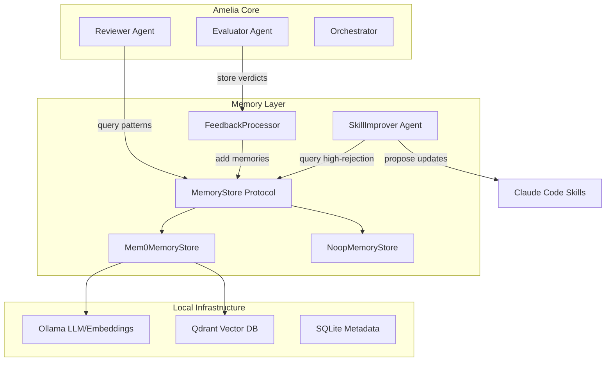
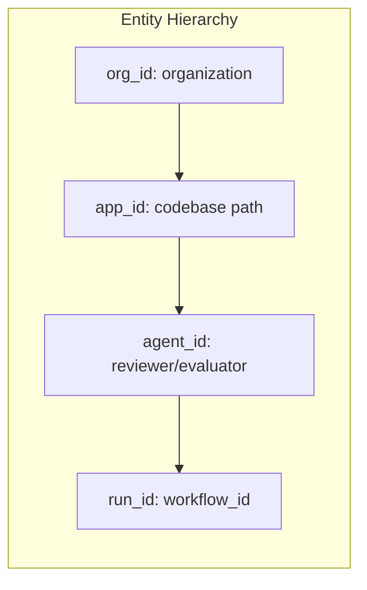

# Mem0 Integration for Amelia Reviewer Agent

---

## Overview

This plan integrates [mem0](https://docs.mem0.ai/) into Amelia's Reviewer agent to enable:
1. **P0 - Incremental Skill Refinement**: Auto-propose skill updates from high-rejection patterns
2. **P1 - Codebase Pattern Memory**: Store learned patterns from REJECTED review items
3. **P1 - Framework Knowledge Memory**: Bootstrap framework-specific knowledge
4. **P1 - Rule Effectiveness Tracking**: Track rejection rates by rule type
5. **P1 - Cross-Review Learning**: Search similar past reviews before reviewing
6. **P2 - Developer Preference Memory**: Learn individual developer patterns

### Goals
- Zero cloud dependencies (Ollama + Qdrant local stack)
- Per-organization memory scope by default, configurable to per-codebase
- Clean integration following existing extension patterns in `amelia/ext/`
- Optional memory - Reviewer works without memory configured

---

## Architecture



### Memory Scoping Strategy



**Default scope**: `org_id` (shared across codebases in an organization)
**Optional scope**: `app_id` (per-codebase isolation)

---

## Data Models

### Memory Records

```python
# amelia/memory/models.py

from datetime import datetime
from enum import StrEnum
from typing import Literal

from pydantic import BaseModel, ConfigDict, Field


class MemoryType(StrEnum):
    """Types of memories stored by the system."""
    REJECTION_PATTERN = "rejection_pattern"      # P1: Codebase patterns
    FRAMEWORK_KNOWLEDGE = "framework_knowledge"  # P1: Framework-specific
    RULE_EFFECTIVENESS = "rule_effectiveness"    # P1: Rule tracking
    DEVELOPER_PREFERENCE = "developer_preference"  # P2: Dev preferences
    REVIEW_OUTCOME = "review_outcome"            # Cross-review learning


class RejectionPatternMemory(BaseModel):
    """Memory of a rejected review item pattern.

    Stored when an Evaluator rejects a review item as technically incorrect.
    Used to prevent similar false positives in future reviews.
    """
    model_config = ConfigDict(frozen=True)

    memory_type: Literal["rejection_pattern"] = "rejection_pattern"
    pattern_description: str = Field(
        description="Natural language description of the incorrect pattern"
    )
    file_pattern: str = Field(
        description="Glob pattern for files this applies to, e.g., '*.py' or 'tests/**'"
    )
    rule_category: str = Field(
        description="Category of rule that was wrong, e.g., 'unused_code', 'naming'"
    )
    rejection_reason: str = Field(
        description="Why this pattern was incorrectly flagged"
    )
    evidence: str = Field(
        description="Concrete evidence that disproved the review item"
    )
    codebase_path: str = Field(
        description="Absolute path to codebase for scoping"
    )
    created_at: datetime = Field(default_factory=datetime.utcnow)


class FrameworkKnowledgeMemory(BaseModel):
    """Framework-specific knowledge that applies across codebases.

    Stored when framework conventions are learned. Shared across
    all codebases in the organization using the same framework.
    """
    model_config = ConfigDict(frozen=True)

    memory_type: Literal["framework_knowledge"] = "framework_knowledge"
    framework: str = Field(description="Framework name, e.g., 'react', 'fastapi'")
    pattern_name: str = Field(description="Name of the pattern or convention")
    description: str = Field(description="What the pattern does")
    correct_usage: str = Field(description="Example of correct usage")
    common_mistakes: list[str] = Field(default_factory=list)
    source: str | None = Field(default=None, description="Where this was learned")


class RuleEffectivenessMemory(BaseModel):
    """Tracking data for rule effectiveness.

    Updated after each review cycle. Used to identify rules
    that have high false-positive rates.
    """
    model_config = ConfigDict(frozen=True)

    memory_type: Literal["rule_effectiveness"] = "rule_effectiveness"
    rule_category: str
    total_flagged: int = 0
    total_rejected: int = 0  # By evaluator as incorrect
    total_implemented: int = 0  # Developer fixed it
    total_deferred: int = 0
    last_updated: datetime = Field(default_factory=datetime.utcnow)

    @property
    def rejection_rate(self) -> float:
        """Percentage of flags that were rejected as incorrect."""
        if self.total_flagged == 0:
            return 0.0
        return self.total_rejected / self.total_flagged


class DeveloperPreferenceMemory(BaseModel):
    """Individual developer coding preferences.

    Learned from patterns in accepted code reviews.
    Used to personalize future reviews.
    """
    model_config = ConfigDict(frozen=True)

    memory_type: Literal["developer_preference"] = "developer_preference"
    developer_id: str = Field(description="Git author email or identifier")
    preference_type: str = Field(description="Type of preference, e.g., 'line_length'")
    preference_value: str = Field(description="The observed preference")
    confidence: float = Field(ge=0.0, le=1.0, description="Confidence level")
    observation_count: int = Field(default=1)


class ReviewOutcomeMemory(BaseModel):
    """Record of a completed review for cross-review learning.

    Stores the essence of a review for similarity search.
    """
    model_config = ConfigDict(frozen=True)

    memory_type: Literal["review_outcome"] = "review_outcome"
    code_summary: str = Field(description="Summary of what the code does")
    issue_summary: str = Field(description="Summary of the issue being addressed")
    key_findings: list[str] = Field(description="Main review findings")
    verdict: Literal["approved", "needs_fixes", "blocked"]
    workflow_id: str
    timestamp: datetime = Field(default_factory=datetime.utcnow)
```

### Skill Improvement Records

```python
# amelia/memory/models.py (continued)

class SkillImprovementProposal(BaseModel):
    """Proposed skill update based on accumulated memory patterns.

    Generated by SkillImprover agent for human review.
    """
    model_config = ConfigDict(frozen=True)

    skill_file: str = Field(description="Path to skill markdown file")
    section: str = Field(description="Section to modify")
    current_content: str = Field(description="Current content of section")
    proposed_content: str = Field(description="Proposed new content")
    rationale: str = Field(description="Why this change is recommended")
    supporting_memories: list[str] = Field(
        description="Memory IDs that support this proposal"
    )
    confidence: float = Field(ge=0.0, le=1.0)


class SkillImprovementOutcome(BaseModel):
    """Result of a skill improvement proposal.

    Stored to track which proposals were accepted/rejected.
    """
    model_config = ConfigDict(frozen=True)

    proposal_id: str
    accepted: bool
    human_feedback: str | None = None
    memory_ids_addressed: list[str] = Field(
        description="Memories marked as addressed if accepted"
    )
```

---

## Protocol Design

```python
# amelia/memory/protocol.py

from typing import Any, Protocol, runtime_checkable

from amelia.memory.models import (
    MemoryType,
    RejectionPatternMemory,
    FrameworkKnowledgeMemory,
    RuleEffectivenessMemory,
    DeveloperPreferenceMemory,
    ReviewOutcomeMemory,
)


# Union type for all memory records
MemoryRecord = (
    RejectionPatternMemory
    | FrameworkKnowledgeMemory
    | RuleEffectivenessMemory
    | DeveloperPreferenceMemory
    | ReviewOutcomeMemory
)


@runtime_checkable
class MemoryStore(Protocol):
    """Protocol for memory storage backends.

    Implementations:
    - Mem0MemoryStore: Production implementation using mem0 + Ollama + Qdrant
    - NoopMemoryStore: No-op for when memory is disabled

    Follows the pattern from amelia/ext/protocols.py
    """

    async def add(
        self,
        content: str,
        memory_type: MemoryType,
        metadata: dict[str, Any],
        *,
        org_id: str,
        app_id: str | None = None,
        agent_id: str = "reviewer",
        run_id: str | None = None,
    ) -> str:
        """Add a memory to the store.

        Args:
            content: Natural language description for embedding
            memory_type: Type of memory being stored
            metadata: Structured data for filtering
            org_id: Organization identifier (required)
            app_id: Optional codebase path for scoping
            agent_id: Agent storing the memory
            run_id: Optional workflow ID for session scoping

        Returns:
            Memory ID for future reference
        """
        ...

    async def search(
        self,
        query: str,
        *,
        org_id: str,
        app_id: str | None = None,
        memory_type: MemoryType | None = None,
        limit: int = 10,
    ) -> list[dict[str, Any]]:
        """Search memories by semantic similarity.

        Args:
            query: Natural language query
            org_id: Organization to search within
            app_id: Optional codebase path filter
            memory_type: Optional type filter
            limit: Maximum results

        Returns:
            List of matching memories with scores
        """
        ...

    async def get_all(
        self,
        *,
        org_id: str,
        app_id: str | None = None,
        memory_type: MemoryType | None = None,
        agent_id: str | None = None,
    ) -> list[dict[str, Any]]:
        """Get all memories matching filters.

        Args:
            org_id: Organization to query
            app_id: Optional codebase path filter
            memory_type: Optional type filter
            agent_id: Optional agent filter

        Returns:
            List of all matching memories
        """
        ...

    async def update(
        self,
        memory_id: str,
        content: str | None = None,
        metadata: dict[str, Any] | None = None,
    ) -> bool:
        """Update an existing memory.

        Args:
            memory_id: ID of memory to update
            content: New content (optional)
            metadata: Metadata to merge (optional)

        Returns:
            True if updated, False if not found
        """
        ...

    async def delete(
        self,
        memory_id: str,
    ) -> bool:
        """Delete a memory.

        Args:
            memory_id: ID of memory to delete

        Returns:
            True if deleted, False if not found
        """
        ...

    async def mark_addressed(
        self,
        memory_ids: list[str],
    ) -> int:
        """Mark memories as addressed by skill update.

        Args:
            memory_ids: IDs of memories to mark

        Returns:
            Number of memories marked
        """
        ...

    async def get_high_rejection_patterns(
        self,
        *,
        org_id: str,
        min_rejection_rate: float = 0.3,
        min_samples: int = 5,
    ) -> list[dict[str, Any]]:
        """Get patterns with high rejection rates for skill improvement.

        Args:
            org_id: Organization to query
            min_rejection_rate: Minimum rejection rate threshold
            min_samples: Minimum number of samples required

        Returns:
            Patterns that may need skill updates
        """
        ...
```

---

## Implementation Components

### 1. Mem0MemoryStore Adapter

```python
# amelia/memory/mem0_store.py

from typing import Any

from loguru import logger
from mem0 import Memory

from amelia.memory.models import MemoryType
from amelia.memory.protocol import MemoryStore


class Mem0MemoryStore:
    """Production memory store using mem0 with local Ollama + Qdrant stack.

    Configuration is passed at initialization, allowing different
    profiles to use different memory configurations.
    """

    def __init__(
        self,
        ollama_base_url: str = "http://localhost:11434",
        ollama_model: str = "llama3.1:latest",
        ollama_embed_model: str = "nomic-embed-text:latest",
        qdrant_host: str = "localhost",
        qdrant_port: int = 6333,
        collection_name: str = "amelia_memories",
        embedding_dims: int = 768,
    ):
        """Initialize mem0 with local configuration.

        Args:
            ollama_base_url: Ollama server URL
            ollama_model: LLM model for memory operations
            ollama_embed_model: Embedding model
            qdrant_host: Qdrant server host
            qdrant_port: Qdrant server port
            collection_name: Vector collection name
            embedding_dims: Embedding dimensions (match your model)
        """
        self._config = {
            "vector_store": {
                "provider": "qdrant",
                "config": {
                    "collection_name": collection_name,
                    "host": qdrant_host,
                    "port": qdrant_port,
                    "embedding_model_dims": embedding_dims,
                },
            },
            "llm": {
                "provider": "ollama",
                "config": {
                    "model": ollama_model,
                    "temperature": 0,
                    "max_tokens": 2000,
                    "ollama_base_url": ollama_base_url,
                },
            },
            "embedder": {
                "provider": "ollama",
                "config": {
                    "model": ollama_embed_model,
                    "ollama_base_url": ollama_base_url,
                },
            },
        }
        self._memory = Memory.from_config(self._config)
        logger.info(
            "Initialized Mem0MemoryStore",
            ollama_url=ollama_base_url,
            qdrant_host=qdrant_host,
        )

    async def add(
        self,
        content: str,
        memory_type: MemoryType,
        metadata: dict[str, Any],
        *,
        org_id: str,
        app_id: str | None = None,
        agent_id: str = "reviewer",
        run_id: str | None = None,
    ) -> str:
        """Add a memory using mem0's intelligent extraction."""
        # Construct message for mem0's inference mode
        messages = [
            {"role": "user", "content": content},
        ]

        # mem0 uses user_id as primary scope
        # We map org_id to user_id and app_id to agent_id
        result = self._memory.add(
            messages,
            user_id=org_id,
            agent_id=app_id or agent_id,
            run_id=run_id,
            metadata={
                "memory_type": memory_type.value,
                "addressed": False,
                **metadata,
            },
        )

        memory_id = result.get("id", "")
        logger.debug(
            "Added memory",
            memory_id=memory_id,
            memory_type=memory_type.value,
            org_id=org_id,
        )
        return memory_id

    async def search(
        self,
        query: str,
        *,
        org_id: str,
        app_id: str | None = None,
        memory_type: MemoryType | None = None,
        limit: int = 10,
    ) -> list[dict[str, Any]]:
        """Search memories using semantic similarity."""
        filters: dict[str, Any] = {"user_id": org_id}
        if app_id:
            filters["agent_id"] = app_id
        if memory_type:
            filters["metadata.memory_type"] = memory_type.value

        results = self._memory.search(
            query=query,
            filters=filters,
            limit=limit,
        )
        return results.get("results", [])

    async def get_all(
        self,
        *,
        org_id: str,
        app_id: str | None = None,
        memory_type: MemoryType | None = None,
        agent_id: str | None = None,
    ) -> list[dict[str, Any]]:
        """Get all memories matching filters."""
        # Build filter kwargs
        kwargs: dict[str, Any] = {"user_id": org_id}
        if app_id:
            kwargs["agent_id"] = app_id

        results = self._memory.get_all(**kwargs)

        # Post-filter by memory_type if specified
        if memory_type:
            results = [
                r for r in results
                if r.get("metadata", {}).get("memory_type") == memory_type.value
            ]

        return results

    async def update(
        self,
        memory_id: str,
        content: str | None = None,
        metadata: dict[str, Any] | None = None,
    ) -> bool:
        """Update an existing memory."""
        try:
            self._memory.update(
                memory_id=memory_id,
                data=content,
                metadata=metadata,
            )
            return True
        except Exception as e:
            logger.warning("Failed to update memory", memory_id=memory_id, error=str(e))
            return False

    async def delete(
        self,
        memory_id: str,
    ) -> bool:
        """Delete a memory."""
        try:
            self._memory.delete(memory_id=memory_id)
            return True
        except Exception as e:
            logger.warning("Failed to delete memory", memory_id=memory_id, error=str(e))
            return False

    async def mark_addressed(
        self,
        memory_ids: list[str],
    ) -> int:
        """Mark memories as addressed by skill update."""
        count = 0
        for memory_id in memory_ids:
            if await self.update(memory_id, metadata={"addressed": True}):
                count += 1
        return count

    async def get_high_rejection_patterns(
        self,
        *,
        org_id: str,
        min_rejection_rate: float = 0.3,
        min_samples: int = 5,
    ) -> list[dict[str, Any]]:
        """Get patterns with high rejection rates for skill improvement."""
        # Get all rule effectiveness memories
        all_rules = await self.get_all(
            org_id=org_id,
            memory_type=MemoryType.RULE_EFFECTIVENESS,
        )

        # Filter by rejection rate and sample count
        high_rejection = []
        for rule in all_rules:
            meta = rule.get("metadata", {})
            total = meta.get("total_flagged", 0)
            rejected = meta.get("total_rejected", 0)

            if total >= min_samples:
                rate = rejected / total
                if rate >= min_rejection_rate:
                    high_rejection.append({
                        **rule,
                        "rejection_rate": rate,
                    })

        # Sort by rejection rate descending
        return sorted(high_rejection, key=lambda x: x["rejection_rate"], reverse=True)
```

### 2. NoopMemoryStore

```python
# amelia/memory/noop_store.py

from typing import Any

from amelia.memory.models import MemoryType
from amelia.memory.protocol import MemoryStore


class NoopMemoryStore:
    """No-op memory store for when memory is disabled.

    All operations return empty results without errors.
    Follows NoopPolicyHook pattern from amelia/ext/noop.py
    """

    async def add(
        self,
        content: str,
        memory_type: MemoryType,
        metadata: dict[str, Any],
        *,
        org_id: str,
        app_id: str | None = None,
        agent_id: str = "reviewer",
        run_id: str | None = None,
    ) -> str:
        """No-op: return empty ID."""
        return ""

    async def search(
        self,
        query: str,
        *,
        org_id: str,
        app_id: str | None = None,
        memory_type: MemoryType | None = None,
        limit: int = 10,
    ) -> list[dict[str, Any]]:
        """No-op: return empty results."""
        return []

    async def get_all(
        self,
        *,
        org_id: str,
        app_id: str | None = None,
        memory_type: MemoryType | None = None,
        agent_id: str | None = None,
    ) -> list[dict[str, Any]]:
        """No-op: return empty results."""
        return []

    async def update(
        self,
        memory_id: str,
        content: str | None = None,
        metadata: dict[str, Any] | None = None,
    ) -> bool:
        """No-op: return False (not found)."""
        return False

    async def delete(
        self,
        memory_id: str,
    ) -> bool:
        """No-op: return False (not found)."""
        return False

    async def mark_addressed(
        self,
        memory_ids: list[str],
    ) -> int:
        """No-op: return 0."""
        return 0

    async def get_high_rejection_patterns(
        self,
        *,
        org_id: str,
        min_rejection_rate: float = 0.3,
        min_samples: int = 5,
    ) -> list[dict[str, Any]]:
        """No-op: return empty results."""
        return []
```

### 3. FeedbackProcessor

```python
# amelia/memory/feedback_processor.py

from loguru import logger

from amelia.agents.evaluator import Disposition, EvaluatedItem, EvaluationResult
from amelia.memory.models import MemoryType, RejectionPatternMemory
from amelia.memory.protocol import MemoryStore


class FeedbackProcessor:
    """Processes evaluation results and stores memories.

    Called after the Evaluator agent completes to capture:
    - Rejection patterns (items marked as technically incorrect)
    - Rule effectiveness statistics
    - Review outcomes for cross-learning
    """

    def __init__(self, memory_store: MemoryStore):
        self._memory = memory_store

    async def process_evaluation(
        self,
        evaluation: EvaluationResult,
        *,
        org_id: str,
        app_id: str | None = None,
        workflow_id: str,
        code_summary: str | None = None,
        issue_summary: str | None = None,
    ) -> None:
        """Process evaluation result and store relevant memories.

        Args:
            evaluation: Result from Evaluator agent
            org_id: Organization identifier
            app_id: Optional codebase path
            workflow_id: Current workflow ID
            code_summary: Summary of code changes
            issue_summary: Summary of issue being addressed
        """
        # Store rejection patterns
        for item in evaluation.items_rejected:
            await self._store_rejection_pattern(item, org_id=org_id, app_id=app_id)

        # Update rule effectiveness for all items
        await self._update_rule_effectiveness(evaluation, org_id=org_id)

        # Store review outcome for cross-learning
        if code_summary:
            await self._store_review_outcome(
                evaluation,
                code_summary=code_summary,
                issue_summary=issue_summary or "",
                workflow_id=workflow_id,
                org_id=org_id,
                app_id=app_id,
            )

    async def _store_rejection_pattern(
        self,
        item: EvaluatedItem,
        *,
        org_id: str,
        app_id: str | None,
    ) -> None:
        """Store a rejection pattern memory."""
        content = f"""
Rejected review item: {item.title}
File: {item.file_path}:{item.line}
Original issue: {item.original_issue}
Rejection reason: {item.reason}
This was incorrectly flagged because: {item.reason}
"""

        # Infer file pattern from file_path
        file_pattern = self._infer_file_pattern(item.file_path)

        await self._memory.add(
            content=content,
            memory_type=MemoryType.REJECTION_PATTERN,
            metadata={
                "file_path": item.file_path,
                "file_pattern": file_pattern,
                "line": item.line,
                "rule_category": self._infer_rule_category(item.title),
                "rejection_reason": item.reason,
                "original_issue": item.original_issue,
            },
            org_id=org_id,
            app_id=app_id,
            agent_id="evaluator",
        )

        logger.info(
            "Stored rejection pattern memory",
            file_path=item.file_path,
            rule_category=self._infer_rule_category(item.title),
        )

    async def _update_rule_effectiveness(
        self,
        evaluation: EvaluationResult,
        *,
        org_id: str,
    ) -> None:
        """Update rule effectiveness statistics."""
        # Group items by rule category
        category_counts: dict[str, dict[str, int]] = {}

        for item in evaluation.items_to_implement:
            cat = self._infer_rule_category(item.title)
            if cat not in category_counts:
                category_counts[cat] = {"flagged": 0, "implemented": 0, "rejected": 0, "deferred": 0}
            category_counts[cat]["flagged"] += 1
            category_counts[cat]["implemented"] += 1

        for item in evaluation.items_rejected:
            cat = self._infer_rule_category(item.title)
            if cat not in category_counts:
                category_counts[cat] = {"flagged": 0, "implemented": 0, "rejected": 0, "deferred": 0}
            category_counts[cat]["flagged"] += 1
            category_counts[cat]["rejected"] += 1

        for item in evaluation.items_deferred:
            cat = self._infer_rule_category(item.title)
            if cat not in category_counts:
                category_counts[cat] = {"flagged": 0, "implemented": 0, "rejected": 0, "deferred": 0}
            category_counts[cat]["flagged"] += 1
            category_counts[cat]["deferred"] += 1

        # Store/update effectiveness memory for each category
        for category, counts in category_counts.items():
            await self._memory.add(
                content=f"Rule effectiveness for {category}: {counts['implemented']} implemented, {counts['rejected']} rejected, {counts['deferred']} deferred",
                memory_type=MemoryType.RULE_EFFECTIVENESS,
                metadata={
                    "rule_category": category,
                    "delta_flagged": counts["flagged"],
                    "delta_implemented": counts["implemented"],
                    "delta_rejected": counts["rejected"],
                    "delta_deferred": counts["deferred"],
                },
                org_id=org_id,
                agent_id="evaluator",
            )

    async def _store_review_outcome(
        self,
        evaluation: EvaluationResult,
        *,
        code_summary: str,
        issue_summary: str,
        workflow_id: str,
        org_id: str,
        app_id: str | None,
    ) -> None:
        """Store review outcome for cross-review learning."""
        key_findings = [
            item.title for item in evaluation.items_to_implement[:5]
        ]

        verdict = "approved"
        if evaluation.items_to_implement:
            verdict = "needs_fixes"

        content = f"""
Review outcome for: {issue_summary}
Code changes: {code_summary}
Key findings: {', '.join(key_findings)}
Verdict: {verdict}
"""

        await self._memory.add(
            content=content,
            memory_type=MemoryType.REVIEW_OUTCOME,
            metadata={
                "code_summary": code_summary,
                "issue_summary": issue_summary,
                "key_findings": key_findings,
                "verdict": verdict,
                "workflow_id": workflow_id,
            },
            org_id=org_id,
            app_id=app_id,
            agent_id="reviewer",
            run_id=workflow_id,
        )

    def _infer_file_pattern(self, file_path: str) -> str:
        """Infer a glob pattern from a file path."""
        if file_path.endswith(".py"):
            if "test" in file_path.lower():
                return "tests/**/*.py"
            return "**/*.py"
        elif file_path.endswith((".ts", ".tsx")):
            return "**/*.{ts,tsx}"
        elif file_path.endswith((".js", ".jsx")):
            return "**/*.{js,jsx}"
        return "*"

    def _infer_rule_category(self, title: str) -> str:
        """Infer rule category from review item title."""
        title_lower = title.lower()

        if "unused" in title_lower:
            return "unused_code"
        elif "import" in title_lower:
            return "imports"
        elif "type" in title_lower or "typing" in title_lower:
            return "type_hints"
        elif "security" in title_lower:
            return "security"
        elif "performance" in title_lower:
            return "performance"
        elif "test" in title_lower:
            return "testing"
        elif "doc" in title_lower or "comment" in title_lower:
            return "documentation"
        elif "name" in title_lower or "naming" in title_lower:
            return "naming"
        elif "error" in title_lower or "exception" in title_lower:
            return "error_handling"
        else:
            return "general"
```

### 4. SkillImprover Agent

```python
# amelia/agents/skill_improver.py

from loguru import logger
from pydantic import BaseModel

from amelia.core.types import Profile
from amelia.drivers.base import DriverInterface
from amelia.memory.models import SkillImprovementProposal
from amelia.memory.protocol import MemoryStore


class SkillImprovementOutput(BaseModel):
    """LLM output schema for skill improvement proposals."""

    proposals: list[SkillImprovementProposal]
    summary: str


class SkillImprover:
    """Agent that proposes skill updates based on accumulated memory patterns.

    Part of P0 - Incremental Skill Refinement:
    1. Queries mem0 for high-rejection patterns
    2. Analyzes patterns to identify skill gaps
    3. Generates concrete skill modification proposals
    4. Human approves -> skill updated -> memories marked as addressed
    """

    SYSTEM_PROMPT = """You are a skill improvement agent. Your task is to analyze
patterns of rejected review items and propose updates to Claude Code skills.

CONTEXT:
- Claude Code uses skill markdown files to guide reviews
- When review items are consistently rejected as "technically incorrect",
  it indicates the skill may need refinement
- Your proposals should prevent future false positives

OUTPUT REQUIREMENTS:
1. Identify specific sections of skills that need modification
2. Provide exact before/after content
3. Explain the rationale with evidence from rejection patterns
4. Assign confidence based on pattern strength

Be conservative - only propose changes with strong pattern evidence."""

    def __init__(
        self,
        driver: DriverInterface,
        memory_store: MemoryStore,
    ):
        self.driver = driver
        self._memory = memory_store

    async def analyze_and_propose(
        self,
        *,
        org_id: str,
        skill_paths: list[str],
        min_rejection_rate: float = 0.3,
        min_samples: int = 5,
    ) -> SkillImprovementOutput:
        """Analyze high-rejection patterns and propose skill improvements.

        Args:
            org_id: Organization to analyze
            skill_paths: Paths to skill files to consider for updates
            min_rejection_rate: Minimum rejection rate to consider
            min_samples: Minimum samples required

        Returns:
            Proposals for skill improvements
        """
        # Get high-rejection patterns from memory
        patterns = await self._memory.get_high_rejection_patterns(
            org_id=org_id,
            min_rejection_rate=min_rejection_rate,
            min_samples=min_samples,
        )

        if not patterns:
            logger.info("No high-rejection patterns found for skill improvement")
            return SkillImprovementOutput(
                proposals=[],
                summary="No patterns requiring skill updates found.",
            )

        # Build prompt with patterns and skill content
        prompt = self._build_prompt(patterns, skill_paths)

        response, _ = await self.driver.generate(
            prompt=prompt,
            system_prompt=self.SYSTEM_PROMPT,
            schema=SkillImprovementOutput,
        )

        logger.info(
            "Generated skill improvement proposals",
            proposal_count=len(response.proposals),
            pattern_count=len(patterns),
        )

        return response

    async def apply_proposal(
        self,
        proposal: SkillImprovementProposal,
        *,
        accepted: bool,
        human_feedback: str | None = None,
    ) -> None:
        """Apply or reject a skill improvement proposal.

        Args:
            proposal: The proposal to apply
            accepted: Whether human accepted the proposal
            human_feedback: Optional feedback from human
        """
        if accepted:
            # Mark supporting memories as addressed
            await self._memory.mark_addressed(proposal.supporting_memories)
            logger.info(
                "Applied skill improvement proposal",
                skill_file=proposal.skill_file,
                section=proposal.section,
                memories_addressed=len(proposal.supporting_memories),
            )
        else:
            logger.info(
                "Rejected skill improvement proposal",
                skill_file=proposal.skill_file,
                feedback=human_feedback,
            )

    def _build_prompt(
        self,
        patterns: list[dict],
        skill_paths: list[str],
    ) -> str:
        """Build prompt for skill improvement analysis."""
        parts = ["## High-Rejection Patterns\n"]

        for i, pattern in enumerate(patterns, 1):
            meta = pattern.get("metadata", {})
            parts.append(f"""
### Pattern {i}: {meta.get('rule_category', 'unknown')}
- Rejection rate: {pattern.get('rejection_rate', 0):.1%}
- Sample count: {meta.get('total_flagged', 0)}
- Common rejection reason: {meta.get('rejection_reason', 'N/A')}
- File pattern: {meta.get('file_pattern', '*')}
""")

        parts.append("\n## Skill Files to Consider\n")
        for path in skill_paths:
            parts.append(f"- {path}")

        parts.append("""

## Task
Analyze the high-rejection patterns above and propose specific updates to
the skill files that would prevent these false positives in future reviews.

For each proposal:
1. Identify the exact section to modify
2. Show the current content and proposed new content
3. Explain why this change addresses the pattern
4. List the memory IDs that support this proposal
""")

        return "\n".join(parts)
```

---

## Configuration Integration

### Profile Extension

```python
# Add to amelia/core/types.py

class MemoryConfig(BaseModel):
    """Configuration for memory storage.

    Attributes:
        enabled: Whether memory is enabled for this profile.
        org_id: Organization identifier for memory scoping.
        scope: Memory scope level (org or codebase).
        ollama_base_url: Ollama server URL.
        ollama_model: LLM model for memory operations.
        ollama_embed_model: Embedding model.
        qdrant_host: Qdrant server host.
        qdrant_port: Qdrant server port.
    """
    enabled: bool = False
    org_id: str = "default"
    scope: Literal["org", "codebase"] = "org"
    ollama_base_url: str = "http://localhost:11434"
    ollama_model: str = "llama3.1:latest"
    ollama_embed_model: str = "nomic-embed-text:latest"
    qdrant_host: str = "localhost"
    qdrant_port: int = 6333


class Profile(BaseModel):
    """Configuration profile for Amelia execution.

    Extended with memory configuration.
    """
    # ... existing fields ...

    memory: MemoryConfig = Field(default_factory=MemoryConfig)
```

### Settings File Example

```yaml
# settings.amelia.yaml

active_profile: work
profiles:
  work:
    name: work
    driver: cli:claude
    model: sonnet
    tracker: github
    strategy: single
    memory:
      enabled: true
      org_id: "my-company"
      scope: org
      ollama_base_url: http://localhost:11434
      ollama_model: llama3.1:latest
      ollama_embed_model: nomic-embed-text:latest
      qdrant_host: localhost
      qdrant_port: 6333
```

---

## Integration Points

### Reviewer Enhancement

```python
# Modifications to amelia/agents/reviewer.py

class Reviewer:
    """Agent responsible for reviewing code changes against requirements.

    Extended with optional memory for cross-review learning.
    """

    def __init__(
        self,
        driver: DriverInterface,
        stream_emitter: StreamEmitter | None = None,
        memory_store: MemoryStore | None = None,  # NEW
    ):
        self.driver = driver
        self._stream_emitter = stream_emitter
        self._memory = memory_store

    async def _query_similar_reviews(
        self,
        state: ExecutionState,
        profile: Profile,
    ) -> list[dict]:
        """Query memory for similar past reviews.

        Returns relevant patterns and past review outcomes.
        """
        if not self._memory:
            return []

        # Build query from current context
        query = f"""
Code review for: {state.goal or ''}
Issue: {state.issue.title if state.issue else ''}
"""

        # Search for similar reviews and rejection patterns
        org_id = profile.memory.org_id if profile.memory.enabled else "default"
        app_id = profile.working_dir if profile.memory.scope == "codebase" else None

        similar = await self._memory.search(
            query=query,
            org_id=org_id,
            app_id=app_id,
            limit=5,
        )

        return similar

    async def structured_review(
        self,
        state: ExecutionState,
        code_changes: str,
        profile: Profile,
        *,
        workflow_id: str,
    ) -> tuple[StructuredReviewResult, str | None]:
        """Perform structured code review with memory-enhanced context."""

        # Query similar reviews for context (NEW)
        similar_reviews = await self._query_similar_reviews(state, profile)

        # Inject learned patterns into prompt
        prompt = self._build_prompt(state, code_changes)
        if similar_reviews:
            patterns_context = self._format_memory_context(similar_reviews)
            prompt = f"{patterns_context}\n\n{prompt}"

        # ... rest of existing implementation ...
```

### Orchestrator Integration

```python
# Add to amelia/core/orchestrator.py after call_evaluation_node

async def call_feedback_processor_node(
    state: ExecutionState,
    config: RunnableConfig | None = None,
) -> dict[str, Any]:
    """Node to process evaluation feedback into memory.

    Called after evaluation to store rejection patterns
    and update rule effectiveness statistics.
    """
    stream_emitter, workflow_id, profile = _extract_config_params(config)

    if not profile.memory.enabled:
        return {}

    # Get memory store from config or create
    memory_store = config.get("configurable", {}).get("memory_store")
    if not memory_store:
        return {}

    processor = FeedbackProcessor(memory_store)

    await processor.process_evaluation(
        evaluation=state.evaluation_result,
        org_id=profile.memory.org_id,
        app_id=profile.working_dir if profile.memory.scope == "codebase" else None,
        workflow_id=workflow_id,
        code_summary=state.code_changes_for_review[:500] if state.code_changes_for_review else None,
        issue_summary=state.issue.title if state.issue else None,
    )

    return {}
```

---

## Local Deployment Setup

### Prerequisites

```bash
# 1. Install Ollama
curl -fsSL https://ollama.com/install.sh | sh

# 2. Pull required models
ollama pull llama3.1:latest
ollama pull nomic-embed-text:latest

# 3. Start Qdrant (Docker)
docker run -d \
  --name qdrant \
  -p 6333:6333 \
  -v qdrant_storage:/qdrant/storage \
  qdrant/qdrant

# 4. Install mem0
uv add mem0ai
```

### Verification Script

```python
# scripts/verify_memory_setup.py

import asyncio
from mem0 import Memory

async def verify_setup():
    """Verify local memory stack is working."""
    config = {
        "vector_store": {
            "provider": "qdrant",
            "config": {
                "collection_name": "amelia_test",
                "host": "localhost",
                "port": 6333,
                "embedding_model_dims": 768,
            },
        },
        "llm": {
            "provider": "ollama",
            "config": {
                "model": "llama3.1:latest",
                "temperature": 0,
                "max_tokens": 100,
                "ollama_base_url": "http://localhost:11434",
            },
        },
        "embedder": {
            "provider": "ollama",
            "config": {
                "model": "nomic-embed-text:latest",
                "ollama_base_url": "http://localhost:11434",
            },
        },
    }

    try:
        m = Memory.from_config(config)

        # Test add
        result = m.add("Test memory for verification", user_id="test")
        print(f"[OK] Memory add: {result}")

        # Test search
        results = m.search("Test memory", user_id="test")
        print(f"[OK] Memory search: {len(results.get('results', []))} results")

        # Test get_all
        all_memories = m.get_all(user_id="test")
        print(f"[OK] Memory get_all: {len(all_memories)} memories")

        print("\n[SUCCESS] All memory operations working!")

    except Exception as e:
        print(f"[ERROR] Memory setup failed: {e}")
        raise

if __name__ == "__main__":
    asyncio.run(verify_setup())
```

---

## Phased Implementation

### Phase 1: Core Infrastructure

| Task | File | Description |
|------|------|-------------|
| 1.1 | `pyproject.toml` | Add `mem0ai` dependency |
| 1.2 | `amelia/memory/models.py` | Create data models |
| 1.3 | `amelia/memory/protocol.py` | Create MemoryStore protocol |
| 1.4 | `amelia/memory/noop_store.py` | Create NoopMemoryStore |
| 1.5 | `amelia/memory/mem0_store.py` | Create Mem0MemoryStore adapter |
| 1.6 | `amelia/memory/__init__.py` | Export public API |
| 1.7 | `tests/unit/memory/` | Unit tests for memory layer |

### Phase 2: Configuration

| Task | File | Description |
|------|------|-------------|
| 2.1 | `amelia/core/types.py` | Add MemoryConfig to Profile |
| 2.2 | `amelia/memory/factory.py` | Create MemoryStoreFactory |
| 2.3 | `tests/unit/test_memory_config.py` | Test configuration loading |

### Phase 3: Feedback Processing

| Task | File | Description |
|------|------|-------------|
| 3.1 | `amelia/memory/feedback_processor.py` | Create FeedbackProcessor |
| 3.2 | `amelia/core/orchestrator.py` | Add feedback processor node |
| 3.3 | `tests/unit/memory/test_feedback_processor.py` | Unit tests |
| 3.4 | `tests/integration/test_feedback_flow.py` | Integration tests |

### Phase 4: Reviewer Enhancement

| Task | File | Description |
|------|------|-------------|
| 4.1 | `amelia/agents/reviewer.py` | Add memory query to review |
| 4.2 | `tests/unit/agents/test_reviewer_memory.py` | Test memory-enhanced review |

### Phase 5: Skill Improvement (P0 - Highest Priority)

| Task | File | Description |
|------|------|-------------|
| 5.1 | `amelia/agents/skill_improver.py` | Create SkillImprover agent |
| 5.2 | `amelia/cli/commands/skill.py` | Add skill improvement CLI |
| 5.3 | `tests/unit/agents/test_skill_improver.py` | Unit tests |

### Phase 6: Documentation & Deployment

| Task | File | Description |
|------|------|-------------|
| 6.1 | `docs/memory-integration.md` | User documentation |
| 6.2 | `scripts/setup_memory_stack.sh` | Setup script |
| 6.3 | `docker-compose.memory.yaml` | Docker compose for local stack |

---

## Testing Strategy

### Unit Tests

```python
# tests/unit/memory/test_mem0_store.py

import pytest
from unittest.mock import MagicMock, patch

from amelia.memory.mem0_store import Mem0MemoryStore
from amelia.memory.models import MemoryType


@pytest.fixture
def mock_mem0():
    """Mock the mem0 Memory class."""
    with patch("amelia.memory.mem0_store.Memory") as mock:
        yield mock


async def test_add_stores_memory_with_correct_scope(mock_mem0):
    """Test add() uses correct scoping parameters."""
    mock_memory = MagicMock()
    mock_memory.add.return_value = {"id": "mem-123"}
    mock_mem0.from_config.return_value = mock_memory

    store = Mem0MemoryStore()
    result = await store.add(
        content="Test pattern",
        memory_type=MemoryType.REJECTION_PATTERN,
        metadata={"rule_category": "unused_code"},
        org_id="my-org",
        app_id="/path/to/repo",
    )

    assert result == "mem-123"
    mock_memory.add.assert_called_once()
    call_kwargs = mock_memory.add.call_args[1]
    assert call_kwargs["user_id"] == "my-org"
    assert call_kwargs["agent_id"] == "/path/to/repo"


async def test_search_filters_by_org_and_type(mock_mem0):
    """Test search() applies correct filters."""
    mock_memory = MagicMock()
    mock_memory.search.return_value = {"results": [{"id": "1"}, {"id": "2"}]}
    mock_mem0.from_config.return_value = mock_memory

    store = Mem0MemoryStore()
    results = await store.search(
        query="unused code patterns",
        org_id="my-org",
        memory_type=MemoryType.REJECTION_PATTERN,
        limit=5,
    )

    assert len(results) == 2
    call_kwargs = mock_memory.search.call_args[1]
    assert call_kwargs["filters"]["user_id"] == "my-org"
    assert call_kwargs["limit"] == 5
```

### Integration Tests

```python
# tests/integration/test_memory_flow.py

import pytest

from amelia.agents.evaluator import EvaluatedItem, EvaluationResult, Disposition
from amelia.memory.feedback_processor import FeedbackProcessor
from amelia.memory.mem0_store import Mem0MemoryStore


@pytest.mark.integration
async def test_rejection_pattern_stored_and_searchable():
    """Test that rejected items become searchable patterns."""
    store = Mem0MemoryStore()  # Uses real local stack
    processor = FeedbackProcessor(store)

    # Create evaluation with rejected item
    evaluation = EvaluationResult(
        items_rejected=[
            EvaluatedItem(
                number=1,
                title="Unused import",
                file_path="tests/test_foo.py",
                line=5,
                disposition=Disposition.REJECT,
                reason="Import is used in fixture loaded at runtime",
                original_issue="Import 'pytest' is not used",
                suggested_fix="Remove unused import",
            )
        ],
        items_to_implement=[],
        items_deferred=[],
        items_needing_clarification=[],
        summary="1 item rejected",
    )

    # Process the evaluation
    await processor.process_evaluation(
        evaluation,
        org_id="test-org",
        workflow_id="wf-123",
    )

    # Search should find the pattern
    results = await store.search(
        query="unused import in test files",
        org_id="test-org",
    )

    assert len(results) > 0
    assert "pytest" in results[0].get("memory", "").lower()
```

---

## Success Metrics

| Metric | Target | Measurement |
|--------|--------|-------------|
| False positive reduction | 30% decrease in rejected items after 2 weeks | Compare rejection rates before/after |
| Skill update adoption | >50% of proposals accepted | Track proposal acceptance rate |
| Review time | No increase (memory queries <500ms) | Measure p95 review latency |
| Memory storage efficiency | <1GB for 10k memories | Monitor Qdrant storage |

---

## Risks & Mitigations

| Risk | Likelihood | Impact | Mitigation |
|------|------------|--------|------------|
| Ollama/Qdrant unavailable | Medium | High | NoopMemoryStore fallback, graceful degradation |
| Embedding dimension mismatch | Low | Medium | Validate config at startup, clear error messages |
| Memory poisoning (bad patterns) | Low | Medium | Human approval for skill updates, manual deletion |
| Performance impact | Medium | Medium | Async memory ops, caching, batch updates |

---

## Dependencies

```toml
# pyproject.toml additions
dependencies = [
    # ... existing ...
    "mem0ai>=0.1.0",
]
```

---

## References

- [Mem0 Documentation](https://docs.mem0.ai/)
- [Self-Hosted AI Companion with Ollama](https://docs.mem0.ai/cookbooks/companions/local-companion-ollama)
- [Qdrant Documentation](https://qdrant.tech/documentation/)
- [beagle issue #6](https://github.com/existential-birds/beagle/issues/6) - Skill improvement tracking
