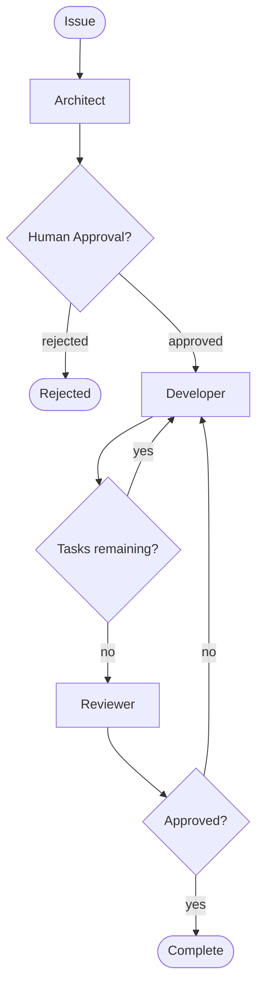

# Agentic AI Concepts

This document explains the core concepts behind Amelia's agentic architecture for engineers new to agentic AI systems.

## What is an "Agent"?

An agent is an LLM given a specific role, tools, and instructions. Unlike a chatbot that just responds to queries, an agent can take actions - executing commands, writing files, and making decisions.

Each agent has:
- **System prompt**: Defines its persona and capabilities
- **Tools**: Access to specific operations (shell commands, file operations)
- **Input/output schemas**: Structured communication with defined types

## Amelia's Agents

### Architect (`amelia/agents/architect.py`)

**Role**: Analyzes issues, designs solutions, creates implementation plans.

| Property | Description |
|----------|-------------|
| Input | `Issue` (id, title, description), optional `Design` |
| Output | `PlanOutput` (markdown_content, markdown_path, goal, key_files) |
| Key Feature | Generates rich markdown plans saved to `docs/plans/` |

The Architect examines an issue and generates a comprehensive Markdown implementation plan. This plan includes a clear goal statement that guides the Developer's agentic execution. The Markdown format is human-readable and compatible with external tools.

**Note**: The Architect's `plan()` method accepts an optional `Design` parameter for incorporating design specifications from brainstorming sessions.

### Developer (`amelia/agents/developer.py`)

**Role**: Executes coding tasks agentically using LLM-driven tool calls.

| Capability | Description |
|------------|-------------|
| Shell commands | Execute terminal commands via `run_shell_command` tool |
| File writes | Create/modify files via `write_file` tool |
| Autonomous execution | LLM decides which tools to call and in what order |
| Streaming | Real-time tool call and result events during execution |

The Developer receives a goal from the Architect and executes it autonomously using available tools. The LLM decides which actions to take, making it adaptive to unexpected situations.

**Agentic Execution**:
The Developer uses `execute_agentic()` which streams events as execution progresses:
- `thinking`: LLM is analyzing and planning
- `tool_call`: LLM is calling a tool (run_shell_command, write_file)
- `tool_result`: Tool execution result
- `result`: Final response when execution completes

### Reviewer (`amelia/agents/reviewer.py`)

**Role**: Reviews code changes, provides feedback, approves or requests fixes.

**Strategies**:
- `single`: One general review covering all aspects
- `competitive`: Parallel reviews from Security, Performance, and Usability personas, then aggregated into final feedback

| Output | Description |
|--------|-------------|
| `approved` | Boolean - whether changes are acceptable |
| `comments` | Detailed feedback on the changes |
| `severity` | Issue severity (info, warning, error) |

### Tracker Factory (`amelia/trackers/factory.py`)

**Role**: Creates the appropriate tracker based on profile configuration.

The `create_tracker()` factory function returns a `BaseTracker` implementation (Jira, GitHub, or Noop) based on the profile's `tracker` setting.

## What is "Orchestration"?

Orchestration coordinates multiple agents through a workflow. Rather than one monolithic AI call, orchestration breaks work into specialized steps with clear handoffs.

Amelia uses **LangGraph's StateGraph** for orchestration:
- **Nodes**: Individual agent calls (architect, developer, reviewer)
- **Edges**: Transitions between nodes
- **Conditional edges**: Decision points (approved? tasks remaining?)

### State Machine



**ExecutionState** tracks everything:
- Profile ID and issue
- Goal extracted from markdown plan
- Markdown plan content and path
- Tool calls and results (agentic execution history)
- Approval status
- Review results
- `driver_session_id`: For driver session continuity
- `workflow_status`: Workflow lifecycle status
- `review_iteration`: Current iteration in review-fix loop

## Tool Use

Agents don't just generate text - they call tools. This is what makes them "agentic."

### How Tool Calls Work

1. Agent receives task/context
2. Agent decides which tool to call with what parameters
3. Driver executes the tool
4. Result returns to agent for next decision

### Example Flow

```
Developer receives: "Create a new test file for user authentication"
    ↓
Developer calls: write_file(path="tests/test_auth.py", content="...")
    ↓
Driver executes the write
    ↓
Developer receives: "File created successfully"
    ↓
Developer marks task complete
```

### Available Tools

| Tool | Purpose |
|------|---------|
| `run_shell_command` | Execute terminal commands |
| `write_file` | Create or modify files |
| `read_file` | Read file contents |

## The Driver Abstraction

Drivers abstract how Amelia communicates with LLMs. This separation enables flexibility across different environments.

### Why Two Drivers?

| Driver | Use Case | Requirements |
|--------|----------|--------------|
| `api:openrouter` | Direct API calls, simple setup, fast prototyping | `OPENROUTER_API_KEY` env var |
| `cli:claude` | Enterprise-friendly, wraps authenticated CLI tools, policy-compliant | `claude` CLI installed |

### Driver Interface

Both drivers implement `DriverInterface`:

```python
class DriverInterface(Protocol):
    async def generate(
        self,
        messages: list,
        schema: type | None = None
    ) -> str | BaseModel:
        """Get LLM response, optionally with structured output."""
        ...

    async def execute_tool(
        self,
        tool_name: str,
        **kwargs
    ) -> str:
        """Execute a tool and return result."""
        ...
```

### Why This Matters

Enterprise environments often prohibit direct API calls due to data retention policies. The CLI driver wraps existing approved tools (like `claude` CLI) that:
- Inherit SSO authentication
- Comply with data policies
- Use existing security approvals

Users can switch between drivers without code changes - just update the profile.

## The Tracker Abstraction

Trackers provide pluggable backends for fetching issues.

| Tracker | Source | Requirements |
|---------|--------|--------------|
| `jira` | Jira issues | `JIRA_BASE_URL`, `JIRA_EMAIL`, `JIRA_API_TOKEN` |
| `github` | GitHub issues | `gh` CLI authenticated (`gh auth login`) |
| `noop` | Manual input | None |

All implement the `BaseTracker` protocol:

```python
class BaseTracker(Protocol):
    def get_issue(self, issue_id: str) -> Issue:
        """Fetch issue details by ID."""
        ...
```

This abstraction means Amelia works with any issue source without changing the core orchestration logic.

## Key Takeaways

1. **Agents are specialized**: Each has a focused role, leading to better outputs
2. **Orchestration provides structure**: State machine ensures consistent workflow
3. **Tools enable action**: Agents execute real changes, not just generate text
4. **Abstractions enable flexibility**: Drivers and trackers adapt to different environments
5. **Human stays in control**: Approval gates ensure oversight at critical points
