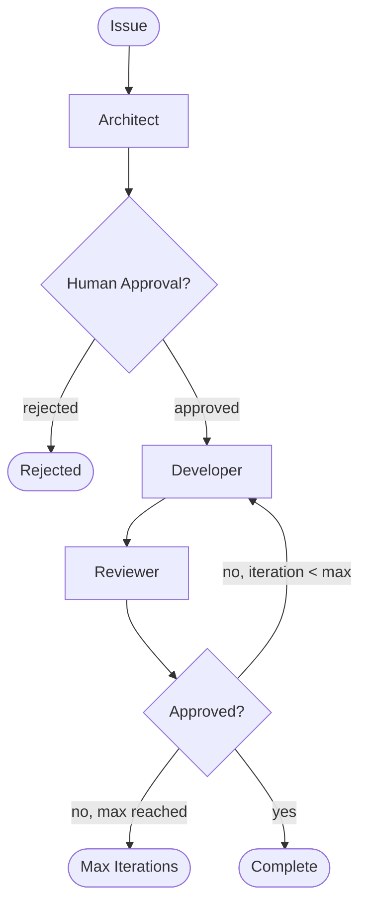

# Agentic AI Concepts

This document explains the core concepts behind Amelia's agentic architecture for engineers new to agentic AI systems.

## What is an "Agent"?

An agent is an LLM given a specific role, tools, and instructions. Unlike a chatbot that just responds to queries, an agent can take actions - executing commands, writing files, and making decisions.

Each agent has:
- **System prompt**: Defines its persona and capabilities
- **Tools**: Access to specific operations (shell commands, file operations)
- **Input/output schemas**: Structured communication with defined types

## Amelia's Agents

### Architect (`amelia/agents/architect.py`)

**Role**: Analyzes issues, designs solutions, creates implementation plans.

| Property | Description |
|----------|-------------|
| Input | `Issue` (id, title, description) + optional `Design` |
| Output | `PlanOutput` (markdown plan, goal, key files) |
| Key Feature | Generates rich markdown plans for agentic execution |

The Architect examines an issue and produces a detailed Markdown implementation plan with phases, tasks, and steps. This plan is presented for human approval before execution.

**Plan Structure**:
- **Goal**: Clear description of what needs to be accomplished
- **Phases**: Logical groupings of related work
- **Tasks**: Discrete units of work within each phase
- **Steps**: Specific actions with code blocks, commands, and success criteria

The Architect follows TDD principles when applicable: write test first, verify it fails, implement, verify it passes.

### Developer (`amelia/agents/developer.py`)

**Role**: Executes code changes through autonomous tool-calling.

| Capability | Description |
|------------|-------------|
| Agentic execution | Autonomous LLM decides which tools to call and when |
| Streaming events | Real-time updates: tool_call, tool_result, thinking, result |
| Session continuity | Maintains context across the execution session |

The Developer uses an agentic execution model where the LLM autonomously decides what actions to take based on the goal and context. It has access to tools for shell commands, file operations, and reading files.

**Streaming Events**:
- `thinking`: Agent is analyzing the situation
- `tool_call`: Agent is invoking a tool (shell command, file write, etc.)
- `tool_result`: Result from tool execution
- `result`: Final output when execution completes

### Reviewer (`amelia/agents/reviewer.py`)

**Role**: Reviews code changes, provides feedback, approves or requests fixes.

**Strategies**:
- `single`: One general review covering all aspects
- `competitive`: Parallel reviews from Security, Performance, and Usability personas, then aggregated into final feedback

| Output | Description |
|--------|-------------|
| `approved` | Boolean - whether changes are acceptable |
| `comments` | Detailed feedback on the changes |
| `severity` | Issue severity (low, medium, high, critical) |

The Reviewer examines code changes and either approves them or provides feedback. If changes are not approved, the Developer receives the feedback and attempts fixes. This review-fix loop continues until approved or the maximum iterations (`max_review_iterations`) is reached.

### Tracker Factory (`amelia/trackers/factory.py`)

**Role**: Creates the appropriate tracker based on profile configuration.

The `create_tracker()` factory function returns a `BaseTracker` implementation (Jira, GitHub, or Noop) based on the profile's `tracker` setting.

## What is "Orchestration"?

Orchestration coordinates multiple agents through a workflow. Rather than one monolithic AI call, orchestration breaks work into specialized steps with clear handoffs.

Amelia uses **LangGraph's StateGraph** for orchestration:
- **Nodes**: Individual agent calls (architect, developer, reviewer)
- **Edges**: Transitions between nodes
- **Conditional edges**: Decision points (approved? review passed?)

### State Machine



**ExecutionState** tracks everything:
- Current profile and issue
- Generated plan (goal + markdown)
- Tool calls and results (with reducers for streaming)
- Approval status
- Review results
- `driver_session_id`: For session continuity
- `review_iteration`: Current iteration in review-fix loop
- `agentic_status`: Current execution status

## Tool Use

Agents don't just generate text - they call tools. This is what makes them "agentic."

### How Tool Calls Work

1. Agent receives goal/context
2. Agent decides which tool to call with what parameters
3. Tool executes and returns result
4. Agent decides next action based on result
5. Repeat until goal is achieved

### Example Flow

```
Developer receives goal: "Add user authentication tests"
    ↓
Developer calls: run_shell_command(command="ls tests/")
    ↓
Result: "test_api.py test_utils.py"
    ↓
Developer calls: read_file(path="tests/test_api.py")
    ↓
Result: [file contents]
    ↓
Developer calls: write_file(path="tests/test_auth.py", content="...")
    ↓
Result: "File created successfully"
    ↓
Developer calls: run_shell_command(command="pytest tests/test_auth.py")
    ↓
Result: "1 passed"
    ↓
Developer marks execution complete
```

### Available Tools

| Tool | Purpose |
|------|---------|
| `run_shell_command` | Execute terminal commands |
| `write_file` | Create or modify files |
| `read_file` | Read file contents |

### Unified Streaming with StreamEvent

Amelia uses a unified `StreamEvent` type for real-time streaming across all drivers. Regardless of whether you use the API driver or CLI driver, tool execution progress is communicated through the same event format.

**StreamEventType** (the event categories):

| Type | Description |
|------|-------------|
| `CLAUDE_THINKING` | Agent is analyzing the situation and planning |
| `CLAUDE_TOOL_CALL` | Agent is invoking a tool with specific parameters |
| `CLAUDE_TOOL_RESULT` | Result returned from tool execution |
| `AGENT_OUTPUT` | Final output when agent completes execution |

**StreamEvent** contains:
- `id`: Unique event identifier
- `type`: One of the `StreamEventType` values
- `content`: Event payload (text content, result, etc.)
- `timestamp`: When the event occurred
- `agent`: Which agent produced the event (developer, reviewer, etc.)
- `workflow_id`: Links the event to its workflow
- `tool_name`: Name of tool being called (for tool events)
- `tool_input`: Input parameters for tool calls

**Driver Conversion**

Each driver converts its native message types to `StreamEvent`:

```python
# CLI driver converts SDK messages via convert_to_stream_event()
stream_event = convert_to_stream_event(sdk_message, agent="developer", workflow_id="...")

# The UI and logging systems consume StreamEvent uniformly
await emit_event(stream_event)
```

This abstraction allows the dashboard and logging systems to display real-time progress identically regardless of which driver is executing the work.

## The Driver Abstraction

Drivers abstract how Amelia communicates with LLMs. This separation enables flexibility across different environments.

### Why Two Drivers?

| Driver | Use Case | Requirements |
|--------|----------|--------------|
| `api:openrouter` | Direct API calls, simple setup, fast prototyping | `OPENROUTER_API_KEY` env var |
| `cli:claude` | Enterprise-friendly, wraps authenticated CLI tools, policy-compliant | `claude` CLI installed |

### Driver Interface

Both drivers implement a simple prompt-based interface:

```python
class DriverInterface(Protocol):
    async def prompt(
        self,
        prompt: str,
        system_prompt: str | None = None,
        session_id: str | None = None,
    ) -> str:
        """Send prompt and get response."""
        ...

    async def prompt_agentic(
        self,
        prompt: str,
        system_prompt: str | None = None,
        session_id: str | None = None,
    ) -> AsyncIterator[ApiStreamEvent]:
        """Stream agentic execution events."""
        ...
```

### Why This Matters

Enterprise environments often prohibit direct API calls due to data retention policies. The CLI driver wraps existing approved tools (like `claude` CLI) that:
- Inherit SSO authentication
- Comply with data policies
- Use existing security approvals

Users can switch between drivers without code changes - just update the profile.

## The Tracker Abstraction

Trackers provide pluggable backends for fetching issues.

| Tracker | Source | Requirements |
|---------|--------|--------------|
| `jira` | Jira issues | `JIRA_BASE_URL`, `JIRA_EMAIL`, `JIRA_API_TOKEN` |
| `github` | GitHub issues | `gh` CLI authenticated (`gh auth login`) |
| `noop` | Manual input | None |

All implement the `BaseTracker` protocol:

```python
class BaseTracker(Protocol):
    def get_issue(self, issue_id: str) -> Issue:
        """Fetch issue details by ID."""
        ...
```

This abstraction means Amelia works with any issue source without changing the core orchestration logic.

## Key Takeaways

1. **Agents are specialized**: Each has a focused role, leading to better outputs
2. **Agentic execution**: The Developer autonomously decides actions with streaming feedback
3. **Orchestration provides structure**: State machine ensures consistent workflow
4. **Tools enable action**: Agents execute real changes, not just generate text
5. **Review-fix loop**: Iterative improvement with configurable iteration limits
6. **Abstractions enable flexibility**: Drivers and trackers adapt to different environments
7. **Human stays in control**: Approval gates ensure oversight at critical points
