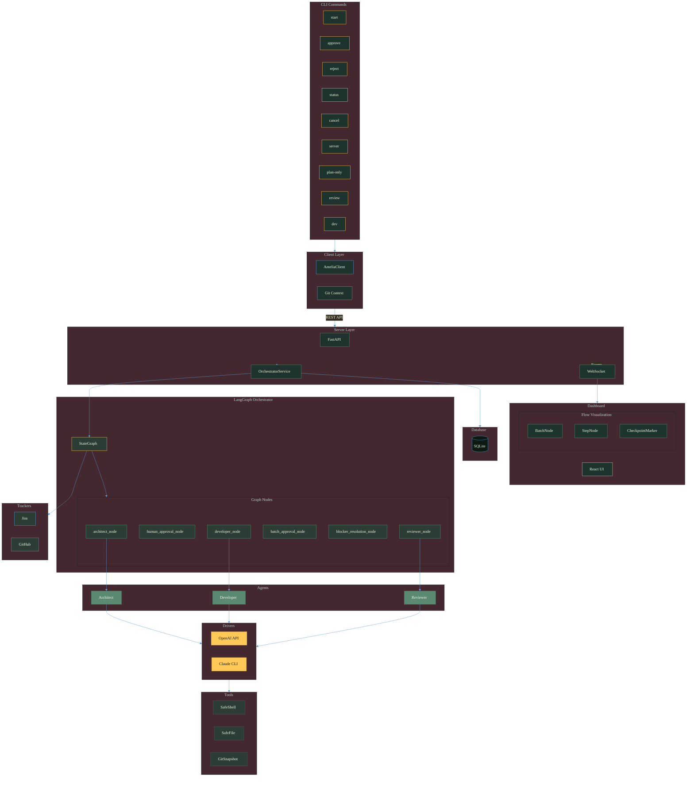
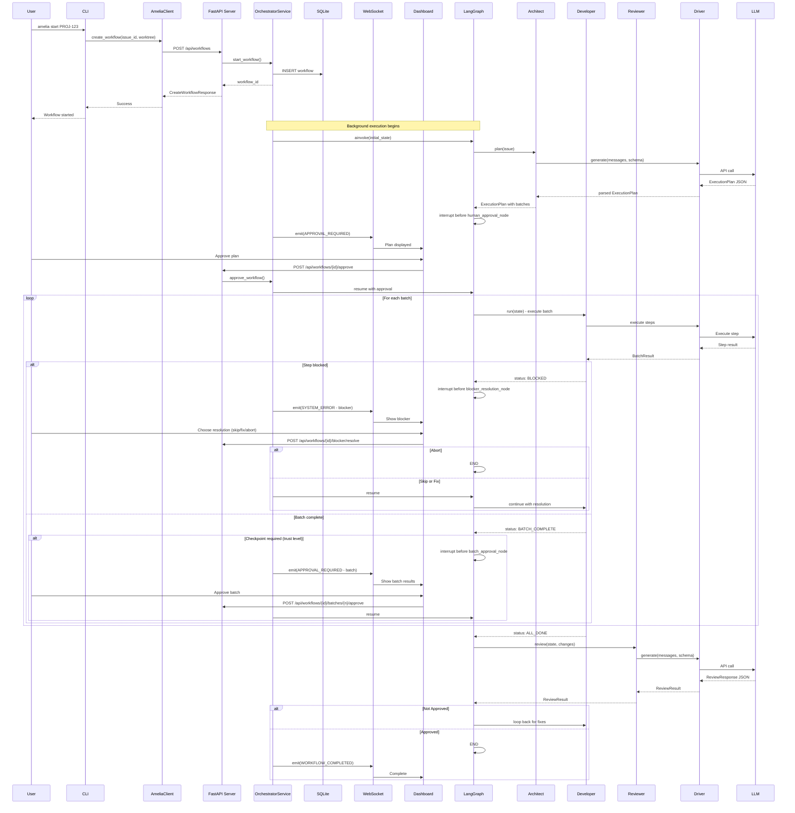
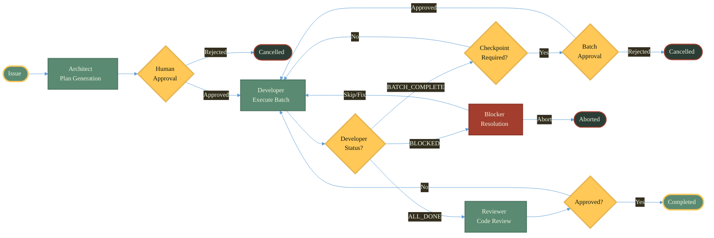

# Architecture & Data Flow

Amelia is a **local agentic coding orchestrator** that coordinates specialized AI agents through a LangGraph state machine, enabling autonomous software development with human oversight at critical decision points.

## What Amelia Does Today

**Phase 1 (Complete):** Multi-agent orchestration with the **Architect → Developer → Reviewer** loop. Issues flow through planning, execution, and review stages with human approval gates before any code ships. Supports both API-based (OpenAI via pydantic-ai) and CLI-based (Claude) LLM drivers, with Jira and GitHub issue tracker integrations.

**Phase 2 (In Progress):** Observable orchestration through a local web dashboard. FastAPI server with SQLite persistence, REST API for workflow management, React dashboard with real-time WebSocket updates, and batch-based execution with checkpoint approvals.

## The Vision: Complete Workflow Autonomy

The [roadmap](/reference/roadmap) charts a path toward **complete end-to-end workflow control**—where developers never need to open GitHub, Jira, or any tracker web UI. Built on the assumption that LLMs will continually improve, Amelia automatically gets better as models advance.

**Design Principles** (informed by [Anthropic's research on effective agent harnesses](https://www.anthropic.com/engineering/effective-harnesses-for-long-running-agents)):
- **Model Improvement as Tailwind** — Prefer prompts over code, delegation over hardcoding
- **Structured Handoffs** — Explicit state transfer mechanisms for cross-session work
- **Verify Before Declaring Done** — Agents test as humans would, not just claim completion
- **Environment as Truth** — Git history and artifacts are the source of truth, not agent memory

<details>
<summary>System Architecture (Mermaid source)</summary>



</details>

## Component Breakdown

| Layer | Location | Purpose | Key Abstractions |
|-------|----------|---------|------------------|
| **Core** | [`amelia/core/`](https://github.com/anderskev/amelia/tree/main/amelia/core) | LangGraph orchestrator, state management, shared types | `ExecutionState`, `TaskDAG`, `Profile`, `Issue` |
| **Agents** | [`amelia/agents/`](https://github.com/anderskev/amelia/tree/main/amelia/agents) | Specialized AI agents for planning, execution, and review | `Architect`, `Developer`, `Reviewer` |
| **Drivers** | [`amelia/drivers/`](https://github.com/anderskev/amelia/tree/main/amelia/drivers) | LLM abstraction supporting API and CLI backends | `DriverInterface`, `DriverFactory` |
| **Trackers** | [`amelia/trackers/`](https://github.com/anderskev/amelia/tree/main/amelia/trackers) | Issue source abstraction for different platforms | `BaseTracker` (Jira, GitHub) |
| **Tools** | [`amelia/tools/`](https://github.com/anderskev/amelia/tree/main/amelia/tools) | Secure command and file operations with 4-layer security | `SafeShellExecutor`, `SafeFileWriter` |
| **Client** | [`amelia/client/`](https://github.com/anderskev/amelia/tree/main/amelia/client) | CLI commands and REST client for server communication | `AmeliaClient`, Typer commands |
| **Server** | [`amelia/server/`](https://github.com/anderskev/amelia/tree/main/amelia/server) | FastAPI backend with WebSocket events, SQLite persistence | `OrchestratorService`, `EventBus`, `WorkflowRepository` |

## Data Flow: `amelia start PROJ-123`

Amelia uses a server-based execution architecture where CLI commands communicate with a background server via REST API.

### Flow Steps

1. **CLI → Client**: Detects git worktree context and creates an `AmeliaClient` to send workflow requests
   → See [`client/cli.py`](https://github.com/anderskev/amelia/blob/main/amelia/client/cli.py)

2. **Server → OrchestratorService**: Validates worktree, checks concurrency limits (one per worktree, max 5 global), creates workflow record, and starts background execution
   → See [`server/orchestrator/service.py`](https://github.com/anderskev/amelia/blob/main/amelia/server/orchestrator/service.py)

3. **Workflow Execution**: Loads settings, creates tracker, initializes `ExecutionState`, and runs the LangGraph state machine with SQLite checkpointing
   → See [`core/orchestrator.py`](https://github.com/anderskev/amelia/blob/main/amelia/core/orchestrator.py)

4. **Real-Time Events**: Emits `WorkflowEvent`s via `EventBus`, broadcasts through WebSocket to the Dashboard
   → See [`server/events/`](https://github.com/anderskev/amelia/tree/main/amelia/server/events)

5. **Human Approval Gate**: Workflow blocks at `human_approval_node` using LangGraph interrupt until user approves/rejects via CLI or Dashboard

### Sequence Diagram

<details>
<summary>Sequence Diagram (Mermaid source)</summary>



</details>

## Key Types

All types are defined as frozen Pydantic models for immutability.

### Configuration Types

| Type | Purpose | Source |
|------|---------|--------|
| `Profile` | Workflow configuration (driver, tracker, strategy, trust level) | [`core/types.py`](https://github.com/anderskev/amelia/blob/main/amelia/core/types.py) |
| `TrustLevel` | Developer autonomy level: `paranoid`, `standard`, `autonomous` | [`core/types.py`](https://github.com/anderskev/amelia/blob/main/amelia/core/types.py) |
| `DeveloperStatus` | Execution state: `executing`, `batch_complete`, `blocked`, `all_done` | [`core/types.py`](https://github.com/anderskev/amelia/blob/main/amelia/core/types.py) |
| `RetryConfig` | Retry settings (max retries, delays) | [`core/types.py`](https://github.com/anderskev/amelia/blob/main/amelia/core/types.py) |
| `ServerConfig` | Server settings with `AMELIA_*` env var support | [`server/config.py`](https://github.com/anderskev/amelia/blob/main/amelia/server/config.py) |

### Domain & Task Types

| Type | Purpose | Source |
|------|---------|--------|
| `Issue` | Issue from tracker (id, title, description, status) | [`core/types.py`](https://github.com/anderskev/amelia/blob/main/amelia/core/types.py) |
| `Design` | Parsed design document (goal, architecture, tech stack) | [`core/types.py`](https://github.com/anderskev/amelia/blob/main/amelia/core/types.py) |
| `PlanStep` | Atomic unit of work (action type, risk level, dependencies) | [`core/state.py`](https://github.com/anderskev/amelia/blob/main/amelia/core/state.py) |
| `ExecutionBatch` | Group of steps executed before checkpoint | [`core/state.py`](https://github.com/anderskev/amelia/blob/main/amelia/core/state.py) |
| `ExecutionPlan` | Complete plan with batches and TDD approach | [`core/state.py`](https://github.com/anderskev/amelia/blob/main/amelia/core/state.py) |

### Result & State Types

| Type | Purpose | Source |
|------|---------|--------|
| `BlockerReport` | Captured when execution blocks (type, error, suggestions) | [`core/state.py`](https://github.com/anderskev/amelia/blob/main/amelia/core/state.py) |
| `BatchResult` | Result of batch execution (status, completed steps, blocker) | [`core/state.py`](https://github.com/anderskev/amelia/blob/main/amelia/core/state.py) |
| `BatchApproval` | Human approval decision for a batch | [`core/state.py`](https://github.com/anderskev/amelia/blob/main/amelia/core/state.py) |
| `GitSnapshot` | Git state before batch for revert capability | [`core/state.py`](https://github.com/anderskev/amelia/blob/main/amelia/core/state.py) |
| `ExecutionState` | Complete workflow state (LangGraph state object) | [`core/state.py`](https://github.com/anderskev/amelia/blob/main/amelia/core/state.py) |
| `ReviewResult` | Code review result (persona, approved, comments, severity) | [`core/state.py`](https://github.com/anderskev/amelia/blob/main/amelia/core/state.py) |

### Server Types

| Type | Purpose | Source |
|------|---------|--------|
| `WorkflowEvent` | Event with type, agent, message, and correlation ID | [`server/models/events.py`](https://github.com/anderskev/amelia/blob/main/amelia/server/models/events.py) |
| `EventType` | 17 event types (workflow lifecycle, file ops, review cycles) | [`server/models/events.py`](https://github.com/anderskev/amelia/blob/main/amelia/server/models/events.py) |
| `TokenUsage` | Token tracking per agent/model with cost calculation | [`server/models/tokens.py`](https://github.com/anderskev/amelia/blob/main/amelia/server/models/tokens.py) |

## Orchestrator Nodes

The LangGraph state machine consists of these nodes:

| Node | Function | Next |
|------|----------|------|
| `architect_node` | Calls `Architect.plan()` to generate `ExecutionPlan` with batches | `human_approval_node` |
| `human_approval_node` | Plan approval gate (LangGraph interrupt) | `developer_node` (approved) or END (rejected) |
| `developer_node` | Executes current batch via `Developer.run()` | `batch_approval_node` (checkpoint), `blocker_resolution_node` (blocked), or `reviewer_node` (all done) |
| `batch_approval_node` | Batch checkpoint gate (trust-level dependent) | `developer_node` (approved) or END (rejected) |
| `blocker_resolution_node` | Handles blocked execution (skip/fix/abort) | `developer_node` (skip/fix) or END (abort) |
| `reviewer_node` | Calls `Reviewer.review()` | `developer_node` (not approved) or END (approved) |

→ See [`core/orchestrator.py`](https://github.com/anderskev/amelia/blob/main/amelia/core/orchestrator.py) for node implementations and conditional edge routing.

### Orchestrator Flow

<details>
<summary>Orchestrator Flow (Mermaid source)</summary>



</details>

## Security Architecture

### Command Execution Security

The [`SafeShellExecutor`](https://github.com/anderskev/amelia/blob/main/amelia/tools/safe_shell.py) implements a 4-layer security model:

| Layer | Check | Purpose |
|-------|-------|---------|
| 1. Metacharacters | Blocks `\|`, `;`, `&`, `$`, backticks, `>`, `<` | Prevents shell injection |
| 2. Blocklist | Blocks `sudo`, `su`, `mkfs`, `dd`, `reboot`, etc. | Prevents privilege escalation |
| 3. Dangerous Patterns | Regex detection of `rm -rf /`, `curl \| sh`, etc. | Prevents destructive commands |
| 4. Strict Allowlist | Optional whitelist of ~50 safe commands | High-security mode |

### File Write Security

The [`SafeFileWriter`](https://github.com/anderskev/amelia/blob/main/amelia/tools/safe_file.py) protects against path traversal:

- **Path Resolution**: All paths resolved to absolute before validation
- **Directory Restriction**: Writes only allowed within specified directories (default: cwd)
- **Symlink Detection**: Blocks symlink escape attacks at every path component
- **Parent Creation**: Auto-creates parent directories within allowed bounds

### Exception Hierarchy

```
AmeliaError (base)
├── ConfigurationError          # Missing/invalid configuration
├── SecurityError               # Base for security violations
│   ├── DangerousCommandError   # Dangerous pattern detected
│   ├── BlockedCommandError     # Command in blocklist
│   ├── ShellInjectionError     # Shell metacharacters detected
│   ├── PathTraversalError      # Path escape attempt
│   └── CommandNotAllowedError  # Not in strict allowlist
└── AgenticExecutionError       # Agentic mode failures
```

→ See [`core/exceptions.py`](https://github.com/anderskev/amelia/blob/main/amelia/core/exceptions.py)

## Observability

### Event System

```
Orchestrator → EventBus → WebSocket → Dashboard
                  ↓
              Database (events table)
```

**Event Types**: 17 distinct event types covering workflow lifecycle, file operations, and review cycles.
→ See [`server/models/events.py`](https://github.com/anderskev/amelia/blob/main/amelia/server/models/events.py)

### Database Schema

SQLite database with three main tables:
- **workflows**: Workflow state persistence (id, issue_id, worktree_path, status, state_json)
- **events**: Append-only event log with monotonic ordering and correlation IDs
- **token_usage**: Token tracking per agent/model with cost calculation

→ See [`server/database/connection.py`](https://github.com/anderskev/amelia/blob/main/amelia/server/database/connection.py)

### Health Endpoints

| Endpoint | Purpose |
|----------|---------|
| `GET /api/health/live` | Kubernetes liveness probe |
| `GET /api/health/ready` | Kubernetes readiness probe |
| `GET /api/health` | Detailed health with metrics (uptime, memory, CPU, active workflows) |

### Logging & Retention

- **Loguru-based logging** with custom Amelia dashboard colors
  → See [`logging.py`](https://github.com/anderskev/amelia/blob/main/amelia/logging.py)
- **LogRetentionService** runs during graceful shutdown:
  - Deletes events older than `AMELIA_LOG_RETENTION_DAYS` (default: 30)
  - Enforces `AMELIA_LOG_RETENTION_MAX_EVENTS` per workflow (default: 100,000)

## API Endpoints

### Workflow Management

| Method | Endpoint | Purpose |
|--------|----------|---------|
| POST | `/api/workflows` | Create new workflow |
| GET | `/api/workflows` | List workflows (with filtering) |
| GET | `/api/workflows/active` | List active workflows |
| GET | `/api/workflows/{id}` | Get workflow details |
| POST | `/api/workflows/{id}/approve` | Approve plan |
| POST | `/api/workflows/{id}/reject` | Reject plan |
| POST | `/api/workflows/{id}/cancel` | Cancel workflow |

### Batch Execution (In Progress)

| Method | Endpoint | Purpose |
|--------|----------|---------|
| POST | `/api/workflows/{id}/batches/{n}/approve` | Approve completed batch |
| POST | `/api/workflows/{id}/blocker/resolve` | Resolve execution blocker |

> **Note:** These endpoints are part of the planned batched execution model and are not yet implemented.

→ See request/response models in [`server/models/`](https://github.com/anderskev/amelia/tree/main/amelia/server/models)

### Error Codes

| Code | Exception | Description |
|------|-----------|-------------|
| 400 | `InvalidWorktreeError` | Invalid worktree path |
| 404 | `WorkflowNotFoundError` | Workflow not found |
| 409 | `WorkflowConflictError` | Workflow already active for worktree |
| 422 | `InvalidStateError` | Workflow not in correct state for action |
| 429 | `ConcurrencyLimitError` | Max concurrent workflows reached |

### WebSocket Events

Connect to `/ws/events` (optionally with `?since=<event_id>` for backfill on reconnect). The WebSocket uses a subscription-based protocol:

**Client → Server:**
```json
{"type": "subscribe", "workflow_id": "<uuid>"}
{"type": "unsubscribe", "workflow_id": "<uuid>"}
{"type": "subscribe_all"}
{"type": "pong"}
```

**Server → Client:**
```json
{"type": "event", "payload": <WorkflowEvent>}
{"type": "ping"}
{"type": "backfill_complete", "count": 15}
```

**Event types:** `workflow_started`, `workflow_completed`, `workflow_failed`, `workflow_cancelled`, `stage_started`, `stage_completed`, `approval_required`, `approval_granted`, `approval_rejected`, `system_error` (includes blocker notifications).

→ See [`server/routes/websocket.py`](https://github.com/anderskev/amelia/blob/main/amelia/server/routes/websocket.py)

## Key Design Decisions

### Why the Driver Abstraction?

Enterprise environments often prohibit direct API calls due to data retention policies. The CLI driver wraps existing approved tools (like `claude` CLI) that inherit SSO authentication and comply with policies. Users can switch between API (fast prototyping) and CLI (enterprise compliance) without code changes.

### Why Separate Agents Instead of One Big Prompt?

1. **Specialization**: Each agent has focused system prompts, leading to better outputs
2. **Token efficiency**: Only relevant context is passed to each agent
3. **Modularity**: Easy to swap implementations (e.g., different review strategies)
4. **Debuggability**: Clear separation makes it easier to trace issues

### Why pydantic-ai for the API Driver?

1. **Structured outputs**: Forces LLM to return valid JSON matching Pydantic schemas
2. **Type safety**: Catches schema mismatches at runtime
3. **Cleaner code**: No manual JSON parsing or validation

### Why LangGraph for Orchestration?

1. **Built for cycles**: Supports developer ↔ reviewer loop naturally
2. **State management**: Built-in state tracking
3. **Checkpointing**: Resumable workflows with SQLite persistence
4. **Conditional edges**: Clean decision logic
5. **Interrupts**: Supports human-in-the-loop approval gates

### Why a Server Architecture?

1. **Decoupled execution**: CLI returns immediately; workflow runs in background
2. **Dashboard integration**: WebSocket enables real-time UI updates
3. **Workflow management**: Approve, reject, cancel from any terminal or browser
4. **Concurrency control**: Prevents multiple workflows on same worktree
5. **Persistence**: SQLite stores workflow state, events, and token usage
6. **Observability**: Event stream enables monitoring and debugging

## File Structure Reference

```
amelia/
├── agents/
│   ├── architect.py          # TaskDAG generation with TDD focus
│   ├── developer.py          # Task execution (structured/agentic modes)
│   └── reviewer.py           # Code review (single/competitive strategies)
├── client/
│   ├── api.py                # AmeliaClient REST client
│   ├── cli.py                # CLI commands: start, approve, reject, status, cancel
│   └── git.py                # get_worktree_context() for git detection
├── core/
│   ├── constants.py          # Security constants: blocked commands, patterns
│   ├── exceptions.py         # AmeliaError hierarchy
│   ├── orchestrator.py       # LangGraph state machine
│   ├── state.py              # ExecutionState, TaskDAG, Task, etc.
│   └── types.py              # Profile, Issue, Settings, Design, RetryConfig
├── drivers/
│   ├── api/openai.py         # OpenAI via pydantic-ai
│   ├── cli/claude.py         # Claude CLI wrapper with agentic mode
│   ├── base.py               # DriverInterface protocol
│   └── factory.py            # DriverFactory
├── server/
│   ├── database/             # SQLite wrapper and repository
│   ├── events/               # EventBus and WebSocket management
│   ├── lifecycle/            # Server startup/shutdown, log retention
│   ├── models/               # Request/response Pydantic models
│   ├── orchestrator/         # OrchestratorService
│   ├── routes/               # REST and WebSocket endpoints
│   └── config.py             # ServerConfig with AMELIA_* env vars
├── trackers/
│   ├── github.py             # GitHub via gh CLI
│   └── jira.py               # Jira REST API
├── tools/
│   ├── safe_file.py          # SafeFileWriter with path traversal protection
│   ├── safe_shell.py         # SafeShellExecutor with 4-layer security
│   └── git_snapshot.py       # GitSnapshot for batch revert capability
└── config.py                 # load_settings(), validate_profile()

dashboard/                    # React + TypeScript frontend
├── src/
│   ├── api/client.ts         # TypeScript API client
│   ├── components/
│   │   ├── flow/             # React Flow nodes (BatchNode, StepNode, CheckpointMarker)
│   │   └── ...               # BatchStepCanvas, BlockerResolutionDialog, etc.
│   ├── hooks/                # Custom React hooks
│   ├── pages/                # Route pages
│   └── stores/               # Zustand state stores
└── vite.config.ts
```

→ [Browse full source on GitHub](https://github.com/anderskev/amelia)
