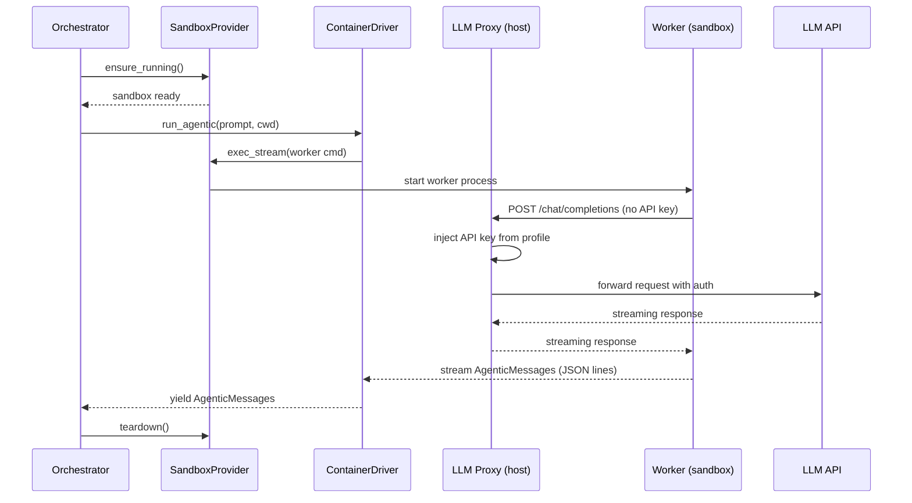

# Architecture & Data Flow

Technical deep dive into Amelia's architecture, components, and data flow.

## What Amelia Does Today

**Phase 1 (Complete):** Multi-agent orchestration with the **Architect -> Developer -> Reviewer** loop. Issues flow through planning, execution, and review stages with human approval gates before any code ships. Supports both API-based (DeepAgents/LangChain) and CLI-based (Claude, Codex) LLM drivers, with Jira and GitHub issue tracker integrations.

```
Issue → [Queue] → Architect (plan) → Human Approval → Developer (execute) ↔ Reviewer (review) → Done
           ↓
     (optional)
   pending state
```

**Queue Step (Optional):** With `--queue` flag, workflows enter `pending` state instead of immediate execution. Use `amelia run` to start queued workflows. The `--plan` flag runs the Architect while queued.

**Phase 2 (Complete):** Observable orchestration through a local web dashboard. FastAPI server with SQLite persistence, REST API for workflow management, React dashboard with real-time WebSocket updates, and agentic execution with streaming tool calls.

**Phase 3 (Complete):** Sandboxed code execution. Agents run inside isolated sandbox containers (local Docker or ephemeral cloud via Daytona) with per-workflow git worktrees. API keys never enter the sandbox — a host-side LLM proxy injects credentials into forwarded requests.

Amelia follows the four-layer agent architecture pattern established in industry research:

| Layer | Amelia Implementation |
| ----- | -------------------- |
| **Model** | Pluggable LLM drivers (API or CLI-wrapped) |
| **Tools** | LLM-native tools via driver (shell, file, search) |
| **Orchestration** | LangGraph state machine with human approval gates |
| **Sandbox** | Isolated execution via Docker or Daytona cloud containers |
| **Deployment** | Local-first server with SQLite persistence |

## Research Foundation

Amelia's architecture draws on industry research in agentic AI — orchestrator-worker patterns, iterative refinement loops, human-in-the-loop gates, and full trajectory persistence. See [Inspiration](/architecture/inspiration) for the bibliography and [Design Principles](/reference/roadmap#design-principles) for the guiding philosophy.

## Component Breakdown

| Layer | Location | Purpose | Key Abstractions |
| ----- | -------- | ------- | ---------------- |
| **Core** | `amelia/core/` | Shared types and agentic state | `AgenticStatus`, `ToolCall`, `ToolResult`, `Profile`, `Issue` |
| **Pipelines** | `amelia/pipelines/` | LangGraph state machines and workflow logic | `BasePipelineState`, `ImplementationState`, `Pipeline` |
| **Agents** | `amelia/agents/` | Specialized AI agents for planning, execution, review, evaluation, and consultation | `Architect`, `Developer`, `Reviewer`, `Evaluator`, `Oracle`, `Brainstormer` |
| **Drivers** | `amelia/drivers/` | LLM abstraction supporting API and CLI backends | `DriverInterface`, `get_driver()` |
| **Sandbox** | `amelia/sandbox/` | Isolated code execution with provider-agnostic container lifecycle | `SandboxProvider`, `ContainerDriver`, `Worker`, `WorktreeManager` |
| **Trackers** | `amelia/trackers/` | Issue source abstraction for different platforms | `BaseTracker` (Jira, GitHub, NoOp) |
| **Tools** | `amelia/tools/` | Git utilities and shell helpers | `git_utils`, `shell_executor` |
| **Client** | `amelia/client/` | CLI commands and REST client for server communication | `AmeliaClient`, Typer commands |
| **Server** | `amelia/server/` | FastAPI backend with WebSocket events, SQLite persistence, LLM proxy | `OrchestratorService`, `EventBus`, `WorkflowRepository` |

## Data Flow: `amelia start PROJ-123`

Amelia uses a server-based execution architecture.

### Server-Based Flow

This is the production architecture where CLI commands communicate with a background server via REST API.

#### 1. CLI to Client

The CLI detects git worktree context and sends requests to the server via the API client.

See [`amelia/client/cli.py`](https://github.com/existential-birds/amelia/blob/main/amelia/client/cli.py) and [`amelia/client/api.py`](https://github.com/existential-birds/amelia/blob/main/amelia/client/api.py) for implementation.

#### 2. Server to OrchestratorService

The server validates the worktree, checks concurrency limits (one active workflow per worktree, max 5 global), creates a workflow record in the database, and starts the workflow in a background task.

See [`OrchestratorService`](https://github.com/existential-birds/amelia/blob/main/amelia/server/orchestrator/service.py) for implementation.

#### 3. Workflow Execution (LangGraph)

The workflow loads settings, creates a tracker for the issue source, initializes state, and runs the LangGraph pipeline with SQLite checkpointing. The profile is passed via LangGraph's RunnableConfig for deterministic replay.

See the implementation pipeline:

- [`ImplementationPipeline`](https://github.com/existential-birds/amelia/blob/main/amelia/pipelines/implementation/pipeline.py) - Pipeline entry point
- [`create_implementation_graph()`](https://github.com/existential-birds/amelia/blob/main/amelia/pipelines/implementation/graph.py) - LangGraph state machine

#### 4. Real-Time Events to Dashboard

Events are emitted at each stage and broadcast to WebSocket clients for real-time dashboard updates.

See the event system:

- [`EventBus`](https://github.com/existential-birds/amelia/blob/main/amelia/server/events/bus.py) - Pub/sub event bus
- [`ConnectionManager`](https://github.com/existential-birds/amelia/blob/main/amelia/server/events/connection_manager.py) - WebSocket client management

#### 5. Human Approval Gate

The workflow blocks at the human approval node (using LangGraph interrupt), emits an `APPROVAL_REQUIRED` event, and waits for user approval via CLI (`amelia approve`) or dashboard.

### Orchestrator Nodes (LangGraph)

See [`amelia/pipelines/implementation/nodes.py`](https://github.com/existential-birds/amelia/blob/main/amelia/pipelines/implementation/nodes.py) for implementation-specific nodes and [`amelia/pipelines/nodes.py`](https://github.com/existential-birds/amelia/blob/main/amelia/pipelines/nodes.py) for shared nodes.

**Node: `call_architect_node`** - Gets driver, calls `Architect.plan()` to generate markdown plan with goal extraction, updates state with plan content.

**Node: `plan_validator_node`** - Validates plan file and extracts structured fields (goal, plan_markdown, key_files) using regex-based extraction and structural validation. Runs in a feedback loop: if validation fails, the Architect revises the plan and re-validation occurs automatically.

**Node: `human_approval_node`** - In server mode: emits `APPROVAL_REQUIRED` event and uses LangGraph interrupt to block. In CLI mode: prompts user directly via typer.

**Node: `developer_node`** - Executes goal agentically using streaming tool calls. Handles events (tool_call, tool_result, thinking, result) and updates state with tool history.

**Node: `reviewer_node`** - Gets code changes, runs `Reviewer.review()`, updates state with review result. Routes back to developer if changes requested, or to END if approved.

**Node: `evaluator_node`** - Evaluates review feedback using a decision matrix to determine the next action: `IMPLEMENT` (apply feedback), `REJECT` (push back on reviewer), `DEFER` (note for later), or `CLARIFY` (ask reviewer for more detail). Prevents infinite review loops by making principled decisions about review comments.

### Agent Roles

| Agent | Purpose |
| ----- | ------- |
| **Architect** | Generates implementation plans from issue descriptions |
| **Developer** | Executes plans agentically with streaming tool calls |
| **Reviewer** | Reviews code changes against the original plan and requirements |
| **Evaluator** | Evaluates review feedback with a decision matrix (IMPLEMENT/REJECT/DEFER/CLARIFY) |
| **Oracle** | Expert consultation agent with agentic LLM execution for targeted questions |
| **Brainstormer** | Chat-based design sessions with artifact creation (service-based, not a pipeline agent) |
| **Plan Validator** | Regex-based plan extraction and structural validation (pipeline node) |

## Sandbox Architecture

The sandbox subsystem provides isolated code execution for agents. All agentic work (file edits, shell commands, tests) runs inside a sandbox container, keeping the host environment clean.

### Execution Flow


```mermaid
sequenceDiagram
    participant O as Orchestrator
    participant SP as SandboxProvider
    participant CD as ContainerDriver
    participant P as LLM Proxy (host)
    participant W as Worker (sandbox)
    participant LLM as LLM API

    O->>SP: ensure_running()
    SP-->>O: sandbox ready
    O->>CD: run_agentic(prompt, cwd)
    CD->>SP: exec_stream(worker cmd)
    SP->>W: start worker process
    W->>P: POST /chat/completions (no API key)
    P->>P: inject API key from profile
    P->>LLM: forward request with auth
    LLM-->>P: streaming response
    P-->>W: streaming response
    W-->>CD: stream AgenticMessages (JSON lines)
    CD-->>O: yield AgenticMessages
    O->>SP: teardown()
```

### Components

**`SandboxProvider` protocol** ([`amelia/sandbox/provider.py`](https://github.com/existential-birds/amelia/blob/main/amelia/sandbox/provider.py)) — Transport-agnostic interface for sandbox lifecycle (`ensure_running`, `exec_stream`, `teardown`, `write_file`, `health_check`). Two implementations:

- **`DockerSandboxProvider`** ([`amelia/sandbox/docker.py`](https://github.com/existential-birds/amelia/blob/main/amelia/sandbox/docker.py)) — Local Docker containers, one per profile. Generates a unique proxy authentication token per container, applies iptables network filtering (with DNS restricted to Docker's internal resolver) when enabled, and only grants `NET_ADMIN`/`NET_RAW` capabilities when network filtering is active.
- **`DaytonaSandboxProvider`** ([`amelia/sandbox/daytona.py`](https://github.com/existential-birds/amelia/blob/main/amelia/sandbox/daytona.py)) — Ephemeral cloud sandboxes via the Daytona SDK with session-based command streaming.

**`ContainerDriver`** ([`amelia/sandbox/driver.py`](https://github.com/existential-birds/amelia/blob/main/amelia/sandbox/driver.py)) — Implements `DriverInterface`, delegates LLM operations to the sandboxed worker via `SandboxProvider.exec_stream()`. Parses JSON-line `AgenticMessage` objects from the worker's stdout.

**`Worker`** ([`amelia/sandbox/worker.py`](https://github.com/existential-birds/amelia/blob/main/amelia/sandbox/worker.py)) — Standalone script that runs inside the sandbox. Receives prompts, runs agentic or single-turn LLM calls, and streams `AgenticMessage` objects as JSON lines to stdout. The worker is self-contained — it inlines its own type definitions to avoid importing the `amelia` package inside the container.

**LLM Proxy** ([`amelia/sandbox/proxy.py`](https://github.com/existential-birds/amelia/blob/main/amelia/sandbox/proxy.py)) — Host-side FastAPI router that intercepts LLM requests from the sandbox. Authenticates requests via per-container `X-Amelia-Proxy-Token` headers, reads the `X-Amelia-Profile` header to resolve which upstream provider to use, injects the API key, and forwards the request. The proxy enforces a 10 MB request body limit, sanitizes upstream error messages to prevent information leakage, and strips internal headers before forwarding. API keys never enter the sandbox environment.

**`WorktreeManager`** ([`amelia/sandbox/worktree.py`](https://github.com/existential-birds/amelia/blob/main/amelia/sandbox/worktree.py)) — Manages per-workflow git worktree isolation inside sandboxes. Uses a bare clone at `/workspace/repo` as the shared base, with each workflow getting a worktree under `/workspace/worktrees/{workflow_id}`.

### Provider Reuse Pattern

A single `SandboxProvider` instance is shared across all agents (Architect, Developer, Reviewer) within a workflow. The orchestrator calls `ensure_running()` once at workflow start, and all agents use the same running sandbox for their `ContainerDriver` operations. This avoids redundant container startup/teardown between pipeline stages. The orchestrator guarantees teardown via `SandboxProvider.teardown()` when the workflow completes, regardless of success or failure.

## Key Design Decisions

### Why Sandboxed Execution?

1. **Security**: Agentic code execution is isolated from the host — a misbehaving agent cannot damage the host filesystem or leak credentials
2. **Key isolation**: API keys never enter the sandbox; the host-side LLM proxy injects credentials per-request
3. **Reproducibility**: Clean container environments ensure consistent behavior across runs
4. **Provider flexibility**: The `SandboxProvider` protocol makes it easy to swap between local Docker and cloud (Daytona) without changing agent code
5. **Network control**: Docker sandboxes use iptables filtering to restrict outbound access, with DNS locked to Docker's internal resolver (127.0.0.11). `NET_ADMIN`/`NET_RAW` capabilities are only granted when network filtering is enabled.
6. **Proxy authentication**: Each sandbox container receives a unique token, preventing cross-container request forgery through the LLM proxy

### Why the Driver Abstraction?

Some environments prohibit direct API calls due to data retention policies. The CLI drivers wrap existing approved tools (`claude` and `codex` CLIs) that inherit SSO authentication and comply with policies. Users can switch between API (fast prototyping) and CLI (policy compliance) without code changes.

### Why Separate Agents Instead of One Big Prompt?

1. **Specialization**: Each agent has focused system prompts, leading to better outputs
2. **Token efficiency**: Only relevant context is passed to each agent
3. **Modularity**: Easy to swap implementations (e.g., different review strategies)
4. **Debuggability**: Clear separation makes it easier to trace issues

### Why Agentic Execution?

The Developer agent uses autonomous tool-calling execution where the LLM decides what actions to take. This approach:

1. **Leverages model capabilities**: Modern LLMs excel at autonomous decision-making
2. **Reduces brittleness**: No rigid step-by-step plans that break on unexpected situations
3. **Enables streaming**: Real-time visibility into agent reasoning and actions
4. **Simplifies orchestration**: Fewer state transitions and edge cases to handle

### Why LangGraph for Orchestration?

1. **Built for cycles**: Supports developer <-> reviewer loop naturally
2. **State management**: Built-in state tracking with reducers for streaming data
3. **Checkpointing**: Resumable workflows with SQLite persistence
4. **Conditional edges**: Clean decision logic
5. **Interrupts**: Supports human-in-the-loop approval gates

### Why a Server Architecture?

1. **Decoupled execution**: CLI returns immediately; workflow runs in background
2. **Dashboard integration**: WebSocket enables real-time UI updates
3. **Workflow management**: Approve, reject, cancel from any terminal or browser
4. **Concurrency control**: Prevents multiple workflows on same worktree
5. **Persistence**: SQLite stores workflow state, events, and token usage
6. **Observability**: Event stream enables monitoring and debugging
