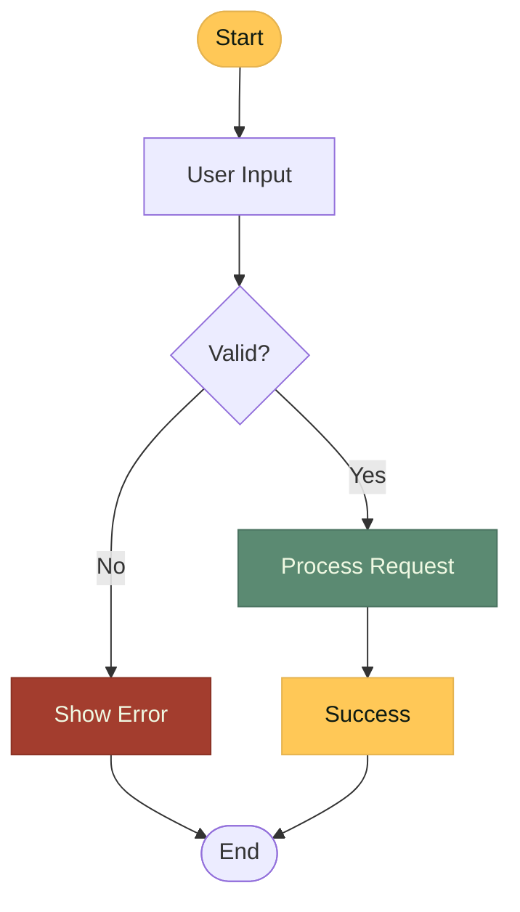
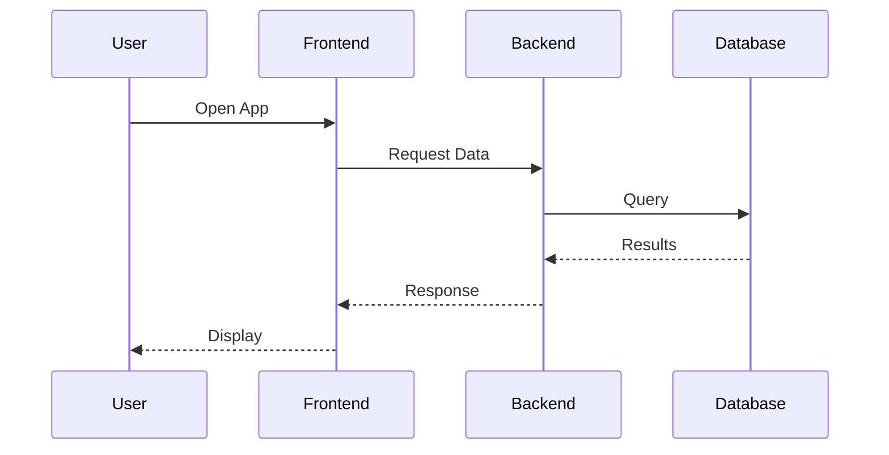
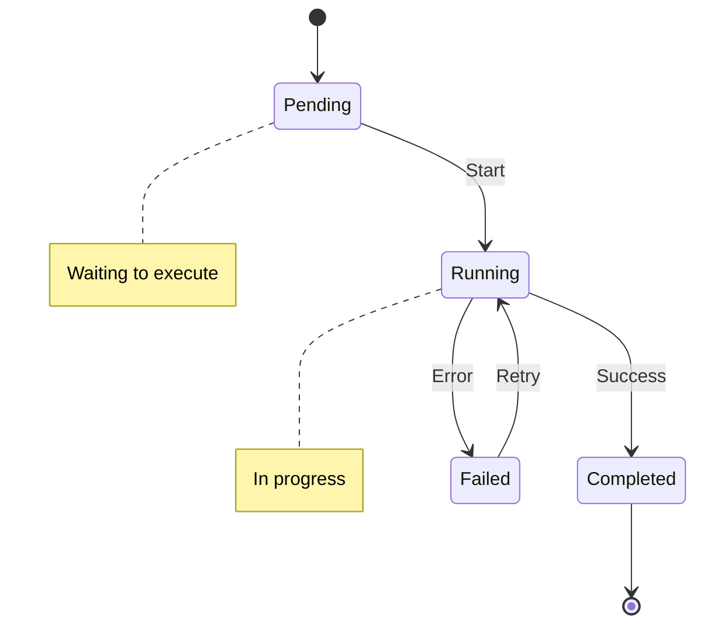
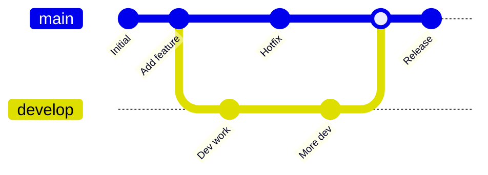
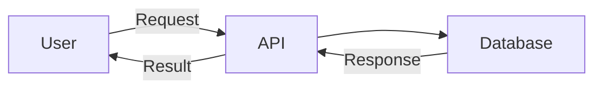

# Diagrams

Guidelines for creating consistent, themed diagrams using D2 and Mermaid with the Amelia Design System.

## Overview

The Amelia Design System provides theme configurations for two popular diagramming tools:

- **D2**: Modern declarative diagramming language with extensive styling options
- **Mermaid**: Markdown-friendly diagram syntax built into VitePress

Both tools use Amelia's color tokens to ensure visual consistency across documentation and presentations.

## D2 Diagrams

[D2](https://d2lang.com/) is a modern diagram scripting language with powerful styling capabilities.

### Dark Theme Configuration

Use the Amelia Dark Theme for professional aesthetics:

```d2
# Amelia Dark Theme
vars: {
  background: "#0D1A12"
  surface: "#1F332E"
  text: "#EFF8E2"
  accent: "#FFC857"
  green: "#5B8A72"
  blue: "#5B9BD5"
  muted: "#88A896"
}
```

**Location**: [design-system/themes/d2/amelia-dark.d2](https://github.com/anderskev/amelia/blob/main/design-system/themes/d2/amelia-dark.d2)

### Light Theme Configuration

Use the Amelia Light Theme for daytime professional aesthetics:

```d2
# Amelia Light Theme
vars: {
  background: "#FDF8F0"
  surface: "#FFFDF9"
  text: "#1A2F23"
  accent: "#2E6B9C"
  green: "#3D7A5A"
  blue: "#5B9BD5"
  muted: "#5C7263"
}
```

**Location**: [design-system/themes/d2/amelia-light.d2](https://github.com/anderskev/amelia/blob/main/design-system/themes/d2/amelia-light.d2)

### Basic Usage

Create a simple diagram with theme colors:

```d2
# Import theme variables
vars: {
  background: "#0D1A12"
  surface: "#1F332E"
  text: "#EFF8E2"
  accent: "#FFC857"
  green: "#5B8A72"
  blue: "#5B9BD5"
}

# Define nodes with themed styles
user: User {
  style: {
    fill: ${surface}
    stroke: ${accent}
    font-color: ${text}
  }
}

api: API Server {
  style: {
    fill: ${surface}
    stroke: ${green}
    font-color: ${text}
  }
}

database: Database {
  style: {
    fill: ${background}
    stroke: ${blue}
    font-color: ${text}
  }
}

# Connections with themed colors
user -> api: HTTP Request {
  style.stroke: ${blue}
}

api -> database: Query {
  style.stroke: ${green}
}
```

### Advanced Patterns

#### Containers and Grouping

```d2
vars: {
  background: "#0D1A12"
  surface: "#1F332E"
  text: "#EFF8E2"
  accent: "#FFC857"
  green: "#5B8A72"
}

system: System Boundary {
  style: {
    fill: ${background}
    stroke: ${accent}
    stroke-width: 2
  }

  frontend: Frontend {
    style: {
      fill: ${surface}
      stroke: ${green}
      font-color: ${text}
    }
  }

  backend: Backend {
    style: {
      fill: ${surface}
      stroke: ${green}
      font-color: ${text}
    }
  }

  frontend -> backend: API Calls {
    style.stroke: ${green}
  }
}
```

#### State Diagrams

Use Amelia workflow colors for workflow states:

```d2
vars: {
  surface: "#1F332E"
  text: "#EFF8E2"
  running: "#FFC857"   # Gold - in progress
  completed: "#5B8A72" # Green - done
  failed: "#A33D2E"    # Red - error
}

idle: Idle {
  style: {
    fill: ${surface}
    stroke: ${running}
    font-color: ${text}
  }
}

processing: Processing {
  style: {
    fill: ${running}
    stroke: ${running}
    font-color: "#0D1A12"
  }
}

done: Completed {
  style: {
    fill: ${completed}
    stroke: ${completed}
    font-color: ${text}
  }
}

error: Failed {
  style: {
    fill: ${failed}
    stroke: ${failed}
    font-color: ${text}
  }
}

idle -> processing
processing -> done
processing -> error
```

#### Sequence Diagrams

```d2
vars: {
  surface: "#1F332E"
  text: "#EFF8E2"
  accent: "#FFC857"
  blue: "#5B9BD5"
}

shape: sequence_diagram

user: User {
  style.fill: ${surface}
  style.font-color: ${text}
}

api: API {
  style.fill: ${surface}
  style.font-color: ${text}
}

db: Database {
  style.fill: ${surface}
  style.font-color: ${text}
}

user -> api: Request {
  style.stroke: ${blue}
}

api -> db: Query {
  style.stroke: ${blue}
}

db -> api: Response {
  style.stroke: ${accent}
}

api -> user: Result {
  style.stroke: ${accent}
}
```

## Mermaid Diagrams

Mermaid diagrams are rendered directly in VitePress markdown. Configure Mermaid to use the design system colors in your VitePress config.

### VitePress Configuration

Add Amelia Mermaid theme configuration to `.vitepress/config.ts`:

```typescript
import { defineConfig } from 'vitepress'

export default defineConfig({
  markdown: {
    mermaidPlugin: {
      theme: 'dark',
      themeVariables: {
        // Amelia Dark Theme
        primaryColor: '#FFC857',      // Gold
        primaryTextColor: '#0D1A12',   // Dark text on gold
        primaryBorderColor: '#E5B350', // Darker gold
        lineColor: '#5B9BD5',          // Blue
        secondaryColor: '#5B8A72',     // Green
        tertiaryColor: '#1F332E',      // Surface
        background: '#0D1A12',         // Dark background
        mainBkg: '#1F332E',            // Card background
        secondBkg: '#2B3D35',          // Muted background
        textColor: '#EFF8E2',          // Text
        border1: '#4A5C54',            // Border
        border2: '#5B8A72',            // Accent border
        fontSize: '16px',
        fontFamily: 'Source Sans 3, sans-serif',
      }
    }
  }
})
```

### Flowchart Example



### Sequence Diagram Example



### State Diagram Example

Using the Amelia workflow colors:



### Git Graph Example



## Color Usage Guidelines

### Semantic Color Mapping

Use colors semantically across both D2 and Mermaid:

| Purpose | Dark Mode | Light Mode | Usage |
|---------|-----------|------------|-------|
| Primary/Brand | #FFC857 (Gold) | #2E6B9C (Blue) | Main elements, CTA |
| Success/Complete | #5B8A72 (Green) | #3D7552 (Green) | Success states |
| Error/Danger | #A33D2E (Red) | #8B3224 (Red) | Error states |
| Info/Links | #5B9BD5 (Blue) | #5B9BD5 (Blue) | Information, connections |
| Background | #0D1A12 | #FDF8F0 | Diagram background |
| Surface | #1F332E | #FFFDF9 | Node backgrounds |
| Text | #EFF8E2 | #1A2F23 | Labels, annotations |
| Muted | #88A896 | #5C7263 | Secondary elements |

### D2 Color Patterns

```d2
# Use consistent patterns for different element types

# Actors/Users
user: {
  style.fill: ${surface}
  style.stroke: ${accent}
}

# Systems/Services
service: {
  style.fill: ${surface}
  style.stroke: ${green}
}

# Databases/Storage
database: {
  style.fill: ${background}
  style.stroke: ${blue}
}

# External/Third-party
external: {
  style.fill: ${background}
  style.stroke: ${muted}
  style.stroke-dash: 3
}

# Data flow
connection: {
  style.stroke: ${blue}
  style.stroke-width: 2
}

# Control flow
control: {
  style.stroke: ${accent}
  style.stroke-width: 2
  style.animated: true
}
```

## Best Practices

### Accessibility

1. **Sufficient Contrast**: All text meets WCAG AA standards (4.5:1 minimum)
2. **Color Independence**: Don't rely on color alone; use labels and annotations
3. **Stroke Width**: Use minimum 2px stroke width for important elements
4. **Font Size**: Minimum 14px for labels

```d2
# Good: Label + color + icon
success: ✓ Success {
  style: {
    fill: ${completed}
    stroke: ${completed}
    font-color: ${text}
    font-size: 14
  }
}

# Good: Adequate stroke width
connection: {
  style.stroke-width: 2
}
```

### Consistency

1. **Use Theme Variables**: Always reference Amelia theme vars, never hardcode colors
2. **Consistent Patterns**: Use same colors for same element types
3. **Font Families**: Match diagram fonts to Amelia design system

```d2
vars: {
  # Always define theme vars at top
  background: "#0D1A12"
  surface: "#1F332E"
  text: "#EFF8E2"
  accent: "#FFC857"
}

# Reference vars throughout
node: {
  style.fill: ${surface}    # Good
  # style.fill: "#1F332E"   # Bad - hardcoded
}
```

### Performance

1. **Optimize Complexity**: Limit diagrams to 20-30 nodes for readability
2. **Use Containers**: Group related elements for better organization
3. **Minimize Crossings**: Arrange nodes to reduce connection crossings

### Layout Tips

```d2
# Use direction to control flow
direction: right  # left, right, up, down

# Control spacing
vars.d2-config: {
  layout-engine: elk
  elk-padding: 50
}

# Grid layouts for consistent spacing
grid-rows: 3
grid-columns: 3
```

## Integration Examples

### D2 in Documentation

Save D2 files with `.d2` extension and render with D2 CLI:

```bash
# Render dark theme diagram
d2 --theme=0 --dark-theme=200 architecture.d2 architecture.svg

# Render for light mode
d2 --theme=200 architecture.d2 architecture-light.svg
```

Include in markdown:

```markdown

```

### Mermaid in VitePress

Mermaid renders automatically in VitePress markdown:

````markdown

````

### Reusable Templates

Create reusable D2 templates:

```d2
# templates/system-diagram.d2
vars: {
  background: "#0D1A12"
  surface: "#1F332E"
  text: "#EFF8E2"
  accent: "#FFC857"
  green: "#5B8A72"
  blue: "#5B9BD5"
}

# Standard node styles
...user: {
  style: {
    fill: ${surface}
    stroke: ${accent}
    font-color: ${text}
  }
}

...service: {
  style: {
    fill: ${surface}
    stroke: ${green}
    font-color: ${text}
  }
}

...database: {
  style: {
    fill: ${background}
    stroke: ${blue}
    font-color: ${text}
  }
}
```

Import in diagrams:

```d2
@import templates/system-diagram.d2

my-user: User {
  ...user
}

my-api: API {
  ...service
}

my-db: PostgreSQL {
  ...database
}

my-user -> my-api: Request
my-api -> my-db: Query
```

## Tools and Resources

### D2 Resources
- [D2 Documentation](https://d2lang.com/)
- [D2 Playground](https://play.d2lang.com/)
- [D2 CLI Installation](https://github.com/terrastruct/d2#install)

### Mermaid Resources
- [Mermaid Documentation](https://mermaid.js.org/)
- [Mermaid Live Editor](https://mermaid.live/)
- [VitePress Mermaid Plugin](https://vitepress.dev/guide/markdown#mermaid)

## Next Steps

- Learn about the [Color System](/design-system/color-system) for diagram colors
- Explore [Typography](/design-system/typography) for diagram labels
- Create [Presentations](/design-system/presentations) with embedded diagrams
- Reference the complete [Token API](/design-system/tokens)
