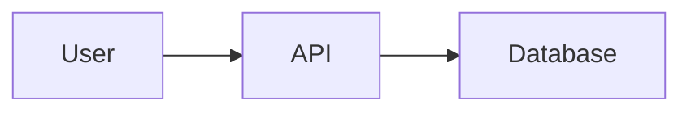

# Presentations

Guidelines for creating professional, consistent presentations using Slidev with the Amelia Design System theme.

## Overview

The Amelia Slidev theme provides:

- **Professional aesthetics** with dark/light mode support
- **15+ custom slide layouts** for different presentation needs
- **7 visualization components** for professional consulting decks
- **Automatic design token integration** for consistent branding
- **Full TypeScript support** with type-safe props

**Theme Location**: [design-system/themes/slidev](https://github.com/existential-birds/amelia/tree/main/design-system/themes/slidev)

## Quick Start

### Installation

Create a new Slidev presentation:

```bash
# Create presentation directory
mkdir my-presentation && cd my-presentation

# Create slides.md
touch slides.md
```

### Basic Configuration

Add the Amelia theme to your `slides.md` frontmatter:

```markdown
---
theme: ./design-system/themes/slidev
colorSchema: dark  # or 'light' or 'both'
title: My Presentation
info: |
  ## My Presentation
  Description of presentation
---

# Welcome

Your first slide
```

### Run Slidev

```bash
# Install Slidev globally if not already installed
npm install -g @slidev/cli

# Start dev server
slidev slides.md

# Export to PDF
slidev export slides.md
```

## Custom Layouts

The theme provides specialized layouts for different presentation scenarios.

### 1. Cover Layout

Title slide with large display font.

```markdown
---
layout: cover
---

# Presentation Title

Subtitle or tagline here

<div class="abs-br m-6 text-sm text-muted-foreground">
  Your Name · Date
</div>
```

### 2. Section Layout

Section divider with centered heading.

```markdown
---
layout: section
---

# Section 1

Market Analysis
```

### 3. Default Layout

Standard content slide with title and body.

```markdown
---
layout: default
---

# Slide Title

- Bullet point 1
- Bullet point 2
- Bullet point 3
```

### 4. Two Columns Layout

Side-by-side content layout.

```markdown
---
layout: two-cols
---

# Comparison

::left::

## Option A
- Feature 1
- Feature 2

::right::

## Option B
- Feature 1
- Feature 2
```

### 5. Action Layout

Action-focused slide with title, subtitle, and footer source.

```markdown
---
layout: action
title: "Next Steps"
subtitle: "Key Actions for Q4"
source: "Strategic Planning 2025"
---

- [ ] Action item 1
- [ ] Action item 2
- [ ] Action item 3
```

### 6. SCQA Layout

Structured executive narrative using the SCQA framework (Situation-Complication-Question-Answer).

```markdown
---
layout: scqa
---

::situation::
Current market conditions show steady 5% growth with established customer base.
::

::complication::
New competitor entered market with 30% lower pricing, threatening market share.
::

::question::
How should we respond to maintain competitive position and profitability?
::

::answer::
Implement differentiation strategy focused on premium service and customer experience.
::
```

### 7. Summary Layout

Executive summary with highlighted recommendation box.

```markdown
---
layout: summary
title: "Executive Summary"
recommendation: "Proceed with phased rollout beginning Q1 2025"
---

**Key Findings:**
- Revenue opportunity: $2.5M annually
- Implementation cost: $500K
- ROI timeline: 6 months
- Risk level: Low
```

### 8. Data Layout

Full-bleed chart slide optimized for data visualization.

```markdown
---
layout: data
title: "Q4 Performance"
chartTitle: "Revenue Growth by Region"
source: "Internal Analytics Dashboard"
---

<BarChart :data="revenueData" />
```

### 9. Diagram Layout

Centered diagram with title and optional annotations.

```markdown
---
layout: diagram
---

# System Architecture


```

### 10. Quote Layout

Large pull quote with attribution.

```markdown
---
layout: quote
---

"The best way to predict the future is to invent it."

**— Alan Kay**
```

### 11. Takeaway Layout

Key takeaway or insight with emphasized styling.

```markdown
---
layout: takeaway
---

# Key Takeaway

Automation can reduce deployment time by 40% while improving reliability.
```

### 12. Ghost Layout

Wireframe/planning mode for work-in-progress slides.

```markdown
---
layout: ghost
title: "Future Feature Concept"
placeholder: "Wireframe for new dashboard goes here"
notes: "Need to validate with stakeholders before proceeding"
---

[Content in planning phase]
```

### 13. Comparison Layout

Side-by-side comparison with versus separator.

```markdown
---
layout: comparison
---

::left::
## Current State
- Manual processes
- 20 hours/week
- Error-prone

::right::
## Future State
- Automated workflows
- 2 hours/week
- Validated data
```

### 14. Pyramid Layout

Hierarchical visualization using pyramid diagram.

```markdown
---
layout: pyramid
---

<PyramidDiagram :layers="[
  { label: 'Strategic Goal', detail: 'Increase market share' },
  { label: 'Tactics', detail: 'Product improvements' },
  { label: 'Actions', detail: 'Feature development' },
]" />
```

### 15. Harvey Layout

Qualitative assessment using Harvey Ball indicators.

```markdown
---
layout: harvey
---

# Capability Assessment

| Capability | Maturity |
|------------|----------|
| DevOps | <HarveyBall fill="three-quarter" /> |
| Security | <HarveyBall fill="half" /> |
| Testing | <HarveyBall fill="quarter" /> |
```

## Visualization Components

Professional consulting-style components for data-driven narratives.

### PyramidDiagram

Pyramid Principle hierarchy visualization.

```vue
<PyramidDiagram :layers="[
  { label: 'Main Message', detail: 'Increase automation' },
  { label: 'Supporting Point 1', detail: 'Reduce costs' },
  { label: 'Supporting Point 2', detail: 'Improve quality' },
  { label: 'Supporting Point 3', detail: 'Scale operations' },
]" />
```

**Props:**
- `layers: Layer[]` - Array of pyramid layers from top to bottom
  - `label: string` - Primary text
  - `detail?: string` - Secondary detail

### SCQABlock

Structured business communication quadrant.

```vue
<SCQABlock type="situation" title="Current State">
  <p>We process 500 orders/day manually</p>
</SCQABlock>

<SCQABlock type="complication" title="Challenge">
  <p>Volume growing 20% monthly, team capacity maxed</p>
</SCQABlock>

<SCQABlock type="question" title="Key Question">
  <p>How do we scale without proportional headcount growth?</p>
</SCQABlock>

<SCQABlock type="answer" title="Recommendation">
  <p>Implement order automation platform</p>
</SCQABlock>
```

**Props:**
- `type: 'situation' | 'complication' | 'question' | 'answer'`
- `title: string`

### HarveyBall

Qualitative indicator circles.

```vue
<table>
  <tr>
    <td>Capability A</td>
    <td><HarveyBall fill="full" size="md" /></td>
  </tr>
  <tr>
    <td>Capability B</td>
    <td><HarveyBall fill="three-quarter" size="md" /></td>
  </tr>
  <tr>
    <td>Capability C</td>
    <td><HarveyBall fill="half" size="md" /></td>
  </tr>
</table>
```

**Props:**
- `fill: 'empty' | 'quarter' | 'half' | 'three-quarter' | 'full'`
- `size?: 'sm' | 'md' | 'lg'` (default: 'md')

### LayerCakeDiagram

Stacked architecture layers.

```vue
<LayerCakeDiagram :layers="[
  { label: 'Presentation', sublabel: 'React, TypeScript', highlight: true },
  { label: 'Business Logic', sublabel: 'Python, FastAPI' },
  { label: 'Data Layer', sublabel: 'PostgreSQL, Redis' },
  { label: 'Infrastructure', sublabel: 'Docker, Kubernetes' },
]" />
```

**Props:**
- `layers: Layer[]`
  - `label: string` - Primary label
  - `sublabel?: string` - Technologies or details
  - `highlight?: boolean` - Emphasize this layer

### ChevronFlow

Process workflow with status indicators.

```vue
<ChevronFlow :steps="[
  { label: 'Research', status: 'completed' },
  { label: 'Design', status: 'completed' },
  { label: 'Development', status: 'active' },
  { label: 'Testing', status: 'pending' },
  { label: 'Deployment', status: 'pending' },
]" />
```

**Props:**
- `steps: Step[]`
  - `label: string`
  - `status: 'completed' | 'active' | 'pending'`

### WaterfallBar

Bridge/waterfall chart segments for value changes.

```vue
<div class="flex items-end gap-2">
  <WaterfallBar value="100" label="Starting" type="start" />
  <WaterfallBar value="30" label="Growth" type="increase" showConnector />
  <WaterfallBar value="-20" label="Costs" type="decrease" showConnector />
  <WaterfallBar value="110" label="Ending" type="end" showConnector />
</div>
```

**Props:**
- `value: number | string`
- `label: string`
- `type: 'start' | 'increase' | 'decrease' | 'end'`
- `showConnector?: boolean`

### RecommendationBox

Highlighted callout for key messages.

```vue
<RecommendationBox type="recommendation">
  <p><strong>Recommendation:</strong> Implement automated testing to reduce deployment time by 40%</p>
</RecommendationBox>

<RecommendationBox type="warning">
  <p><strong>Risk:</strong> Current architecture cannot scale beyond 1000 users</p>
</RecommendationBox>

<RecommendationBox type="insight">
  <p><strong>Insight:</strong> 80% of support tickets are from same 3 issues</p>
</RecommendationBox>

<RecommendationBox type="action">
  <p><strong>Next Step:</strong> Schedule stakeholder review for next week</p>
</RecommendationBox>
```

**Props:**
- `type: 'recommendation' | 'warning' | 'insight' | 'action'`

## Color Scheme

### Dark Mode (Default)

Amelia Dark Mode aesthetic:
- Background: #0D1A12 (deep green)
- Text: #EFF8E2 (warm off-white)
- Primary: #FFC857 (gold)
- Accent: #5B9BD5 (blue)

```markdown
---
colorSchema: dark
---
```

### Light Mode

Amelia Light Mode professional daytime theme:
- Background: #FDF8F0 (warm cream)
- Text: #1A2F23 (dark green-black)
- Primary: #2E6B9C (professional blue)
- Accent: #E8B84A (gold)

```markdown
---
colorSchema: light
---
```

### Adaptive Mode

Respects system preference:

```markdown
---
colorSchema: both
---
```

## Typography

The Amelia theme uses the Amelia design system fonts:

- **Display**: Bebas Neue (cover slides, large headings)
- **Headings**: Barlow Condensed (section titles)
- **Body**: Source Sans 3 (content, bullets)
- **Code**: IBM Plex Mono (code blocks)

Fonts are automatically loaded from Google Fonts.

## Best Practices

### Structure

1. **Start with cover slide** using `layout: cover`
2. **Use section dividers** for major topics using `layout: section`
3. **One idea per slide** - keep content focused
4. **End with summary** using `layout: summary` or `layout: takeaway`

```markdown
---
layout: cover
---
# Presentation Title

---
layout: section
---
# Part 1: Analysis

---
layout: default
---
# Key Finding

Content here...

---
layout: summary
---
# Summary

Key points...
```

### Content Guidelines

1. **6x6 Rule**: Maximum 6 bullets, 6 words each
2. **Hierarchy**: Use components and layouts to show relationships
3. **Data visualization**: Prefer charts/diagrams over text
4. **White space**: Don't overcrowd slides

**Good:**
```markdown
# Revenue Growth

<BarChart :data="revenue" />

**Key Insight:** 30% year-over-year growth
```

**Avoid:**
```markdown
# Revenue Growth

Our revenue grew significantly last year with Q1 showing 25% growth,
Q2 showing 28% growth, Q3 showing 32% growth, and Q4 showing 35% growth.
This represents a 30% year-over-year increase compared to previous year...
```

### Accessibility

1. **High contrast**: All text meets WCAG AA (4.5:1)
2. **Large fonts**: Minimum 24px for body text
3. **Alt text**: Describe images and charts
4. **Semantic HTML**: Use proper heading hierarchy

```markdown
# Main Topic

## Subsection

Regular content with sufficient contrast
```

### Consistency

1. **Use Amelia design tokens**: Colors adapt to theme automatically
2. **Consistent layouts**: Same layout type for similar content
3. **Component reuse**: Use same component for same data types

```vue
<!-- Consistent use of HarveyBall for all capability assessments -->
<HarveyBall fill="three-quarter" /> <!-- Good -->
<span>75%</span> <!-- Avoid mixing styles -->
```

## Advanced Features

### Custom Styling

Override styles per slide:

```markdown
---
layout: default
class: 'custom-class'
style: 'background-color: var(--card)'
---

# Custom Styled Slide
```

### Slide Transitions

```markdown
---
transition: slide-left
---

# Animated Slide
```

### Click Animations

```markdown
# Progressive Reveal

<v-clicks>

- Point 1
- Point 2
- Point 3

</v-clicks>
```

### Presenter Notes

```markdown
# Slide Content

<!--
These are presenter notes - only visible in presenter mode.
Press 'o' to enter presenter mode.
-->
```

### Code Highlighting

```markdown
# Code Example

\`\`\`python {1,3-5}
def hello():
    print("Hello")
    for i in range(10):
        print(i)
    return True
\`\`\`
```

## Export Options

### PDF Export

```bash
# Export to PDF
slidev export slides.md

# With custom settings
slidev export slides.md --output presentation.pdf --dark
```

### Static Site

```bash
# Build static site
slidev build slides.md

# Deploy to hosting
cd dist && netlify deploy
```

### Screenshots

```bash
# Export slides as PNGs
slidev export slides.md --format png
```

## Example Presentation

Complete example combining layouts and components:

```markdown
---
theme: ./design-system/themes/slidev
colorSchema: dark
title: Q4 Strategy Review
info: Strategic planning for Q4 2025
---

# Q4 Strategy Review

Building momentum for 2025

<div class="abs-br m-6 text-sm opacity-50">
  Strategic Planning Team · December 2024
</div>

---
layout: section
---

# Executive Summary

---
layout: summary
title: "Executive Summary"
recommendation: "Accelerate cloud migration to achieve 40% cost reduction"
---

**Situation:** Infrastructure costs growing 15% quarterly

**Opportunity:** Cloud migration can reduce costs while improving scalability

**Timeline:** 6-month phased rollout

**Investment:** $500K with 6-month ROI

---
layout: section
---

# Current State Analysis

---
layout: scqa
---

::situation::
Processing 10,000 transactions/day with on-premise infrastructure at 85% capacity utilization.
::

::complication::
Growth projections show 50% increase in volume by Q2, requiring $2M infrastructure investment.
::

::question::
How can we scale cost-effectively while maintaining performance and reliability?
::

::answer::
Migrate to cloud infrastructure with auto-scaling, reducing fixed costs by 40% and improving elasticity.
::

---
layout: data
title: "Cost Comparison"
chartTitle: "5-Year TCO Analysis"
source: "Finance Department Analysis"
---

<BarChart :data="costData" />

---
layout: section
---

# Recommended Approach

---
layout: default
---

# Migration Phases

<ChevronFlow :steps="[
  { label: 'Assessment', status: 'completed' },
  { label: 'Planning', status: 'active' },
  { label: 'Pilot', status: 'pending' },
  { label: 'Migration', status: 'pending' },
  { label: 'Optimization', status: 'pending' },
]" />

---
layout: takeaway
---

# Key Takeaway

Cloud migration delivers 40% cost reduction and unlimited scalability with 6-month payback period.

---
layout: action
title: "Next Steps"
subtitle: "Action Items for Leadership"
source: "Strategic Planning 2025"
---

- [ ] **This Week:** Approve $500K budget allocation
- [ ] **Next Month:** Finalize vendor selection
- [ ] **Q1 2025:** Complete pilot migration
- [ ] **Q2 2025:** Full production migration
```

## Resources

### Slidev Documentation
- [Slidev Official Docs](https://sli.dev/)
- [Slidev Guide](https://sli.dev/guide/)
- [Slidev Themes](https://sli.dev/themes/gallery.html)

### Theme Source
- Theme source: [design-system/themes/slidev](https://github.com/existential-birds/amelia/tree/main/design-system/themes/slidev)
- Layout docs: `design-system/themes/slidev/layouts/README.md`
- Component docs: `design-system/themes/slidev/components/README.md`

### Keyboard Shortcuts
- `Space` / `→` - Next slide
- `←` - Previous slide
- `o` - Presenter mode
- `d` - Toggle dark mode
- `f` - Fullscreen
- `g` - Go to slide (type number)

## Next Steps

- Learn about the [Color System](/design-system/color-system) used in the theme
- Explore [Typography](/design-system/typography) for text styling
- Create [Diagrams](/design-system/diagrams) to embed in slides
- Reference the complete [Token API](/design-system/tokens)
