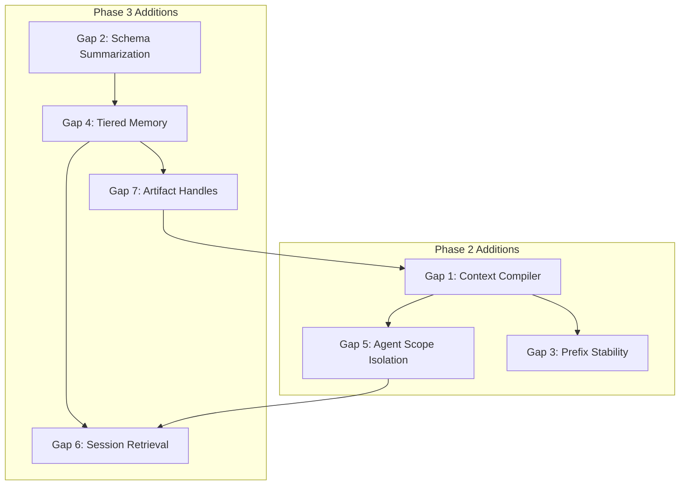

# Context Engineering Gaps Analysis

> **Research conducted by:** hey-amelia bot (research mode) with Claude Opus 4.5

> Analysis of Amelia's architecture against agentic context engineering principles.
> Each gap includes a brainstorming prompt for detailed design work.

## Executive Summary

| Gap | Severity | Current Phase | Recommended Phase |
|-----|----------|---------------|-------------------|
| Context Compiler | Critical | Not planned | Phase 2 |
| Schema-Driven Summarization | Critical | Phase 16 (vague) | Phase 3 |
| Prompt Prefix Stability | Critical | Not planned | Phase 2 |
| Tiered Memory Architecture | High | Partial | Phase 3 |
| Agent Scope Isolation | High | Not planned | Phase 2 |
| Session Memory Retrieval | Moderate | Not planned | Phase 3 |
| Artifact Handle System | Moderate | Partial | Phase 3 |

---

## Critical Gaps

### Gap 1: Context Compiler

**Current State:**
- `ExecutionState.messages` accumulates across agent transitions
- Standard OpenAI message format passed through linearly
- Each agent receives full history, not a minimal relevant view
- No "freshly computed projection" per LLM call

**Principle Violated:**
> "Every LLM call should be a freshly computed projection against a durable state, not dragging the last 500 turns."

**Impact:**
- Signal dilution as workflows grow longer
- Token waste on irrelevant context
- Inability to handle multi-hour loops without context exhaustion

**Location in Codebase:**
- `amelia/core/state.py` - `ExecutionState.messages`
- `amelia/agents/*.py` - Each agent builds prompts from state
- `amelia/drivers/` - Drivers pass messages to LLM

#### Brainstorming Prompt

```
Design a ContextCompiler system for Amelia that builds minimal, relevant prompts per LLM call.

Requirements:
1. Each agent (Architect, Developer, Reviewer) should receive only context relevant to its current task
2. Context should be computed fresh from durable state, not accumulated messages
3. Support different compilation strategies per agent type
4. Enable inspection/debugging of what context was compiled for each call

Consider:
- What state does each agent actually need? (Architect needs issue + design; Developer needs current task + file context; Reviewer needs diff + task description)
- How do we define "relevance" for context selection?
- Should compilation be rule-based or LLM-assisted?
- How do we handle edge cases where an agent needs to "remember" something from earlier?
- Integration with existing ExecutionState and AgentMessage types
- How does this interact with the drivers layer?

Constraints:
- Must work with both API and CLI drivers
- Must not break existing orchestrator flow
- Should be opt-in initially (feature flag)

Output: A detailed design document with:
- New types/interfaces required
- Compilation algorithms per agent
- Migration path from current message accumulation
- Example compiled contexts for each agent type
```

---

### Gap 2: Schema-Driven Summarization

**Current State:**
- No summarization mechanism exists
- Phase 16 mentions "context compaction" vaguely
- Risk of "glossy soup" if implemented naively

**Principle Violated:**
> "Naive summarization turns reasoning into vague glossy soup. Compact information using schemas and templates that preserve essential semantics and event types."

**Impact:**
- Long-running workflows will eventually exhaust context
- Naive summarization loses decision structures
- Debugging becomes impossible when history is prose

**Location in Codebase:**
- `amelia/core/state.py` - `AgentMessage` is unstructured
- `amelia/server/models/events.py` - `EventType` enum exists but not used for compaction

#### Brainstorming Prompt

```
Design a schema-driven summarization system for Amelia that preserves semantic structure when compacting context.

Requirements:
1. Define compaction schemas for different event types (tool_call, tool_result, error, decision, human_response)
2. Summarization must preserve:
   - Event type and category
   - Key decision points and their outcomes
   - Error states and resolutions
   - Temporal relationships between events
3. Compacted events must be parseable back into structured form
4. Support configurable compression levels (minimal, standard, verbose)

Consider:
- What information is NEVER safe to lose during compaction?
- How do we handle tool results that contain large outputs (diffs, logs)?
- Should compaction be incremental (compact as we go) or batch (compact when limit reached)?
- How do we preserve "chains of reasoning" that span multiple events?
- Integration with existing EventType enum and WorkflowEvent model
- When should compaction trigger? (Token count? Event count? Time?)

Constraints:
- Must maintain debuggability - compacted state should be inspectable
- Must be reversible to the extent possible (or at least auditable)
- Should work with the tiered memory model (Gap 4)

Output: A detailed design document with:
- Compaction schema definitions (Pydantic models)
- Compaction algorithms for each event type
- Compression level configurations
- Examples of before/after compaction
- Integration with ContextCompiler (Gap 1)
```

---

### Gap 3: Prompt Prefix Stability for Cache Optimization

**Current State:**
- No caching strategy documented
- Each agent call likely rebuilds full prompt from scratch
- Claude CLI driver has session resumption but not prefix caching
- Major latency and cost optimization missed

**Principle Violated:**
> "Design prompt layout so that the prefix (identity, static strategy, instructions) remains stable, allowing cache reuse across turns. Only the variable suffix should change."

**Impact:**
- 10x potential latency reduction missed
- Higher API costs due to repeated prefix processing
- No benefit from provider-side prompt caching features

**Location in Codebase:**
- `amelia/agents/*.py` - `SYSTEM_PROMPT` strings
- `amelia/drivers/` - How prompts are constructed and sent

#### Brainstorming Prompt

```
Design a prompt architecture for Amelia that maximizes cache hit rates through prefix stability.

Requirements:
1. Separate prompts into stable prefix and variable suffix
2. Prefix should include: system identity, capabilities, project conventions, safety rules
3. Suffix should include: current task, recent tool results, variable context
4. Support cache invalidation when prefix legitimately changes
5. Measure and report cache hit rates

Consider:
- What content belongs in prefix vs suffix for each agent?
- How do we handle project-specific conventions that may change?
- Should we use provider-specific caching features (Anthropic prompt caching, OpenAI cached prompts)?
- How does this interact with the ContextCompiler (Gap 1)?
- What's the cache key strategy? (Agent type? Project? Profile?)
- How do we handle multi-turn within a single agent call?

Constraints:
- Must work with both API and CLI drivers
- Must not compromise prompt quality for cache hits
- Should be measurable (cache hit rate metrics)

Output: A detailed design document with:
- Prompt template structure (prefix/suffix separation)
- Cache key generation strategy
- Integration with existing driver abstraction
- Metrics and observability for cache performance
- Example prompt layouts for each agent
```

---

## High-Priority Gaps

### Gap 4: Tiered Memory Architecture

**Current State:**

| Tier | Status | Implementation |
|------|--------|----------------|
| Working Context | Missing | No minimal view computation |
| Sessions | Partial | SQLite `events` table exists but not used as tier |
| Memory | Missing | No cross-session searchable insights |
| Artifacts | Partial | Git/files exist but content gets embedded |

**Principle Violated:**
> "Implement a tiered memory model mirroring Cache, RAM, and Disk: Working Context, Sessions, Memory, and Artifacts."

**Impact:**
- No architectural separation between hot and cold context
- Cross-session learning impossible without Memory tier
- Heavy artifacts pollute working context

**Location in Codebase:**
- `amelia/core/state.py` - `ExecutionState`
- `amelia/server/database/` - SQLite schema
- `amelia/server/models/events.py` - Event storage

#### Brainstorming Prompt

```
Design a four-tier memory architecture for Amelia following the Cache/RAM/Disk hierarchy pattern.

Tiers to Design:
1. **Working Context** - Minimal view for immediate LLM call (like CPU cache)
2. **Sessions** - Structured event logs for current workflow (like RAM)
3. **Memory** - Durable insights extracted across runs (like SSD)
4. **Artifacts** - Large objects referenced by handle (like disk/NAS)

Requirements:
1. Clear APIs for reading/writing each tier
2. Automatic promotion/demotion between tiers
3. Searchable Memory tier for cross-session retrieval
4. Handle-based artifact references (not embedding)

Consider:
- What triggers movement between tiers?
- How do we extract "insights" for the Memory tier?
- What's the schema for Memory entries? (Tags? Embeddings? Both?)
- How do artifacts get registered and referenced?
- Integration with existing SQLite schema
- How does this interact with Phase 3 (Session Continuity)?

Constraints:
- Must maintain backward compatibility with existing workflows
- Must support both local (SQLite) and future cloud deployment
- Should be observable (which tier served each request?)

Output: A detailed design document with:
- Data models for each tier
- APIs for tier access
- Promotion/demotion rules
- SQLite schema changes
- Integration with ContextCompiler and existing state management
```

---

### Gap 5: Agent Scope Isolation

**Current State:**
- Agents have distinct roles (Architect, Developer, Reviewer)
- But all receive full `ExecutionState` with all history
- No "default to nearly nothing" scope isolation
- Communication via shared message history, not structured artifacts

**Principle Violated:**
> "The default context for any agent should contain nearly nothing, requiring the agent to make active decisions to retrieve past steps or artifacts."

**Impact:**
- Agents see irrelevant context from other agents
- "Reasoning drift" as agents react to noise
- Token waste on context they shouldn't need

**Location in Codebase:**
- `amelia/core/orchestrator.py` - State passed between nodes
- `amelia/agents/*.py` - Each agent's context requirements

#### Brainstorming Prompt

```
Design an agent scope isolation system for Amelia where each agent receives minimal default context.

Requirements:
1. Define minimal context requirements per agent type
2. Agents should actively request additional context when needed
3. Communication between agents via structured artifacts, not message passing
4. Support audit trail of what context each agent accessed

Per-Agent Minimal Context:
- **Architect**: Issue description, design doc reference (if any)
- **Developer**: Current task from TaskDAG, relevant file paths
- **Reviewer**: Diff reference, task description, acceptance criteria

Consider:
- How do agents request additional context? (Tool call? Explicit API?)
- What's the handoff artifact between Architect → Developer?
- What's the handoff artifact between Developer → Reviewer?
- How do we handle the Developer ↔ Reviewer loop (revision requests)?
- Should agents be able to access other agents' reasoning? When?
- Integration with ContextCompiler (Gap 1)

Constraints:
- Must not break existing workflows
- Must maintain debuggability (what context did agent have?)
- Should improve token efficiency measurably

Output: A detailed design document with:
- Minimal context specification per agent
- Context request mechanism
- Handoff artifact schemas
- Changes to orchestrator node implementations
- Before/after context size comparisons
```

---

## Moderate-Priority Gaps

### Gap 6: Session Memory Retrieval

**Current State:**
- Everything pinned in context, nothing retrieved on-demand
- Issue context fetched once at start
- Phases 11 & 13 plan document RAG, but not session memory retrieval

**Principle Violated:**
> "Long-term memory must be searchable and retrieved on demand. Don't pin everything into a large context window."

**Impact:**
- Can't reference decisions from earlier in long workflows
- No ability to learn from similar past sessions
- Context window fills with noise instead of relevant history

**Location in Codebase:**
- `amelia/server/database/repository.py` - Event storage
- `amelia/core/state.py` - How history is accessed

#### Brainstorming Prompt

```
Design a session memory retrieval system for Amelia that enables on-demand access to relevant history.

Requirements:
1. Index session events for semantic search
2. Support retrieval by: similarity, recency, event type, agent
3. Integrate with ContextCompiler to fetch relevant history
4. Support cross-session retrieval from Memory tier

Consider:
- What embedding model for session events?
- How do we balance recency vs relevance?
- Should retrieval be agent-initiated or compiler-initiated?
- How do we handle retrieval latency in the hot path?
- Integration with existing SQLite events table
- How does this relate to Phase 11 (Spec Builder) RAG?

Constraints:
- Must not significantly increase latency for simple workflows
- Should work with sqlite-vec for local deployment
- Must integrate with tiered memory architecture (Gap 4)

Output: A detailed design document with:
- Indexing strategy for session events
- Retrieval API design
- Integration with ContextCompiler
- Query patterns and examples
- Performance considerations
```

---

### Gap 7: Artifact Handle System

**Current State:**
- Git diffs embedded directly in prompts
- Plan saved as markdown but content sometimes embedded
- No consistent handle/pointer system for large objects

**Principle Violated:**
> "Offload heavy state to file systems. Pass pointers or handles to the agent rather than embedding content."

**Impact:**
- Large diffs consume significant context
- No ability to reference specific parts of artifacts
- Duplicate content when same artifact referenced multiple times

**Location in Codebase:**
- `amelia/agents/reviewer.py` - Receives full diff
- `amelia/core/state.py` - `code_changes_for_review: str`

#### Brainstorming Prompt

```
Design an artifact handle system for Amelia that references large objects by pointer instead of embedding.

Requirements:
1. Register artifacts with unique handles (e.g., `artifact://diff/abc123`)
2. Support artifact types: diffs, files, logs, plans, test results
3. Enable partial artifact access (e.g., specific file from diff)
4. Track artifact lifecycle (creation, access, expiration)

Consider:
- What's the handle format? URI? UUID? Content-addressed hash?
- How do agents request artifact content when needed?
- Should artifacts be summarized when referenced? (e.g., "diff with 3 files, +150/-50 lines")
- How do we handle artifacts that change? (Immutable with versions?)
- Storage backend: filesystem? SQLite blob? Both?
- Integration with git for code artifacts

Constraints:
- Must work with CLI driver (which may need file paths)
- Should support lazy loading (don't fetch until accessed)
- Must integrate with tiered memory (Artifacts tier)

Output: A detailed design document with:
- Handle format specification
- Artifact registry API
- Storage backend design
- Agent integration (how agents use handles)
- Example artifact flows for common cases (diff review, plan reference)
```

---

## Implementation Sequence



**Recommended Order:**
1. **Gap 1: Context Compiler** - Foundation for all other context work
2. **Gap 3: Prefix Stability** - Quick win for latency/cost
3. **Gap 5: Agent Scope Isolation** - Reduces context immediately
4. **Gap 4: Tiered Memory** - Architectural foundation
5. **Gap 7: Artifact Handles** - Enables proper artifact management
6. **Gap 2: Schema Summarization** - Requires tiered memory
7. **Gap 6: Session Retrieval** - Requires tiered memory + handles

---

## References

- [Agentic Context Engineering Principles](source: video analysis)
- [12-Factor Agents Methodology](https://github.com/humanlayer/12-factor-agents)
- [Amelia 12-Factor Compliance Analysis](/ideas/research/12-factor-compliance)
- [Amelia Roadmap](/reference/roadmap)
- [Amelia Architecture](/architecture/overview)
